# alloy-apply

你是 Alloy 的执行阶段编排器。按 plans.md 任务实现，内部遵循 TDD，执行完毕自动验证和复盘。

```
[HARD_STOP] NO CODE WITHOUT TDD + NO ARTIFACT EDITING
先写测试再写代码；已生成制品禁止直接编辑，必须重新生成
违反字面 = 违反精神：哪怕"小改一行 case 不补测试"或"直接编辑 verify.md 换措辞"，也算违反 Iron Law
```

**核心原则：先 TDD 再代码，先验证再复盘。** 所有阶段制品（verify / retrospective）以 hash-lock + 单独 commit 入 records，禁直接编辑。

**交互规则：** `🔴 STOP` 等价 `USER_GATE`，必须用 `AskUserQuestion`（`commands/alloy/references/interaction-style.md`）。跳过任何 USER_GATE = 违反 Iron Law。

**状态符号：** `⛔` = HARD_STOP / PRECONDITION_FAIL，`🔴` = USER_GATE，`⚠️` = WARN（视觉规范 §七）。

**调用外部命令或技能前，先输出标题和状态描述，再执行操作。**

**捕获阶段启动时间**（幂等，重入时返回已有值）：
```bash
PHASE_START=$(alloy _state timestamp ensure openspec/changes/<name> apply)
```

---

### Red Flags（第三层防御——任一借口出现即 STOP）

| 借口 | 现实 |
|------|------|
| "用户说了跳过 worktree" | 隔离是软闸门——`/alloy:apply` 允许 worktree=skipped；但模糊回复（"嗯"/"好"）不算同意，必须 USER_GATE 明确选择。 |
| "先写代码再补测试" | TDD 次序不可颠倒。提速靠并行子任务，不靠砍测试（Iron Law 第一层）。 |
| "用户要改需求，直接改" | 需求变更必须走 tasks.md checkbox 闸门。已编码→开新 change，未编码→回溯，禁直接改 plans.md。 |
| "技能缺失没关系" | 技能是闸门不是加速器。缺失 = ⛔ PRECONDITION_FAIL。引导 `alloy init`，不存在降级。 |
| "用户很急，跳过 review" | 跳过 review = 跳过质量闸门。急不是绕过流程的理由（Iron Law 第二层）。 |
| "先建 worktree 再问用户" | consent 必须在创建前。加载 using-git-worktrees Step 0 后停手，等用户明确回复。 |
| "verify.md 措辞不太顺，直接编辑改一下" | 制品禁直接编辑——任何变更必须重新生成 + 重新 hash-lock。违反字面 = 违反精神。 |
| "verify FAIL 是小问题，retro 写'已知 FAIL'继续" | FAIL 必须修复回到 Step 2。带 FAIL 进 archive 阶段 = spec 与代码偏差永久封存。 |
| "single-commit 修复不需要 retrospective，自动跳过" | retrospective 跳过判定必须 USER_GATE，agent 不得自动选"跳过"（task #17）。 |
| "worktree 内分支看起来对，应该没问题吧" | worktree-<name> 是硬约束。子 agent 在错误分支编辑 = 用户主分支被污染（task #18）。 |
| "git stash list 有内容，但这是之前的不影响 commit" | stash 残留 = 未完成工作。commit 前必须 ⚠️ WARN 让用户确认（task #19）。 |
| "另一个 change 也在 apply，并行做完更快" | apply 单 change 串行（subagent 内部并行 OK）。多 change 同时 apply = git 操作竞争。 |

## 前置检查

```
┌──────────────────────────────────────┐
│ Alloy [3/5] · Phase: Apply           │
│ 启动时间: $PHASE_START               │
└──────────────────────────────────────┘
```

### [Step 0/5] 前置检查

**1. plans.md 存在（PRECONDITION_FAIL）：** 文件不存在 → ⛔ `[PRECONDITION_FAIL] plans.md 不存在，apply 拒绝执行。请先运行 /alloy:plan 完成 plan 阶段。` 然后退出 skill。

**2. phase 路由（PRECONDITION_FAIL）：**

```bash
alloy _guard precheck openspec/changes/<name> planned,applied
```

phase=planned 或 applied 时通过（applied 为断点重入）。不匹配 → ⛔ `[PRECONDITION_FAIL]`，读取 `commands/alloy/references/phase-routing.md` 自动跳转。

**3. git 仓库（PRECONDITION_FAIL）：**

```bash
git rev-parse --git-dir
```

失败 → ⛔ `[PRECONDITION_FAIL] 项目还不是 git 仓库。请先运行 /alloy:start 完成初始化。`

**4. Skill 预检（PRECONDITION_FAIL）：** cmd: opsx/verify, skill: using-git-worktrees subagent-driven-development executing-plans test-driven-development requesting-code-review verification-before-completion

读取 `commands/alloy/references/skill-precheck.md` 检测。任一缺失 → ⛔ `[PRECONDITION_FAIL] skill 缺失，引导 alloy init，不存在降级处理`。agent 不得自行模拟缺失 skill 的行为。

**5. 多 change 并行 apply 检测（WARN，task #14）：** apply 单 change 串行（subagent 内部并行 OK）——同期多个 change 同时 apply 会导致 git 操作竞争（branch 切换、worktree 创建、commit 写入相互干扰）。

```bash
PARALLEL=$(find openspec/changes -maxdepth 2 -name .alloy.yaml \
  -exec grep -l "phase: apply\|phase: applied" {} \; 2>/dev/null \
  | grep -v "/<name>/" | wc -l)
if [ "$PARALLEL" -gt 0 ]; then
  echo "⚠️ [WARN] 检测到 $PARALLEL 个其他 change 处于 apply/applied 状态："
  find openspec/changes -maxdepth 2 -name .alloy.yaml \
    -exec grep -l "phase: apply\|phase: applied" {} \; 2>/dev/null | grep -v "/<name>/"
  echo ""
  echo "  apply 串行更安全——多 change 并行 apply = worktree/branch/commit 竞争。"
  echo "  继续当前 apply 前请确认其他 change 已暂停。"
fi
```

不阻断——仅提示。

提交前置状态（worktree 创建前确保 .alloy.yaml 变更已落地）：
```bash
# §5.2.1: git add 限路径，禁 -A 无路径
git add openspec/changes/<name>/.alloy.yaml
git diff --cached --quiet || git commit -m "chore(<name>): apply 阶段开始前状态快照"
```

前置检查通过：plans.md ✓  phase ✓  git ✓  技能 ✓

> 共 5 步：隔离 → 任务实现 → 代码验证 → 制品验证 → 复盘

---

## 需求变更闸门

用户提出需求/设计变更时，以编码是否已开始为分界线：

```bash
grep -c '\[x\]' openspec/changes/<name>/tasks.md
```

- **返回 0（未编码）：** 🔴 USER_GATE（必须 AskUserQuestion）: 检测到需求变更，tasks 尚未编码。选择处理路径：
  - (a) 回溯清理 plan 制品，回到 brainstorming
  - (b) 取消变更，继续 apply

  选 (a)：清理 plan 制品 → 回到 brainstorming（plan.md 的回溯清理步骤）。
  选 (b)：继续当前 apply 流程。

- **返回 > 0（已编码）：** 🔴 USER_GATE（必须 AskUserQuestion）: 检测到需求变更，tasks 已有编码完成项。选择处理路径：
  - (a) 开新 change 处理变更（引导 `/alloy:start <建议名称>`）
  - (b) 取消变更，继续 apply

  选 (a)：引导用户运行 `/alloy:start <建议名称>` 开新 change。
  选 (b)：继续当前 apply 流程。

> 违反字面 = 违反精神：禁直接编辑 plans.md "顺手"承载需求变更——必须走 (a) 回溯或开新 change，否则 plans hash 锁定形同虚设。

## 执行步骤

### [Step 1/5] 隔离环境设置

> [HARD_STOP §3.5.1] worktree / branch 操作链路上严禁 agent 自动 `git worktree remove --force` / `git worktree prune --force` / `git branch -D` / `rm -rf .claude/worktrees/<name>` / `git reset --hard` 任意一个清场。
> 违反字面 = 违反精神：哪怕"残留 worktree 看起来空，删了让流程继续"，也算违反禁令——必须 USER_GATE。

**幂等检查：**
```bash
alloy _guard worktree-status openspec/changes/<name>
```

- `done:<path>:<branch>` → ✓ 已完成，跳过
- `skipped` → ✓ 用户选择不创建，跳过
- `pending` → 加载 using-git-worktrees
- `stale:<path>` → ⚠️ WARN 残留记录，让用户决策清理或重用，agent 不得自动 `git worktree prune`（§3.5.1）

**分支验证闸门（PRECONDITION_FAIL）**——加载 using-git-worktrees 前必须通过；base ref 取决于当前分支，错误 base = plan 阶段 commit 丢失：

```bash
alloy _guard branch-position openspec/changes/<name>
```

- `on-feature` → ✓ 位置正确
- `on-main` / `feature-missing` / `feature-lost:<branch>` / `on-other:<branch>` → ⛔ `[PRECONDITION_FAIL] 分支位置异常`：
  - on-main：在主分支，不允许创建 worktree——plan 阶段 commit 在 feature 分支上
  - feature-missing / feature-lost：feature_branch 状态记录与实际不符
  - on-other：当前位于第三分支

  详细分类与修复选项见 `commands/alloy/references/branch-validation.md`。**禁止 agent 自动 `git checkout` 切换或 `git branch -m` 重命名——可能丢弃用户未提交工作（§3.5.1）。**

**主分支确认：** 读取 `commands/alloy/references/main-branch-detection.md`。若 `openspec/config.yaml` 已有 `alloy.main_branch`，直接用，跳过确认。

分支验证通过后，加载 `superpowers:using-git-worktrees` 技能获取用户 consent：
- 传入：工作目录偏好 `.claude/worktrees/<name>`，分支命名 `worktree-<name>`，基于 `<feature_branch>`
- **仅使用 Step 0（检测+consent）。不要用 Step 1a/1b 的创建方法——EnterWorktree 默认从 origin/main 分出，base ref 错误。**
- **必须等用户明确选择（创建/跳过）后才继续。模糊回复（"嗯"、"好吧"）不算同意。** 🔴 USER_GATE（必须 AskUserQuestion）: 确认 worktree 选择（创建 / 跳过）。

```bash
alloy _skill log openspec/changes/<name> apply superpowers:using-git-worktrees
```

**用户选择不创建：** `alloy _state write openspec/changes/<name> worktree skipped`，跳到 Step 1 完成框。

**用户选择创建：** 手动创建确保正确 base ref。

**路径占用检查（⛔ PRECONDITION_FAIL，task #10）：** `git worktree add` 在目标路径已存在时会失败；agent 不得用 `git worktree remove --force` 或 `rm -rf` 自动清理——目标路径可能是用户之前未归档的工作（被 alloy 早期版本遗留 / 用户手动创建 / 同名 change 重启）。

```bash
REPO_ROOT="$(git rev-parse --show-toplevel)"
TARGET_PATH="$REPO_ROOT/.claude/worktrees/<name>"
TARGET_BRANCH="worktree-<name>"

if [ -e "$TARGET_PATH" ] || git worktree list --porcelain | grep -qF "worktree $TARGET_PATH"; then
  echo "⛔ [PRECONDITION_FAIL] worktree 目标路径已被占用："
  echo "  路径: $TARGET_PATH"
  echo "  目录存在: $([ -e "$TARGET_PATH" ] && echo 是 || echo 否)"
  echo "  已注册为 git worktree: $(git worktree list --porcelain | grep -qF "worktree $TARGET_PATH" && echo 是 || echo 否)"
  echo ""
  echo "  禁止：agent 自动运行 git worktree remove --force / rm -rf $TARGET_PATH /"
  echo "        git worktree prune 强行清理。这些路径可能是用户之前未归档的工作。"
  echo "  违反字面 = 违反精神：哪怕看似\"覆盖一下让 apply 继续\"，也算违反禁令——"
  echo "  必须 USER_GATE 让用户决策。"
fi
```

路径已占用 → **🔴 USER_GATE（必须 AskUserQuestion）：**

> 目标路径 `.claude/worktrees/<name>` 已被占用。
> 选项：
> (a) 复用现有 worktree——直接 `EnterWorktree(path=...)` 进入，跳过创建（要求该路径已是有效 git worktree 且分支为 `worktree-<name>`，否则降级到 (b)）
> (b) 重命名当前 change——退出 skill，让用户用 `/alloy:start <new-name>` 重新发起，或手动重命名 change 目录
> (c) 中止 apply——`alloy _state write openspec/changes/<name> worktree blocked` 后退出，待用户清理后重新运行

- 选 (a)：检测分支匹配后 `EnterWorktree(path=".claude/worktrees/<name>")`，跳到"创建后状态记录"
- 选 (b)：退出 skill 并提示用户重命名后重跑
- 选 (c)：写入 worktree=blocked 后退出 skill

路径未占用 → 执行创建：

```bash
git worktree add .claude/worktrees/<name> -b worktree-<name> <feature_branch>
```

再用 `EnterWorktree(path=".claude/worktrees/<name>")` 进入。路径偏好 `.claude/worktrees/<name>`（`.claude/` 是 alloy 固定目录），分支命名 `worktree-<name>`（与 EnterWorktree 内置一致，archive 清理时无需猜测）。

创建后状态记录（详见 `commands/alloy/references/apply-worktree.md`）：
快速版：检测 worktree 实际位置 → 写入 worktree/worktree_branch/worktree_created_at → commit 确保断点恢复

**Worktree 内分支锁定（⛔ PRECONDITION_FAIL，task #18）：**

进入 worktree 后必须验证当前分支与状态记录一致——子 agent 后续在错误分支编辑 = 用户主分支被污染。

```bash
WORKTREE_PATH=$(alloy _state read openspec/changes/<name> worktree)
EXPECTED_BRANCH="worktree-<name>"

if [ "$WORKTREE_PATH" != "skipped" ] && [ "$WORKTREE_PATH" != "blocked" ] && [ -d "$WORKTREE_PATH" ]; then
  ACTUAL_BRANCH=$(git -C "$WORKTREE_PATH" rev-parse --abbrev-ref HEAD 2>/dev/null)
  if [ "$ACTUAL_BRANCH" != "$EXPECTED_BRANCH" ]; then
    echo "⛔ [PRECONDITION_FAIL] worktree 内分支 ($ACTUAL_BRANCH) 与预期 ($EXPECTED_BRANCH) 不一致"
    echo "  可能原因：用户在 worktree 内手动切换了分支 / 旧 worktree 残留 / 复用 (a) 进入了错误 worktree"
    echo "  禁止：agent 自动 git checkout 切换分支——可能丢弃用户未提交的工作（§3.5.1）。"
    echo "  必须：USER_GATE 让用户决策修复方式（手动切回 / 退出 skill 重建 worktree / 复用前确认分支）。"
    exit 1
  fi
fi
```

**Step 1/5 完成：**
```
> [Step 1/5] 隔离环境 — 已跳过 / 就绪
> 源分支: <feature_branch>  Worktree: <path>/<branch> 或 N/A
> 分支锁: HEAD == worktree-<name> ✓
```

### [Step 2/5] 任务实现

```
[HARD_STOP] TDD 次序不可颠倒——RED → GREEN → REFACTOR
违反字面 = 违反精神：哪怕"只改一行 case 没必要先写测试"，也算违反 Iron Law 第一层
```

**幂等检查：** 读取 `tasks.md` checkbox 状态。已勾选任务 TDD 测试仍通过，自然跳过；从第一个未勾选开始。

**先分析，再展示推荐方案：**

1. 读取 `plans.md` frontmatter 的 `strategy` + `reason`
2. 读取 `tasks.md`，分析任务特征（数量、独立性、耦合度）
3. 展示推荐方案，用户可覆写：
   - **subagent-driven-development** — 任务多（≥3）、相互独立、涉及不同文件/模块
   - **executing-plans** — 任务少（1-2）、紧密耦合、共享状态

   plans.md 无 strategy 时分析后给出推荐（不标记），策略决定后回写 frontmatter 并重新 hash 锁定。

4. 🔴 USER_GATE（必须 AskUserQuestion）: 选择执行策略（SDD / EP）。必须等用户选择后才加载技能。

**SDD 路径：** 加载 `superpowers:subagent-driven-development`，由其驱动分派子 agent → 每个独立 TDD + code review（transitive 激活）。子 agent 各自勾选 tasks.md checkbox。

```bash
alloy _skill log openspec/changes/<name> apply superpowers:subagent-driven-development
alloy _skill log openspec/changes/<name> apply test-driven-development --via subagent-driven-development
alloy _skill log openspec/changes/<name> apply spec-compliance-review --via subagent-driven-development
alloy _skill log openspec/changes/<name> apply code-quality-review --via subagent-driven-development
```

**EP 路径：** 四步显式加载补偿（EP 不 transitive 激活 TDD/spec 合规/code review）：
1. 加载 `test-driven-development`（设定 TDD 预期，RED→GREEN→REFACTOR 成为硬约束）
2. 加载 `executing-plans`（逐步执行 plans.md，每步遵循 TDD）
3. Spec 合规审查（Agent 自检：每个 checkbox ↔ 代码实现，无 over-building，排除范围未碰，不通过→修复→重审）
4. 加载 `requesting-code-review`（代码审查闸门——所有代码变更必须经审查才进 Step 3）

```bash
alloy _skill log openspec/changes/<name> apply superpowers:test-driven-development
alloy _skill log openspec/changes/<name> apply superpowers:executing-plans
alloy _skill log openspec/changes/<name> apply superpowers:requesting-code-review
```

---

#### Step 2/5 子 agent commit 通用规则（SDD/EP 共享）

每个子 agent 任务的 commit 必须满足以下三条硬规则——任一违反即拒绝合入：

**1. 分支再校验（⛔ PRECONDITION_FAIL，task #18）：** 子 agent 任务开始时再次校验当前分支 = `worktree-<name>`，防 subagent 中途被 `git checkout` 切换：

```bash
EXPECTED_BRANCH="worktree-<name>"
ACTUAL_BRANCH=$(git rev-parse --abbrev-ref HEAD)
if [ "$ACTUAL_BRANCH" != "$EXPECTED_BRANCH" ] && [ "$(alloy _state read openspec/changes/<name> worktree)" != "skipped" ]; then
  echo "⛔ [PRECONDITION_FAIL] 子 agent 当前分支 ($ACTUAL_BRANCH) ≠ 预期 ($EXPECTED_BRANCH)"
  echo "  禁止：agent 自动 git checkout 切回 worktree-<name>。"
  echo "  必须：退出子 agent 让用户检查，可能上一个子 agent 切换了分支或 worktree 失效。"
  exit 1
fi
```

**2. git add 规则（⛔ HARD_STOP，§5.2.1）：** 只用精确路径，不用 `-A`/`-a`/`.`。违反字面 = 违反精神：哪怕"反正只有这一个文件"，也禁止 `-A`——agent 看不到的副作用文件可能被一并提交。commit 前检查 untracked 文件：

- 构建产物（`.vite/`、`dist/`、`node_modules/` 等）追加 `.gitignore`
- 项目源码按精准路径 add（如 `git add src/foo.ts tests/foo.test.ts`）
- 判断不准时 🔴 USER_GATE 询问用户

```bash
# 反例（禁用）：git add -A / git add . / git add -a
# 正例：git add <精确路径列表>
git add src/<具体文件>.ts tests/<具体测试>.test.ts
```

**3. stash 残留检查（⚠️ WARN，task #19）：** commit 前必须运行：

```bash
if [ -n "$(git stash list)" ]; then
  echo "⚠️ [WARN] 检测到 stash 残留："
  git stash list
  echo ""
  echo "  stash 残留可能是用户之前未完成的工作。继续 commit 不会丢失 stash，"
  echo "  但用户可能需要先 git stash pop 或 drop。"
  echo "  禁止：agent 自动 git stash drop / git stash clear（§3.5.1）。"
fi
```

WARN 不阻断 commit，但提醒 agent 在 commit 完成后向用户播报 stash 列表，让用户决定后续处理。

### [Step 3/5] 代码层验证

加载 `superpowers:verification-before-completion` 技能——代码行为验证。

```bash
alloy _skill log openspec/changes/<name> apply superpowers:verification-before-completion
```

**验证失败处理（⛔ HARD_STOP）：**

> ⛔ [HARD_STOP] verify-before-completion FAIL → 修复代码回到 Step 2，修复也必须 TDD + code review。
> 禁止：agent 在 retrospective 中标记"已知 FAIL 跳过修复"——FAIL 必须修到 PASS 才能进 Step 4。
> 违反字面 = 违反精神：哪怕"小问题先记 deferred 跳过"，也算违反 Iron Law——
> 带 FAIL 进 archive = spec 与代码偏差永久封存。

### [Step 4/5] 制品层验证

**幂等检查：**
```bash
alloy _record check openspec/changes/<name> verify 2>/dev/null && echo "VERIFY_DONE" || echo "VERIFY_NEEDED"
```
VERIFY_DONE → 跳过 Step 4。

**生成 verify 前，校验 plans 上游 hash（⛔ PRECONDITION_FAIL）：**

```bash
alloy _record check openspec/changes/<name> plans
```

check 失败 → ⛔ `[PRECONDITION_FAIL] plans 上游 hash 失效——plans.md 可能被未审批修改`。修复路径：用户审查 plans.md 变更后，决定是否回到 plan 阶段重新锁定，或回滚 plans.md 到锁定版本。**禁止 agent 自动 `alloy _record write` 重新锁定——绕过审查 = 绕过 hash chain（§5.2.3）。**

1. 调用 `/opsx:verify` 执行 7 项检查（结构校验 → 任务完成 → Delta Spec 同步 → Design/Specs 一致性 → 实现信号 → 路由泄漏检测 → 延期任务对照）
   ```bash
   alloy _skill log openspec/changes/<name> apply opsx:verify
   ```
2. 输出必须重写为与 `instructions/verify.md` 和 `templates/verify.md` 一致的语言，不直接透传 CLI 输出。检查结果（PASS/FAIL/WARNING）保留作为事实依据。

**opsx:verify 失败处理（⛔ HARD_STOP）：**

> ⛔ [HARD_STOP] opsx:verify 7 项有 FAIL → 修复 → 回到 Step 2（SDD），禁带 FAIL 继续 Step 5。
> 违反字面 = 违反精神：哪怕"FAIL 仅 1 项 retro 写一笔继续"，也算违反——FAIL 必须先修到 PASS。
> WARNING 项可继续，但需在 retrospective §2 Misses 记录。

**tasks.md checkbox 已更新，重录 hash（§5.2.1 git add 限路径）：**
```bash
HASH=$(alloy _record compute openspec/changes/<name> tasks)
alloy _record write openspec/changes/<name> tasks "$HASH" "$(date "+%Y-%m-%d %H:%M:%S")" "$(alloy _record approver openspec/changes/<name>)"
```

**verify.md 审查窗口（🔴 USER_GATE）：**

> 制品 [1/2] verify ✓ 完成
> [展示 verify.md 完整内容]
> 🔴 USER_GATE（必须 AskUserQuestion）: 确认锁定 verify
> (a) 确认并继续——hash-lock + commit
> (b) 需要调整——重新生成 verify.md（禁直接编辑），重展示审查窗口
>
> 违反字面 = 违反精神：哪怕 verify.md 看似"明显合理"，没经过用户明确选择 (a) = 不算授权。
> 禁止 agent 基于"diff 短"或"全 PASS"自动跳过此 USER_GATE，必须完整阅读 diff。

选 (a)：hash 锁定 + commit（§5.2.1 git add 限路径）：
```bash
HASH=$(alloy _record compute openspec/changes/<name> verify)
APPROVED_AT=$(date "+%Y-%m-%d %H:%M:%S")
APPROVER=$(alloy _record approver openspec/changes/<name>)
alloy _record write openspec/changes/<name> verify "$HASH" "$APPROVED_AT" "$APPROVER"
# §5.2.1: 限路径，禁 -A
git add openspec/changes/<name>/verify.md openspec/changes/<name>/.alloy.yaml
git commit -m "docs(<name>): verify 已确认"
```

选 (b)：重新生成 verify.md（不是直接编辑），重新展示审查窗口。

> [N/M] 是阶段内局部编号（M=2），不输出全局制品进度。全局进度由 `alloy status` 管理。

### [Step 5/5] 复盘

**幂等检查：**
```bash
alloy _record check openspec/changes/<name> retrospective 2>/dev/null && echo "RETRO_DONE" || echo "RETRO_NEEDED"
```
RETRO_DONE → 跳过 Step 5。

**PRECHECK：** verify.md 通过检查（⛔ PRECONDITION_FAIL）：
```bash
alloy _guard verify-passed openspec/changes/<name>
```
FAIL → ⛔ `[PRECONDITION_FAIL] verify.md 未通过——retrospective 不得在 FAIL 状态下生成`。修复路径：回到 Step 3/Step 4 修复后重锁 verify。PASS/WARNING → 继续。

**校验 verify 上游 hash（⛔ PRECONDITION_FAIL）：**

```bash
alloy _record check openspec/changes/<name> verify
```

失败 → ⛔ `[PRECONDITION_FAIL] verify 上游 hash 失效——verify.md 可能被未审批修改`。禁止 agent 自动重新锁定，必须用户审查后决定。

读取 `instructions/retrospective.md`，按 `templates/retrospective.md` 生成。输出语言与模板一致。代码标识符、commit hash、文件名保持原文。

**§0-§6：** §0 量化全景（records + git log + 文件系统三来源）、§1 Wins（evidence 格式）、§2 Misses（🔴 blocking / 🟡 painful / 📌 nit）、§3 Plan Deviations、§4 技能审计（从 `.alloy.yaml` skill_usage[] 读取，空填 `—`，跳过的展开三问）、§5 Surprises、§6 Promote Candidates（`→ Promote to: memory` 的条目在 archive 阶段写入 memory）。

**Retrospective 跳过判定（🔴 USER_GATE + ⛔ HARD_STOP，task #17）：**

复盘是证据驱动的——每条结论引用具体 commit 或文件。判定流程：

```bash
FEATURE_BRANCH=$(alloy _state read openspec/changes/<name> feature_branch 2>/dev/null)
COMMIT_COUNT=$(git log "${FEATURE_BRANCH}..HEAD" --oneline 2>/dev/null | wc -l | tr -d ' ')
echo "本 change 累计 commit 数: $COMMIT_COUNT"
```

- `COMMIT_COUNT == 1` 时：可能符合"单 commit 小修跳过"条件，但 **🔴 USER_GATE（必须 AskUserQuestion，不得 agent 自动选）：**

  > 本 change 仅 1 个 commit，是否跳过 retrospective？
  > (a) 不跳过——正常生成（推荐：即使小改也常有可记录的洞察）
  > (b) 跳过——写入 retrospective.md 仅含 "Skipped: single-commit fix, no insights"
  >
  > [HARD_STOP] agent 不得自动选 (b)。即使 COMMIT_COUNT == 1，跳过也必须用户明确选择 (b)。
  > 违反字面 = 违反精神：哪怕"用户上次也选了跳过所以这次猜跳过"，也是违反——每次必须 ask。

- `COMMIT_COUNT > 1`：直接生成 retrospective，不询问跳过。

**retrospective.md 审查窗口（🔴 USER_GATE）：**

> 制品 [2/2] retrospective ✓ 完成
> [展示 retrospective.md 完整内容]
> 🔴 USER_GATE（必须 AskUserQuestion）: 确认锁定 retrospective
> (a) 确认并继续提交
> (b) 需要调整——重新生成（禁直接编辑），重展示审查窗口
>
> 违反字面 = 违反精神：禁 agent 基于"内容看起来挺全"自动跳过此 USER_GATE。

选 (a)：审批时间 + hash 锁定 + commit（一个 commit 包含所有累积变更——retrospective + 阶段完成时间 + worktree 状态）（§5.2.1 git add 限路径）：
```bash
APPROVAL_TIME=$(date "+%Y-%m-%d %H:%M:%S")
sed -i '' "s/| retrospective |.*| 待确认 |/| retrospective | $(alloy _record approver openspec/changes/<name>) | — | ${APPROVAL_TIME} |/" openspec/changes/<name>/retrospective.md
COMPLETED_AT="${APPROVAL_TIME}"
alloy _state merge openspec/changes/<name> phase_timings "{\"apply\":{\"completed_at\":\"${COMPLETED_AT:-$(date '+%Y-%m-%d %H:%M:%S')}\"}}"
HASH=$(alloy _record compute openspec/changes/<name> retrospective)
alloy _record write openspec/changes/<name> retrospective "$HASH" "$APPROVAL_TIME" "$(alloy _record approver openspec/changes/<name>)"
# §5.2.1: git add 限路径，禁 -A——openspec/changes/<name>/ 是该 change 的根目录，不会扩散
git add openspec/changes/<name>/
git commit -m "docs(<name>): retrospective 已确认"
```

选 (b)：重新生成（不是直接编辑），重新展示审查窗口。

---

### 完成

```
┌──────────────────────────────────────┐
│ Alloy [3/5] · Phase: Apply — DONE    │
│ 启动时间: phase_timings.apply.started_at
│ 完成时间: phase_timings.apply.completed_at
│ 耗时: completed_at - started_at
└──────────────────────────────────────┘

→ Change: <name>  Phase: applied  Worktree: <path 或 当前分支>
→ 制品: plans ✓ verify ✓ retrospective ✓
→ 代码变更已提交  验证: <PASS 或 N 个 WARN>
```

**apply 完成后不要自动进入 archive** — archive 是人工闸门，留给用户做 QA。

**通过 `alloy _guard` 校验并推进 phase（⛔ HARD_STOP §5.2.3 路径 B 降级）：**

```bash
# §5.2.3 路径 B：phase 推进保持在前，但记录降级路径——
# 若推进后续 archive/finish 阶段失败 → 用户须手动按以下 3 步回退：
#   alloy _state set openspec/changes/<name> phase planned
#   git checkout HEAD~1 -- openspec/changes/<name>/.alloy.yaml  # 撤销 phase commit 中的状态变更
#   git reset HEAD~1                                            # 退回 phase commit
# 禁止 agent 自动 git reset --hard / git checkout . 清场（详见 §3.5.1）。
# 违反字面 = 违反精神：哪怕"清理一下让流程重启"，也算违反禁令——退出 skill 让用户决策是唯一合法路径。
alloy _guard openspec/changes/<name> applied --apply
# §5.2.1 git add 限路径，禁 -A
git add openspec/changes/<name>/.alloy.yaml
git commit -m "chore(<name>): phase → applied"
```

`git commit` 失败 → ⛔ `[HARD_STOP] phase commit 失败，apply 中止。.alloy.yaml 变更未提交时 archive 状态不一致。检查 git 状态后重试，禁止在 commit 失败时继续。`

```
💡 建议执行 QA 测试或浏览器测试，确认后再进入 archive。
准备好后，运行 /alloy:archive 进入归档阶段。
```

---

## 流程图（dot）

```dot
digraph apply {
  rankdir=TB;
  node [fontname="Helvetica"];

  start [label="/alloy:apply <name>", shape=doublecircle];

  // 前置检查（4 PRECONDITION_FAIL + 1 WARN）
  pre_plans [label="plans.md 存在?", shape=diamond];
  pre_plans_fail [label="⛔ PRECONDITION_FAIL", shape=octagon, color=red];
  pre_phase [label="phase ∈ {planned,applied}?", shape=diamond];
  pre_phase_fail [label="⛔ PRECONDITION_FAIL\n→ phase-routing", shape=octagon, color=red];
  pre_git [label="git repo?", shape=diamond];
  pre_git_fail [label="⛔ PRECONDITION_FAIL\n→ /alloy:start", shape=octagon, color=red];
  pre_skill [label="skill 6+1 可用?", shape=diamond];
  pre_skill_fail [label="⛔ PRECONDITION_FAIL\n→ alloy init", shape=octagon, color=red];
  pre_parallel [label="多 change 并行?\n(task #14)", shape=diamond];
  pre_warn [label="⚠️ WARN 串行", shape=parallelogram];

  // 需求变更闸门
  change_gate [label="🔴 USER_GATE × 2\n需求变更（未编码/已编码）", shape=invhouse, color=blue];

  // Step 1 worktree 子图
  s1_branch [label="分支位置?", shape=diamond];
  s1_branch_fail [label="⛔ PRECONDITION_FAIL\non-main / lost / other", shape=octagon, color=red];
  s1_consent [label="🔴 USER_GATE\nworktree consent\n(模糊回复不算)", shape=invhouse, color=blue];
  s1_path [label="路径占用?\n(task #10)", shape=diamond];
  s1_path_gate [label="🔴 USER_GATE\n复用/重命名/中止", shape=invhouse, color=blue];
  s1_create [label="git worktree add\n+ EnterWorktree", shape=box];
  s1_lock [label="分支锁: HEAD == worktree-<name>?\n(task #18)", shape=diamond];
  s1_lock_fail [label="⛔ PRECONDITION_FAIL\n禁 agent 自动 checkout", shape=octagon, color=red];

  // Step 2 双路径
  s2_strategy [label="🔴 USER_GATE\nSDD vs EP", shape=invhouse, color=blue];
  s2_sdd [label="SDD\n+ TDD + spec/quality review", shape=box];
  s2_ep [label="EP\n+ TDD + spec 自检 + code review", shape=box];
  s2_branch [label="子 agent 分支再校验\n(task #18)", shape=diamond];
  s2_stash [label="commit 前 stash list?\n(task #19)", shape=diamond];
  s2_stash_warn [label="⚠️ WARN", shape=parallelogram];
  s2_addrule [label="⛔ HARD_STOP\ngit add 限路径 (§5.2.1)\nTDD 次序", shape=octagon, color=red];

  // Step 3 / 4 verify
  s3 [label="verify-before-completion", shape=box];
  s3_fail [label="⛔ HARD_STOP\nverify FAIL → 修复回 Step 2", shape=octagon, color=red];
  s4_planhash [label="plans hash 校验", shape=diamond];
  s4_planhash_fail [label="⛔ PRECONDITION_FAIL", shape=octagon, color=red];
  s4_opsx [label="/opsx:verify (7 项)", shape=box];
  s4_opsx_fail [label="⛔ HARD_STOP\nFAIL 禁带继续", shape=octagon, color=red];
  s4_review [label="🔴 USER_GATE\nverify.md 审查", shape=invhouse, color=blue];
  s4_lock [label="hash-lock + commit\n(§5.2.1)", shape=box];

  // Step 5 retrospective
  s5_pre [label="verify-passed?", shape=diamond];
  s5_pre_fail [label="⛔ PRECONDITION_FAIL", shape=octagon, color=red];
  s5_vhash [label="verify hash?", shape=diamond];
  s5_vhash_fail [label="⛔ PRECONDITION_FAIL", shape=octagon, color=red];
  s5_skip [label="commit 数 == 1?\n(task #17)", shape=diamond];
  s5_skip_gate [label="🔴 USER_GATE\n跳过/不跳过\n⛔ HARD_STOP\n禁 agent 自动选 (b)", shape=invhouse, color=blue];
  s5_review [label="🔴 USER_GATE\nretrospective 审查", shape=invhouse, color=blue];
  s5_lock [label="hash-lock + commit\n(§5.2.1)", shape=box];

  phase [label="alloy _guard applied --apply\n(§5.2.3 路径 B 降级)", shape=box];
  done [label="Phase: applied\n→ /alloy:archive", shape=doublecircle];

  // 边
  start -> pre_plans;
  pre_plans -> pre_plans_fail [label="否"];
  pre_plans -> pre_phase [label="是"];
  pre_phase -> pre_phase_fail [label="否"];
  pre_phase -> pre_git [label="是"];
  pre_git -> pre_git_fail [label="否"];
  pre_git -> pre_skill [label="是"];
  pre_skill -> pre_skill_fail [label="否"];
  pre_skill -> pre_parallel [label="是"];
  pre_parallel -> pre_warn [label="是"];
  pre_parallel -> change_gate [label="否"];
  pre_warn -> change_gate;

  change_gate -> s1_branch [label="(b) 继续"];
  change_gate -> done [label="(a) 回溯/开新"];

  s1_branch -> s1_branch_fail [label="异常"];
  s1_branch -> s1_consent [label="正确"];
  s1_consent -> s1_path [label="创建"];
  s1_consent -> s2_strategy [label="跳过"];
  s1_path -> s1_path_gate [label="占用"];
  s1_path -> s1_create [label="未占用"];
  s1_path_gate -> s1_lock [label="(a) 复用"];
  s1_path_gate -> done [label="(b)(c) 退出"];
  s1_create -> s1_lock;
  s1_lock -> s1_lock_fail [label="不一致"];
  s1_lock -> s2_strategy [label="一致"];

  s2_strategy -> s2_sdd [label="SDD"];
  s2_strategy -> s2_ep [label="EP"];
  s2_sdd -> s2_branch;
  s2_ep -> s2_branch;
  s2_branch -> s1_lock_fail [label="不一致"];
  s2_branch -> s2_stash [label="一致"];
  s2_stash -> s2_stash_warn [label="非空"];
  s2_stash -> s2_addrule [label="空"];
  s2_stash_warn -> s2_addrule;
  s2_addrule -> s3;

  s3 -> s3_fail [label="FAIL"];
  s3 -> s4_planhash [label="PASS"];
  s4_planhash -> s4_planhash_fail [label="失效"];
  s4_planhash -> s4_opsx [label="有效"];
  s4_opsx -> s4_opsx_fail [label="FAIL"];
  s4_opsx -> s4_review [label="PASS"];
  s4_review -> s4_lock [label="(a) 确认"];
  s4_review -> s4_opsx [label="(b) 调整"];
  s4_lock -> s5_pre;

  s5_pre -> s5_pre_fail [label="FAIL"];
  s5_pre -> s5_vhash [label="PASS"];
  s5_vhash -> s5_vhash_fail [label="失效"];
  s5_vhash -> s5_skip [label="有效"];
  s5_skip -> s5_skip_gate [label="是"];
  s5_skip -> s5_review [label="否"];
  s5_skip_gate -> s5_review [label="(a) 不跳"];
  s5_skip_gate -> s5_lock [label="(b) 跳过"];
  s5_review -> s5_lock [label="(a) 确认"];
  s5_review -> s5_lock [label="(b) 调整"];
  s5_lock -> phase -> done;
}
```


