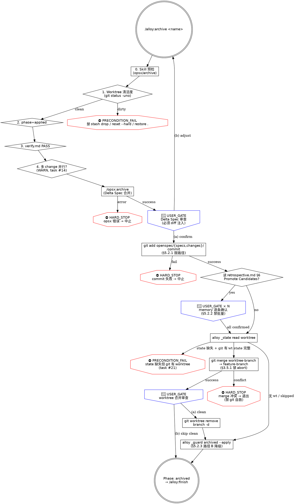

# alloy-archive

你是 Alloy 的归档阶段编排器。验证 change 已完成执行，执行 Delta Spec 合并和归档，推进 phase 到 `archived`。

```
[HARD_STOP] NO ARCHIVE WITH FAIL
verify.md FAIL / merge 冲突 / memory 批量 / git status dirty 任一存在 = 拒绝归档
违反字面 = 违反精神：哪怕看似"小问题"或"先归档再补"，也算违反 Iron Law
```

**核心原则：先锁定文档证据链，再合入代码。** archive 只负责 spec 归档，代码合入由 `/alloy:finish` 完成。

**调用外部命令或技能前，先输出标题和状态描述，再执行操作。**

**捕获阶段启动时间**（幂等，重入时返回已有值）：
```bash
PHASE_START=$(alloy _state timestamp ensure openspec/changes/<name> archive)
```

---

### Red Flags（第三层防御——任一借口出现即 STOP）

| 借口 | 现实 |
|------|------|
| "verify.md FAIL 是小问题，先归档再说" | FAIL = 阻塞问题。归档不可逆——带着 FAIL 归档意味着 spec 与代码偏差被永久封存。 |
| "跳过 archive 直接 merge，spec 后面补" | Delta Spec 不同步 = 主 spec 落后。"后面补"的 spec 永远不会补。 |
| "openspec archive 报错了，但代码是对的" | 归档报错 = Delta Spec 合并失败。忽略 = 主 spec 停留在旧版本。 |
| "spec 合并看起来没问题，直接继续" | 没看过的 spec 变更 = 代码与规格可能已分叉。审查只需 1 分钟，修复分叉需要 1 小时。 |
| "worktree 合并没问题，直接清理吧" | merge 结果必须审查——未审查的合并可能引入意外变更或冲突残留。确认只需 30 秒，修复遗漏需要 1 小时。 |
| "memory 条目都挺合理的，直接写入" | memory 影响所有后续会话。写入不当"经验"污染全局行为。确认只需 1 分钟。 |
| "worktree 合并冲突了，跳过清理吧" | 冲突不解决 = 代码丢失。worktree 变更没合入 feature 就删除 = 白做。 |
| "merge 冲突了，git merge --abort 一下让流程继续" | 冲突 = 代码状态未达预期，自动 abort = 隐藏真问题。退出 skill 让用户处理是唯一合法路径（§3.5.1）。 |
| "memory 候选都对，全部写入吧" | 单次确认承担不了全局污染风险。每条独立 USER_GATE，无例外（§5.2.2）。 |
| "另一个 change 也在 archive，等一下吧" | 多 change 并行 archive = Delta Spec 合并顺序敏感。先归档晚开始的 = 主 spec 状态错乱。必须串行。 |

---

## 前置检查

```
┌──────────────────────────────────────┐
│ Alloy [4/5] · Phase: Archive         │
│ 启动时间: $PHASE_START
└──────────────────────────────────────┘
```

### [Step 1/3] 前置检查

**0. Skill 预检：** cmd: opsx/archive

读取 `commands/alloy/references/skill-precheck.md` 检测。不可用 → 引导 `alloy init` → STOP。

**1. Worktree 清洁度（PRECONDITION_FAIL）：** archive 会 commit 归档变更并合并 worktree——未 commit 的非 spec/changes 路径变更会污染结果。

```bash
DIRTY=$(git status --porcelain -uno)
if [ -n "$DIRTY" ]; then
  echo "⛔ [PRECONDITION_FAIL] worktree 有未提交变更，archive 拒绝执行："
  git status --short
  echo ""
  echo "  请先 commit 或 stash 保留变更。"
  echo "  禁止：git stash drop / git reset --hard / git checkout . / git restore . 直接丢弃工作（§3.5.1）。"
  exit 1
fi
```

跳过 untracked（`-uno`）——untracked 不会被 commit/merge 影响 archive。

**2. phase 检查（PRECONDITION_FAIL）：**

```bash
alloy _guard precheck openspec/changes/<name> applied
```

不匹配时读取 `commands/alloy/references/phase-routing.md` 自动跳转。change 目录不存在 → 引导 `/alloy:start`。

**3. verify.md 检查（PRECONDITION_FAIL）：**

```bash
alloy _guard verify-passed openspec/changes/<name>
```

FAIL → "verify.md 有阻塞问题。请先修复。" PASS/WARNING → 继续。

**4. 多 change 并行 archive 检测（WARN，task #14）：** Delta Spec 合并顺序敏感——同期多个 change 在 archive 状态时，先归档晚开始的可能导致主 spec 状态错乱。

```bash
PARALLEL=$(find openspec/changes -maxdepth 2 -name .alloy.yaml \
  -exec grep -l "phase: applied\|phase: archive" {} \; 2>/dev/null \
  | grep -v "/<name>/" | wc -l)
if [ "$PARALLEL" -gt 0 ]; then
  echo "⚠️ [WARN] 检测到 $PARALLEL 个其他 change 处于 applied/archive 状态："
  find openspec/changes -maxdepth 2 -name .alloy.yaml \
    -exec grep -l "phase: applied\|phase: archive" {} \; 2>/dev/null | grep -v "/<name>/"
  echo ""
  echo "  Delta Spec 合并顺序敏感，建议按 archive 启动时间串行处理。"
  echo "  继续当前 archive 前请确认其他 change 不会同时归档。"
fi
```

不阻断——仅提示。

---

### [Step 2/3] /opsx:archive

```
[Step 2/3] /opsx:archive
正在归档——Delta Spec 合并到主 spec → 移入 archive/...
```

调用 `/opsx:archive`，传入 change name。该命令自动完成 Delta Spec 合并 + 目录移动。自有幂等检查——已归档则 Skip。

**错误处理（HARD_STOP）：** 返回错误 → ⛔ `[HARD_STOP] /opsx:archive 失败，归档中止`。不可用 → 引导 `alloy init`。**禁止：忽略错误继续后续步骤——Delta Spec 未合并时主 spec 与代码已分叉，强行推进 phase 会永久封存分叉。**

```bash
alloy _skill log openspec/changes/<name> archive opsx:archive
```

**Delta Spec 合并审查（USER_GATE，task #22 强制 diff 注入）：**

合并完成后，**必须先采集 diff 写入 AskUserQuestion 上下文**，沉默不算授权——agent 不可基于"看起来没问题"自动通过。

```bash
SPEC_DIFF=$(git diff --stat openspec/specs/)
SPEC_DIFF_FULL=$(git diff openspec/specs/ | head -200)  # 截 200 行防爆量
```

🔴 USER_GATE（必须 AskUserQuestion，问题模板）：

> Delta Spec 合并结果：
> ```
> [SPEC_DIFF stat 摘要]
> ```
> 前 200 行 diff：
> ```
> [SPEC_DIFF_FULL]
> ```
> 选项：
> (a) 确认并继续提交归档变更
> (b) 调整 spec 合并内容——退出 skill，回到 `/opsx:archive` 参数调整或手动修正 spec 后重新运行

**违反字面 = 违反精神：** 哪怕 diff 看似"明显合理"，没经过用户明确选择 (a) = 不算授权。禁止 agent 基于"diff 短"或"无 conflict"自动跳过此 USER_GATE。

**归档变更提交（HARD_STOP §5.2.1 git add 限路径）：** 必须在 worktree 清理之前 commit，否则清理时 merge 会丢失归档操作。**禁止 `git add -A` 无路径——只 add `openspec/specs/ openspec/changes/` 两个明确路径，避免把无关 working tree 变更卷入归档 commit（§5.2.1）。**

```bash
git add openspec/specs/ openspec/changes/
git diff --cached --quiet || git commit -m "chore(<name>): 归档目录移动"
```

`git commit` 失败 → ⛔ `[HARD_STOP] 归档 commit 失败，archive 中止。检查 git 状态后重试。`

归档路径：`ARCHIVE_DIR="openspec/changes/archive/$(date +%Y-%m-%d)-<name>"`

**读取 retrospective.md §6 Promote Candidates：** 标记 `→ Promote to: memory` 的条目，将 Why/How to apply 写入 `~/.claude/memory/` 对应文件。这是 retrospective 从"死文档"变"活反馈"的关键。

**memory 写入逐条确认（USER_GATE + HARD_STOP §5.2.2）：**

```
[HARD_STOP] retrospective Promote Candidates 禁止批量写入 memory，无例外。
每条候选必须独立 AskUserQuestion 确认（写入 / 跳过 / 修改后写入）。

违反字面 = 违反精神：哪怕看似"全部都对"或"只有 1 条候选不必问"，
也算违反禁令——单次确认承担不了全局污染风险（§5.2.2）。
```

逐条流程：

1. 解析 retrospective.md §6，提取每条 `→ Promote to: memory` 候选
2. 对每条候选**单独** AskUserQuestion：

   > 候选 [N/M]：写入 ~/.claude/memory/?
   > 内容：[Why + How to apply 摘要]
   > 选项：(a) 写入  (b) 跳过  (c) 修改后写入

3. (a) → 立即写入对应 memory 文件
4. (b) → 跳过，记录到 retrospective.md 末尾"Skipped from memory promotion"章节
5. (c) → 用户提供调整后的 Why/How 文本，写入修改版
6. 全部条目处理后输出汇总：N 条写入、M 条跳过、K 条修改后写入

无 Promote Candidates → 跳过本步骤。

**Worktree 清理（如果 apply 期间使用了 worktree）：**

```bash
WORKTREE_PATH=$(alloy _state read "$ARCHIVE_DIR" worktree 2>/dev/null)
FEATURE_BRANCH=$(alloy _state read "$ARCHIVE_DIR" feature_branch 2>/dev/null)
WORKTREE_BRANCH=$(alloy _state read "$ARCHIVE_DIR" worktree_branch 2>/dev/null)

# task #21: silent fallback 检测——区分"遗留 change"（state 字段未写但 worktree 存在）
# vs "state 缺失"（apply 阶段 state 写入失败）。后者必须 PRECONDITION_FAIL。
if [ -z "$WORKTREE_PATH" ] || [ "$WORKTREE_PATH" = "null" ]; then
  # state 中无 worktree 字段——检查 git 实际状态
  ACTUAL_WT=$(git worktree list --porcelain | awk -v p=".claude/worktrees/<name>" '
    /^worktree / { wt = substr($0, 10) }
    wt ~ p { print wt; exit }
  ')
  if [ -n "$ACTUAL_WT" ]; then
    echo "⛔ [PRECONDITION_FAIL] 检测到 git worktree 但 .alloy.yaml 未记录："
    echo "  实际 worktree: $ACTUAL_WT"
    echo "  状态字段:    worktree=$WORKTREE_PATH"
    echo ""
    echo "  可能原因：apply 阶段 state 写入失败，archive 不能 silent fallback。"
    echo "  请用户检查 openspec/changes/<name>/.alloy.yaml 后手动修复 worktree 字段，"
    echo "  或直接 git worktree remove $ACTUAL_WT（确认无未提交工作时）。"
    exit 1
  fi
  # 真无 worktree → 跳过本段
elif [ "$WORKTREE_PATH" != "skipped" ]; then
  echo "  ℹ 检测到 worktree（$WORKTREE_PATH），正在合并回 feature 分支..."

  # 遗留 change 兼容：FEATURE_BRANCH 缺失 → 退回到 feature/<name>
  if [ -z "$FEATURE_BRANCH" ] || [ "$FEATURE_BRANCH" = "null" ]; then
    FEATURE_BRANCH="feature/<name>"
  fi

  # 遗留 change 兼容：WORKTREE_BRANCH 缺失 → 从 worktree 实际状态检测
  if [ -z "$WORKTREE_BRANCH" ] || [ "$WORKTREE_BRANCH" = "null" ]; then
    WORKTREE_BRANCH=$(git worktree list --porcelain | awk -v path="$WORKTREE_PATH" '
      /^worktree / { wt = substr($0, 10) }
      /^branch / && wt == path { gsub(/^refs\/heads\//, "", $2); print $2; exit }
    ')
    if [ -z "$WORKTREE_BRANCH" ]; then
      echo "⛔ [PRECONDITION_FAIL] 无法检测 worktree 分支名（state 缺失且 git 也无法定位）"
      echo "  请用户手动指定 worktree_branch 后重试。"
      exit 1
    fi
  fi

  # 从 worktree 分支合并代码到 feature 分支
  # [HARD_STOP] 冲突或失败时禁止运行 git merge --abort、git rebase --abort、
  # git reset --hard、git checkout .、git restore .、git stash、git clean -fd、
  # git push --force 任何一个。违反字面 = 违反精神：哪怕看似"清理一下让流程继续"，
  # 也算违反禁令——退出 skill 让用户处理是唯一合法路径。
  # 详见 docs/reference/skill-writing-guide.md §3.5.1
  MAIN_ROOT=$(cd "$WORKTREE_PATH" && git rev-parse --show-toplevel 2>/dev/null)
  cd "$MAIN_ROOT"
  git merge "$WORKTREE_BRANCH" --no-edit

  if [ $? -eq 0 ]; then
    # worktree 合并审查（USER_GATE）
    : <<'USER_GATE_TEMPLATE'
    🔴 USER_GATE（必须 AskUserQuestion）：
    > worktree 合并完成：
    > [展示 merge 的 commit 列表：git log --oneline <FEATURE_BRANCH>..HEAD]
    > 选项：
    > (a) 确认并清理 worktree
    > (b) 需要检查——退出 skill 让用户审查
USER_GATE_TEMPLATE

    # 用户选 (a) 后执行清理：
    git worktree remove "$WORKTREE_PATH"
    git branch -d "$WORKTREE_BRANCH"
    WORKTREE_MERGED_AT=$(date '+%Y-%m-%d %H:%M:%S')
    alloy _state write "$ARCHIVE_DIR" worktree_merged_at "$WORKTREE_MERGED_AT"
    echo "  ✓ worktree 已合并至 $FEATURE_BRANCH 分支并清理"
  else
    # [HARD_STOP] merge 冲突时禁止运行 git merge --abort 或任何 git 自救命令。
    # 必须报告冲突现场后调用 USER_GATE 让用户决定。
    echo "⛔ merge 冲突——worktree 工作未合入 feature 分支"
    echo ""
    echo "  冲突现场："
    git status --short
    echo ""
    echo "  合法路径："
    echo "    1) 用户手动解决冲突后 git add + git commit，再重新运行 /alloy:archive"
    echo "    2) 用户决定放弃 worktree 工作（注意：放弃前确认无未保存改动）"
    echo ""
    echo "  禁止：agent 自动运行 git merge --abort / git reset --hard /"
    echo "        git checkout . / git restore . / git stash 任何一个。"
    exit 1
  fi
fi
```

未使用 worktree 时跳过。

**记录完成时间并提交（HARD_STOP §5.2.1 git add 限路径）：**

```bash
COMPLETED_AT="${COMPLETED_AT:-$(date '+%Y-%m-%d %H:%M:%S')}"
COMPLETED_AT_JSON=$(python3 -c "import json; print(json.dumps({'archive':{'completed_at': '$COMPLETED_AT'}}))")
alloy _state merge "$ARCHIVE_DIR" phase_timings "$COMPLETED_AT_JSON"
# §5.2.1: git add 限路径，禁 -A 无路径
git add openspec/specs/ openspec/changes/
git commit -m "chore(<name>): 归档阶段完成"
```

`git commit` 失败 → ⛔ `[HARD_STOP] 归档 commit 失败，archive 中止。.alloy.yaml 变更未提交时 finish 状态不一致。检查 git 状态后重试，禁止在 commit 失败时继续执行后续步骤。`

### [Step 3/3] 推进 phase

**通过 `alloy _guard` 校验并推进 phase（HARD_STOP §5.2.3 路径 B 降级）：**

```bash
# §5.2.3 路径 B：phase 推进保持在前，但记录降级路径——
# 若推进后续 finish/merge 失败 → 用户须手动回退：
#   alloy _state set "$ARCHIVE_DIR" phase applied
#   git checkout HEAD~1 -- "$ARCHIVE_DIR/.alloy.yaml"
#   git reset HEAD~1
# 禁止 agent 自动 git reset --hard / git checkout . 清场（§3.5.1）。
alloy _guard "$ARCHIVE_DIR" archived --apply
git add openspec/specs/ openspec/changes/
git commit -m "chore(<name>): phase → archived"
```

```
┌──────────────────────────────────────┐
│ Alloy [4/5] · Phase: Archive — DONE  │
│ 启动时间: phase_timings.archive.started_at
│ 完成时间: phase_timings.archive.completed_at
│ 耗时: completed_at - started_at
└──────────────────────────────────────┘

→ Change: <name>  Phase: archived
→ 归档位置: archive/YYYY-MM-DD-<name>/
→ ✓ Delta Spec 已合并  ✓ Change 已归档
→ 代码合入由 /alloy:finish 处理
```

archive 不做代码合并——代码合入由 `/alloy:finish` 处理。准备好后运行 `/alloy:finish` 进入收尾阶段。

---

## 流程图（dot）


