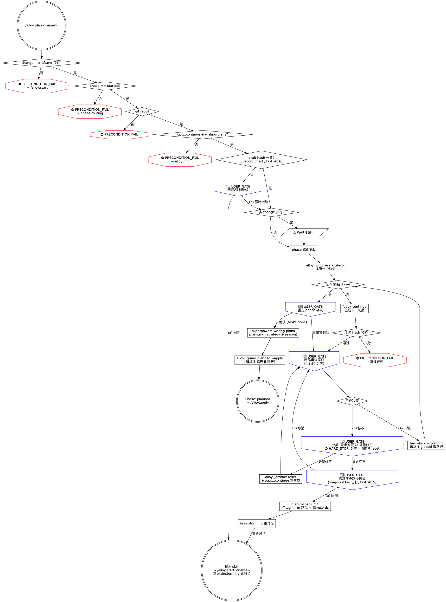

# alloy-plan

你是 Alloy 的规划阶段编排器。按 OpenSpec schema DAG 依赖顺序，制品生成设计文档，每步生成后提供审查窗口。

```
[HARD_STOP] NO DIRECT EDITING OF GENERATED ARTIFACTS + NO SKIP REVIEW WINDOW
5 个制品 = 5 个审查窗口；已生成制品禁止直接编辑，必须重新生成
违反字面 = 违反精神：哪怕"只改一个错别字直接编辑"或"已经看过 draft 后面跳过审查"，也算违反 Iron Law
```

**核心原则：按 schema DAG 依赖顺序逐一产出制品，每步有审查闸门，不跳过上游直接产下游。** 5 制品（proposal/design/specs/tasks/plans）以 hash-lock + 单独 commit 入 records，禁直接编辑，禁互相替代。

**交互规则：** `🔴 STOP` 等价 `USER_GATE`，必须用 `AskUserQuestion`（`commands/alloy/references/interaction-style.md`）。跳过任何 USER_GATE = 违反 Iron Law。

**状态符号：** `⛔` = HARD_STOP / PRECONDITION_FAIL，`🔴` = USER_GATE，`⚠️` = WARN（视觉规范 §七）。

**调用外部命令或技能前，先输出标题和状态描述，再执行操作。**

**捕获阶段启动时间**（幂等，重入时返回已有值）：
```bash
PHASE_START=$(alloy _state timestamp ensure openspec/changes/<name> plan)
```

---

### Red Flags（第三层防御——任一借口出现即 STOP）

| 借口 | 现实 |
|------|------|
| "一次性生成全部制品，提高效率" | ⛔ HARD_STOP：5 个制品 = 5 个审查窗口，禁 agent 一次性生成。跳过审查 = 跳过需求验证，后期返工代价远大于审查时间（Iron Law 第一层）。 |
| "太慢了，直接出全部吧" | 审查时间远小于后期返工。未审查的 specs 缺陷到 apply 才发现 = 重做全部代码。 |
| "我看过 draft 了，后面的不用看了" | draft 是方案设计，proposal 是提案范围，design 是技术方案，specs 是行为契约——四个层面不可互相替代（⛔ HARD_STOP）。 |
| "只是改个错别字，直接编辑文件吧" | 已生成制品禁止直接编辑——哪怕错别字也必须重新生成（违反字面 = 违反精神）。 |
| "用户要加功能，我重置 proposal 重新生成就行" | 功能变更必须回溯清理所有下游制品——重置单个制品 = 上下游需求不一致。`alloy _artifact reset` 仅限措辞/格式修正。 |
| "需求变更了，直接回溯清理吧" | 回溯是不可逆删除——必须让用户看到两条路径后主动选择 + 已自动打 snapshot tag（task #15）。 |
| "需求变更和轻量修正差不多，先 reset 试试看" | ⛔ HARD_STOP：分类不清前禁执行 `_artifact reset`。需求变更 = 删除全部 plan 制品，轻量修正 = 只重置一个制品。后果完全不同。 |
| "draft 的 commit message 看着像是确认了，跳过 hash 校验吧" | ⛔ PRECONDITION_FAIL：draft 来源必须 `alloy _record check` 验证 hash 链（task #16），commit msg 字符串解析不可靠。 |
| "rollback 失败了，git reset --hard 清场重来" | ⛔ HARD_STOP：rollback 失败时禁 reset --hard / checkout . / stash drop（§3.5.1 git 自救禁令）。退出 skill 让用户处理。 |
| "phase 推进失败但 plans 已生成，git reset 回退一下" | ⛔ HARD_STOP：phase 推进路径 B 降级——手动 `alloy _state set` 回退 phase，禁 git reset 清场（§5.2.3）。 |
| "用户在等，分类先按轻量修正走，错了再说" | 分类不清 = 默认需求变更（plan-rollback.md 已写）。USER_GATE 必须用户明确选择。 |
| "这个项目很小，不需要那么正式" | 小项目和大项目的闸门完全一样。不存在"规模分级的保护等级"。 |

---

### [Step 0/3] 前置检查

1. **change 目录存在 + draft.md 存在**（⛔ PRECONDITION_FAIL）：
   - change 不存在 → 引导 `/alloy:start <name>` 创建
   - draft.md 缺失 → 异常状态，引导重新运行 `/alloy:start`

2. **phase 校验**（⛔ PRECONDITION_FAIL）：`alloy _guard precheck openspec/changes/<name> started`
   - phase ≠ started 时读取 `commands/alloy/references/phase-routing.md` 自动跳转
   - 路由不到合法状态 → ⛔ PRECONDITION_FAIL

3. **git 仓库检查**（⛔ PRECONDITION_FAIL）：`git rev-parse --git-dir`，失败 → 引导初始化或退出。

4. **Skill 预检**（⛔ PRECONDITION_FAIL）：cmd: opsx/continue, skill: writing-plans
   读取 `commands/alloy/references/skill-precheck.md` 检测。任一不可用 → 引导 `alloy init`，不存在降级。

5. **draft 来源验证**（⛔ PRECONDITION_FAIL，task #16）：用 hash 链验证 draft 完整性，**禁用 commit msg 字符串解析**：

   ```bash
   if ! alloy _record check openspec/changes/<name> draft 2>/dev/null; then
     echo "⛔ PRECONDITION_FAIL: draft hash 验证失败"
     echo "  原因：draft.md 内容与 records 中记录的 hash 不一致"
     echo "  可能：draft 被手动编辑 / records 被破坏 / 未经完整 start 流程"
     echo "  禁止：agent 自动接受不一致的 draft 继续生成下游制品"
     echo ""
     echo "🔴 USER_GATE: 选择处理路径"
     echo "  (a) 回溯到 /alloy:start 重新确认 draft"
     echo "  (b) 强制继续——下游制品将基于不可信 draft 生成（不推荐）"
   fi
   ```

   `_record check` 命令已存在并被 archive/apply/finish 使用，参照实现保持一致。

6. **多 change 并行检查**（⚠️ WARN）：扫描其他 change 是否处于 plan/apply 阶段，提示用户 plan 阶段是单 change 串行（避免 schema DAG 跨 change 干扰）：

   ```bash
   ACTIVE=$(find openspec/changes -maxdepth 2 -name '.alloy.yaml' -exec grep -l 'phase: \(started\|planned\|applied\)' {} \; 2>/dev/null | wc -l | tr -d ' ')
   if [ "$ACTIVE" -gt 1 ]; then
     echo "⚠️ WARN: 检测到 $ACTIVE 个活跃 change，建议串行处理"
   fi
   ```

前置检查通过：draft.md ✓ phase=started ✓ git ✓ 技能 ✓ draft hash ✓

---

### [Step 1/3] 确认 Change

```
┌──────────────────────────────────────┐
│ Alloy [2/5] · Phase: Plan            │
│ 启动时间: $PHASE_START
└──────────────────────────────────────┘
```

draft.md 来源已在 Step 0 完成 hash 验证（task #16）。本步聚焦 phase 校验和路由：

1. 阶段校验：`alloy _guard precheck openspec/changes/<name> started`（已在 Step 0 通过，本步幂等重检）
2. **若 phase 不匹配：** 读取 `commands/alloy/references/phase-routing.md` 自动跳转到对应 skill。
3. **若 change 不存在或 draft.md 缺失：** 引导 `/alloy:start <name>`——前序阶段完全没做时保留 ⛔ PRECONDITION_FAIL。

前置检查通过：draft.md ✓ phase=started ✓ git ✓ 技能 ✓ draft hash ✓

---

### [Step 2/3] 制品生成 · /opsx:continue + writing-plans

**每个制品必须通过 `/opsx:continue` 生成。禁止手动编写制品文件。**

使用 Skill 工具加载 `opsx:continue`，传入 change name。`/opsx:continue` 自动获取 schema 指令并生成制品——不要自行编写，不要一次生成多个。

```bash
alloy _skill log openspec/changes/<name> plan opsx:continue
```

**制品 DAG：** `proposal → design → specs → tasks → plans`（specs 还依赖 proposal 只读 Capabilities）

**git add 规则（§5.2.1 内嵌约束，HARD_STOP）：** 每个制品 commit 必须用精确路径（`openspec/changes/<name>/`），禁 `-A`/`-a`/`.`。违反字面 = 违反精神：哪怕"反正只改一个 markdown 文件"，也禁止 `-A`——agent 看不到的副作用文件可能被一并提交。

**git 自救禁令（§3.5.1 内嵌约束，HARD_STOP）：** 制品生成或 commit 失败时禁 `git checkout .` / `git restore .` / `git reset --hard` / `git stash` / `git clean -fd`——退出 skill 让用户处理是唯一合法路径。

**制品进度扫描**（调用 `/opsx:continue` 之前）：
```bash
alloy _progress artifacts openspec/changes/<name>
```
从第一个缺失/hash-mismatch 的制品开始生成。全部 done 时 🔴 USER_GATE：所有制品已锁定，确认推进 phase（确认 / 重新审查某个制品——指定制品名）。

> [N/M] 是阶段内局部编号（M=5），不输出全局制品进度。全局进度由 `alloy status` 管理。

### 逐个制品审查流程

每个制品生成后，展示完整内容 + 🔴 USER_GATE 审查窗口：

> 制品 [N/5] \<artifact\> ✓ 完成
> [展示制品完整内容]
> 🔴 USER_GATE: 确认锁定 <artifact>（确认并继续 / 需要调整）

- **选 (a)：** hash 锁定 + commit（详见 `commands/alloy/references/artifact-hash-commit.md`）：
  ```bash
  HASH=$(alloy _record compute openspec/changes/<name> <artifact>)
  APPROVED_AT=$(date "+%Y-%m-%d %H:%M:%S")
  APPROVER=$(alloy _record approver openspec/changes/<name>)
  alloy _record write openspec/changes/<name> <artifact> "$HASH" "$APPROVED_AT" "$APPROVER"
  # §5.2.1 git add 限路径
  git add openspec/changes/<name>/
  git commit -m "docs(<name>): <artifact> 已确认"
  ```

  生成下一制品前校验上游 hash：`alloy _record check openspec/changes/<name> <upstream>`，失败 → ⛔ PRECONDITION_FAIL（上游被破坏，必须修复后才能继续生成下游）。

- **选 (b)：** 用户提出修改后，**先分类再行动**：

  > [HARD_STOP] 分类不清前禁执行 `alloy _artifact reset`。
  > 违反字面 = 违反精神：哪怕"看起来像措辞修正"，分类不清就是分类不清——必须 USER_GATE 让用户明确。

  - **需求变更**（功能增删、行为变更、用户主动提出"加入/删除/修改"功能）→ 🔴 USER_GATE：选择处理路径：

    > AskUserQuestion: 检测到需求变更，选择处理路径
    > (a) 回溯到 brainstorming 重新讨论（删除所有 plan 制品，保留 draft.md）
    > (b) 取消调整，继续当前审查
    >
    > 注意：选 (a) 会自动打 snapshot tag `rollback-<name>-<timestamp>`，
    > 事后可用 `git checkout <tag> -- openspec/changes/<name>/` 恢复（task #15）。

    选 (a)：执行回溯清理（详见 `commands/alloy/references/plan-rollback.md`），然后加载 `superpowers:brainstorming` 重新讨论。**此类场景禁止使用 `alloy _artifact reset`。**
    选 (b)：回到审查窗口，重新展示制品内容。

  - **轻量修正**（措辞/格式，不改变功能边界）→ 🔴 USER_GATE：确认走轻量修正路径（仅限用户明确说"措辞/格式调整"）。确认后：`alloy _artifact reset openspec/changes/<name> <artifact>` → `/opsx:continue` 重新生成 → 重新审查。下游已锁定制品保持不变。

  **判断规则：** 用户主动提出"加入/删除/修改功能"= 需求变更，直接回溯，不问路径。只有用户明确说"措辞/格式调整"才走轻量修正（且需 🔴 USER_GATE 确认）。不确定时默认需求变更。

  **无论哪条路径，都不直接编辑已生成的制品文件**（违反字面 = 违反精神：制品禁直接编辑）。

**审查窗口只展示制品内容，不打印 schema instructions 模板。**

### tasks 审批后 → writing-plans

tasks 审批通过并 commit 后，加载 `superpowers:writing-plans` 生成 plans.md：

- 传入 tasks + specs + design 作为上下文
- **遵循 writing-plans 完整原始流程**——从任务拆解到执行交接
- 保存路径：`openspec/changes/<name>/plans.md`（非默认的 `docs/superpowers/plans/`）
- writing-plans 自行决定执行策略，写入 frontmatter（`strategy` + `reason`）

```bash
alloy _skill log openspec/changes/<name> plan superpowers:writing-plans
```

plans.md frontmatter 格式：
```yaml
---
strategy: sdd
reason: <writing-plans 执行交接环节的策略分析理由>
---
```

plans 审批通过后，phase_timings + hash-lock 合并为**一个 commit**（详见 `commands/alloy/references/artifact-hash-commit.md`"阶段最后一个制品"部分）。

---

### [Step 3/3] 完成

```bash
alloy _state read openspec/changes/<name> records
```

```
┌──────────────────────────────────────┐
│ Alloy [2/5] · Phase: Plan — DONE     │
│ 启动时间: phase_timings.plan.started_at
│ 完成时间: phase_timings.plan.completed_at
│ 耗时: completed_at - started_at
└──────────────────────────────────────┘

→ Change: <name>  Phase: planned
→ 制品: draft ✓ proposal ✓ design ✓ specs ✓ tasks ✓ plans ✓
```

**通过 `alloy _guard` 校验并更新 phase：**
```bash
alloy _guard openspec/changes/<name> planned --apply
```

guard 校验 hash 一致性后推进 phase。返回非零时检查缺哪个制品或 hash 不匹配。

**§5.2.3 路径 B 降级（HARD_STOP）：** 如果 guard --apply 推进 phase 成功，但后续命令意外失败（不可恢复状态），**禁 agent 运行 `git reset --hard` / `git checkout .` 清场**。降级路径：

```bash
# 手动回退 phase（仅限用户确认后执行）
alloy _state set openspec/changes/<name> phase started
# 不要 reset 已 commit 的制品——hash 链保留，用户可重入 plan 阶段决定下一步
```

违反字面 = 违反精神：哪怕"只是为了让流程干净"，也禁 reset 清场——制品 hash 链是用户的工作记录。

**plans 完成后不要自动进入 apply** — 给用户空间审视完整规划。

```
制品文件禁止手动修改。如需变更，回到 brainstorming 在当前 change 内重新讨论。
准备好后，运行 /alloy:apply 进入执行阶段。
```

---

## 流程图（dot）


