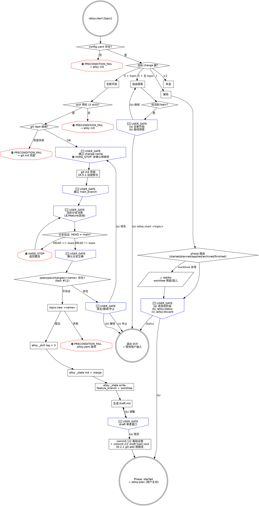

# alloy-start

你是 Alloy 工作流的智能入口。检测状态、路由到正确流程、调度外部技能完成探查和需求设计，产出 draft.md。

**核心原则：把实际工作委托给专门的技能，不要自己做。Alloy 是编排器，不是执行者。** draft.md 以 hash-lock + commit 入 records，禁直接编辑。

```
[HARD_STOP] NO WORK ON MAIN BRANCH + NO AUTO ADVANCE
每个 change 必须在独立 feature 分支上；start 完成后绝不自动进 plan
违反字面 = 违反精神：哪怕"用户在催赶时间在 main 上先建文件"或"用户上次也是接 plan 这次猜跳过 USER_GATE"，也算违反 Iron Law
```

> **`<TIMESTAMP>`：** 每次渲染阶段头部时执行 `date "+%Y-%m-%d %H:%M:%S"` 获取本地时间。`<START_TIME>` 是"全新开始"路径中捕获的时间——agent 捕获后复用于 header 和 phase_timings。`<created_at>` 从 `.alloy.yaml` 读取。

**交互规则：** `🔴 STOP` 等价 `USER_GATE`，必须用 `AskUserQuestion`（`commands/alloy/references/interaction-style.md`）。跳过任何 USER_GATE = 违反 Iron Law。

**状态符号：** `⛔` = HARD_STOP / PRECONDITION_FAIL，`🔴` = USER_GATE，`⚠️` = WARN（视觉规范 §七）。

---

### Red Flags（第三层防御——任一借口出现即 STOP）

| 借口 | 现实 |
|------|------|
| "不用建分支了，就在 main 上干吧" | ⛔ HARD_STOP：主分支污染不可逆。建分支只需 2 秒。违反字面 = 违反精神：哪怕"只是先建个目录后面再切"也算（Iron Law 第一层）。 |
| "分支创建是可选步骤" / "用户没提分支" | 分支创建是硬性闸门——没有验证，后续步骤全部禁止。闸门默认生效，不需要用户主动请求。 |
| "项目简单/一个人开发，不需要分支" | 分支保护的是 discard 安全性，不是团队协作。简单项目一样需要——否则 discard 丢失主分支无关变更。 |
| "不用 brainstorming，直接写代码" | brainstorming 不可跳过。跳过需求设计 = 规格和代码分叉的起点。 |
| "brainstorming 完成了，写 spec 文件吧" | Alloy start 的产出是 draft.md，不是 docs/superpowers/specs/。brainstorming 完成后直接输出方案，由 Alloy 流程生成 draft.md。 |
| "start 完成了，直接进 plan" / "用户没回复，我先继续" | ⛔ HARD_STOP：start 完成后绝不自动进入 plan。沉默 ≠ 授权（Iron Law 第二层）。替用户做阶段转换 = 剥夺审查机会。 |
| "draft.md 讨论过了，直接 commit" | brainstorming 讨论的是概念，draft.md 是最终文本。必须展示完整内容，等用户 USER_GATE 确认。 |
| "openspec/changes/<name>/ 已经有了，直接复用" | ⛔ PRECONDITION_FAIL：目录已存在 = #12 冲突。USER_GATE 让用户决策（改名 / 接续 / 中止），禁 agent 自动复用——可能覆盖用户既有工作。 |
| "/opsx:new 失败了，git mkdir 凑合一下" | ⛔ PRECONDITION_FAIL：opsx:new 是 schema 闸门，手工 mkdir 绕过制品 DAG 验证——退出 skill 引导用户排查。 |
| "change name 还没确认，先把分支建了" | ⛔ HARD_STOP：change name 未确认前禁继续步骤 2-9。违反字面 = 违反精神：哪怕"反正 name 大概就这个"。 |
| "git init 后 reset --hard 一下，把环境清干净" | ⛔ HARD_STOP：git 初始化失败禁 reset --hard / clean -fd / checkout .（§3.5.1 git 自救禁令）。退出 skill 让用户处理。 |
| "用户没明确选 (a) 但意思就是进 plan，加载吧" | 沉默 ≠ 授权。USER_GATE 必须明确选择 (a)，不接受推断（Iron Law 第二层）。 |

---

## 状态检测（前置门）

**第一步**（⛔ PRECONDITION_FAIL）：检查 `openspec/config.yaml` 是否存在——不存在则提示用户 `alloy init`，agent 不得自动初始化（init 会写 `.claude/` / 模板等关键文件，必须由用户主动触发）。

**第二步：** 扫描 `openspec/changes/*/.alloy.yaml`，统计 phase != `finished` 的 change，作为路由依据：
- 0 个活跃 change + 提供 topic → 全新开始
- 0 个活跃 change + 无 topic → 自由探索
- 1 个活跃 change → 接续
- 多个活跃 change → 多选

**第三步**（⛔ PRECONDITION_FAIL）：「全新开始」与「强制新建」路径强制 Skill 预检——cmd: opsx/explore opsx/new, skill: brainstorming。读取 `commands/alloy/references/skill-precheck.md` 检测，任一不可用 → 引导 `alloy init`，不存在降级。

**第四步**（⛔ PRECONDITION_FAIL）：「全新开始」与「强制新建」路径强制 git 仓库就绪——`git rev-parse --git-dir` 失败时尝试 `git init` 兜底（详见全新开始步骤 2）；兜底失败 → 退出 skill。

---

## 全新开始（无活跃 change + 用户提供了 topic）

**捕获阶段启动时间：**
```bash
date "+%Y-%m-%d %H:%M:%S"
```
> 不要混用 bash 变量——bash 状态在两次工具调用间不持久。直接捕获 date 输出文本。

```
┌──────────────────────────────────────┐
│ Alloy [1/5] · Phase: Start           │
│ 启动时间: <START_TIME>
└──────────────────────────────────────┘
```

> **前置门：** Skill 预检 + git 仓库就绪已在「状态检测」第三/四步完成（⛔ PRECONDITION_FAIL）。本路径假设两者已通过。

### [Step 1/2] 上下文探查

加载 `opsx:explore` 技能，按其指引探索项目上下文。

**交互风格：** 使用 `AskUserQuestion` 工具。详见 `commands/alloy/references/interaction-style.md`。

**额外上下文：** 扫描 `openspec/changes/archive/` 下最近 3 个 `retrospective.md`，提取 §5 意外发现、§6 值得推广、§4 技能跳过模式，作为本次 brainstorming 参考。

---

### [Step 2/2] 需求设计

加载 `superpowers:brainstorming` 技能，传入探查结果和主题：

```
探查结果：<Step 1 关键发现摘要>
主题：<topic>
项目类型：<新项目/存量项目>

**Alloy 流程覆盖：** 本调用在 Alloy start 流程内，brainstorming 完成后产出是 draft.md
（openspec/changes/<name>/draft.md），不是 docs/superpowers/specs/ 文件。
请跳过 brainstorming checklist 中的"Write design doc"和"Invoke writing-plans"步骤。

**交互风格：** 使用 AskUserQuestion 组件，不用纯文本 (a)(b)(c)。
单选用 radio，多选用 checkbox，代码方案对比用 preview。
每次提问不超过 4 个问题，相关问题合并到一次调用。
给出默认推荐——推荐选项在 description 中标注理由。
```

**用户确认方案后，生成 draft.md**（不是 spec 文件）。用户要求调整时回到 brainstorming 继续。

```markdown
# [功能名称]

## Why
<!-- 要解决的问题 -->

## What
<!-- 方案概述 -->

## 关键决策
<!-- brainstorming 中确定的关键技术决策及理由 -->

## 范围与边界
<!-- 做什么、明确不做什么 -->
```

> [HARD_STOP] **用户明确确认方案之前，不要生成 draft.md。**
> 违反字面 = 违反精神：哪怕"内容已经基本明确再补审查"，也算违反——审查窗口是 USER_GATE，不可后置。

---

用户确认方案后，执行以下步骤：

> **git 自救禁令（§3.5.1 内嵌约束，HARD_STOP）：** 步骤 2 git init / 步骤 3 分支创建/切换 / 步骤 9 commit 任何环节失败，禁 agent 运行 `git reset --hard` / `git checkout .` / `git restore .` / `git stash` / `git clean -fd` / `git push --force` —— 退出 skill 让用户处理是唯一合法路径。
>
> **git add 限路径（§5.2.1 内嵌约束，HARD_STOP）：** 所有 commit 用精确路径（`.claude/` `openspec/` `CLAUDE.md` 等明确列举），禁 `-A`/`-a`/`.`。违反字面 = 违反精神：哪怕"反正只改了已知文件"，也禁通配——可能把 `.superpowers/` 临时目录或测试残留一并 commit。

1. **建议 change name**——kebab-case，🔴 USER_GATE: 确认 change name（建议名 / 自定义）。

   > [HARD_STOP] **未确认时禁止继续步骤 2-9。**
   > 违反字面 = 违反精神：哪怕"name 大概就这个先建分支"，也算违反——name 是 directory + branch + records 主键。

2. **确保 git 仓库就绪：**
   ```bash
   if ! git rev-parse --git-dir 2>/dev/null; then
     git init
     git add .claude/ .gitignore openspec/config.yaml openspec/schemas/ 2>/dev/null
     [ -f CLAUDE.md ] && git add CLAUDE.md 2>/dev/null
     git commit -m "chore: alloy init 项目初始化"
   fi
   ```

3. **分支选择**——创建 change 目录之前完成，确保所有制品落在 feature 分支上：

   **① 主分支检测：** 读取 `commands/alloy/references/main-branch-detection.md`。若 config 已有 `main_branch`，直接用。否则检测后 🔴 USER_GATE: 确认主分支（检测值 / 自定义）。确认后写入并提交（§5.2.1 git add 限路径）：
   ```bash
   alloy _config write . main_branch <确认值>
   git add openspec/config.yaml
   git diff --cached --quiet || git commit -m "chore: 配置主分支"
   ```

   **② 当前分支决策**（🔴 USER_GATE，3 种情况共用同款语义节点）：
   ```bash
   CURRENT_BRANCH=$(git branch --show-current)
   ```

   - **在主分支上** → ⛔ HARD_STOP："不允许在主分支开发。" → 🔴 USER_GATE: 只展示"新建分支"
   - **在 feature 分支且名称含 change 名** → 🔴 USER_GATE: 继续使用当前分支 / 新建分支
   - **在非主分支的已有分支上** → 🔴 USER_GATE: 切换到已有分支 / 新建分支

   无可用本地非主分支时 → 直接新建。

   新建分支命名：默认 `feature/<change-name>`，用户可自定义。校验不允许与主分支同名。`git checkout -b <branch-name>`

   **③ 分支验证（⛔ HARD_STOP）：** 创建/切换后必须验证才能继续：
   ```bash
   CURRENT=$(git branch --show-current)
   echo "当前分支: $CURRENT | 主分支: $MAIN_BRANCH"
   ```
   `$CURRENT` = `$MAIN_BRANCH` → ⛔ HARD_STOP，返回重新选择
   `$CURRENT` ≠ `$MAIN_BRANCH` → 🔴 USER_GATE: 确认分支状态正确

   > [HARD_STOP] **未通过验证或用户未确认时，禁止执行步骤 4-9。**

3.5. **opsx:new 目录冲突预检**（⛔ PRECONDITION_FAIL，task #12）

   ```bash
   if [ -d "openspec/changes/<name>" ]; then
     echo "⛔ PRECONDITION_FAIL: openspec/changes/<name> 已存在"
     echo "  可能原因：name 已被占用 / 旧 change 残留 / 多 session 并发"
     echo "  禁止：agent 自动覆盖（rm -rf）或自动复用——可能丢失用户既有工作"
   fi
   ```

   🔴 USER_GATE: 选择处理路径
   - (a) 改用其他 name → 回步骤 1 重新建议 change name
   - (b) 接续已有 change → 退出 start，引导用户跑 `/alloy:start`（无 topic）触发"接续"路径
   - (c) 中止本次 /alloy:start

   > [HARD_STOP] agent 不得自动选 (a) / (b) / (c)——必须由用户明确决策。
   > 违反字面 = 违反精神：哪怕"目录看起来是空的"或"看起来是上次中断的"，也禁 agent 自动复用。

4. **调用 `/opsx:new <name>`** 创建 change 目录（前置：步骤 3 ③ 验证已通过 + 步骤 3.5 目录冲突已解决）

   调用后验证创建结果：
   ```bash
   if [ ! -f "openspec/changes/<name>/.alloy.yaml" ]; then
     echo "⛔ PRECONDITION_FAIL: /opsx:new 创建失败——.alloy.yaml 缺失"
     echo "  退出 skill 让用户排查 opsx 命令"
     exit 1
   fi
   ```

5. **批量记录技能使用：**
   ```bash
   alloy _skill log openspec/changes/<name> start opsx:explore && \
   alloy _skill log openspec/changes/<name> start superpowers:brainstorming && \
   alloy _skill log openspec/changes/<name> start opsx:new
   ```

6. **写入 state：**
   ```bash
   alloy _state init openspec/changes/<name>
   alloy _state merge openspec/changes/<name> phase_timings "{\"start\":{\"started_at\":\"$(date '+%Y-%m-%d %H:%M:%S')\"}}"
   ```

7. **记录分支信息：**
   ```bash
   alloy _state write openspec/changes/<name> feature_branch <branch-name>
   alloy _state write openspec/changes/<name> worktree null
   ```

8. **生成 `draft.md`** 到 `openspec/changes/<name>/draft.md`

   **draft.md 审查窗口——start 阶段唯一的制品闸门：**

   > 制品 draft ✓ 完成
   > [展示 draft.md 完整内容]
   > 🔴 USER_GATE: 确认锁定 draft（确认并继续提交 / 需要调整回 brainstorming）

   选确认 → 步骤 9；选调整 → 回到 Step 2/2 brainstorming。

9. **提交——仅用户确认锁定后，执行以下 2 个 commit：**

   **commit 1/2——基础设施（幂等，已提交则跳过；§5.2.1 git add 限路径）：**
   ```bash
   git add .claude/ .gitignore openspec/config.yaml openspec/schemas/ 2>/dev/null
   [ -f CLAUDE.md ] && git add CLAUDE.md 2>/dev/null
   git diff --cached --quiet || git commit -m "chore: alloy init 项目初始化"
   ```

   **commit 2/2——draft hash-lock + .alloy.yaml 变更（§5.2.1 git add 限路径）：**
   ```bash
   COMPLETED_AT=$(date "+%Y-%m-%d %H:%M:%S")
   alloy _state merge openspec/changes/<name> phase_timings "{\"start\":{\"completed_at\":\"${COMPLETED_AT:-$(date '+%Y-%m-%d %H:%M:%S')}\"}}"
   DRAFT_HASH=$(alloy _record compute openspec/changes/<name> draft)
   APPROVED_AT=$(date "+%Y-%m-%d %H:%M:%S")
   APPROVER=$(git config user.name)
   alloy _record write openspec/changes/<name> draft "$DRAFT_HASH" "$APPROVED_AT" "$APPROVER"
   git add openspec/changes/<name>/
   git commit -m "docs(<name>): draft 已确认"
   ```

   前面步骤写入的 `.alloy.yaml` 变更在 draft commit 中一并提交。

---

### 完成

```
┌──────────────────────────────────────┐
│ Alloy [1/5] · Phase: Start — DONE    │
│ 启动时间: phase_timings.start.started_at
│ 完成时间: phase_timings.start.completed_at
│ 耗时: completed_at - started_at
└──────────────────────────────────────┘

→ Change: <name>  Phase: started
→ 制品: draft ✓
```

> [HARD_STOP] **start 阶段到此结束。**
> 不要自动运行 `/alloy:plan`，不要生成 plan 阶段制品，不要调用 `opsx:continue` 或 `writing-plans`。
> 违反字面 = 违反精神：哪怕"用户上次也是接 plan 这次猜跳过 USER_GATE"或"draft 已锁定流程很顺"，也算违反 Iron Law（NO AUTO ADVANCE）。
> **你的唯一操作：展示完成信息，等待用户输入下一个命令。**

> **§5.2.3 路径 B 边界说明：** start 是 phase 推进起点（无前序 phase），phase=started 写入失败时降级路径只有"重跑 /alloy:start"——不存在 phase 回退场景。本阶段无 §5.2.3 适用空间。

---

## 自由探索（无活跃 change + 无 topic）

```
┌──────────────────────────────────────┐
│ Alloy [1/5] · Phase: Start           │
│ 启动时间: <TIMESTAMP>
└──────────────────────────────────────┘
```

扫描项目上下文（README、代码、requirement.md 等）。

**有上下文：** 总结项目信息，给 2-3 个建议方向，帮用户明确要做什么。

**空项目：** "项目较新，无上下文。请用 `/alloy:start <topic>` 重新调用，进入完整需求设计流程。"

> 必须让用户重新输入 `/alloy:start <topic>`——只有重新调用命令，alloy:start 技能才会被重新加载。仅输入 topic 文本会导致脱离编排框架，关键闸门被跳过。

**自由探索发现用户有明确 topic 后：**

🔴 USER_GATE: 检测到明确功能需求，请选择：
- (a) 以 "<topic>" 进入全新开始（请输入 `/alloy:start <topic>` 正式开始）
- (b) 继续自由探索

选 (a) 时输出提示文本，Agent 不得直接跳转到"全新开始"流程。

---

## 强制新建（--new <topic>）

无论是否有活跃 change，直接走"全新开始"流程。多个 change 可并行 planning，但不能同时 apply。

---

## 接续（有 1 个活跃 change）

```
┌──────────────────────────────────────┐
│ Alloy [1/5] · Phase: Start           │
│ 启动时间: phase_timings.start.started_at 或 created_at
└──────────────────────────────────────┘

→ 检测到活跃 change：<name>（phase: <phase>）
→ 已完成制品：<列出>
→ 下一步：<建议操作>
```

读取 `.alloy.yaml` + 文件系统确认制品状态，按 phase 路由：

| phase | 制品状态 | 路由 |
|-------|---------|------|
| started | proposal.md 存在 | 🔴 USER_GATE: 选择继续规划（alloy-plan） / 回需求讨论（重新 start） |
| started | draft.md 存在且 hash 有效 | 🔴 USER_GATE: 选择进 plan / 回 brainstorming |
| started | draft.md 缺失或 hash 不匹配 | 重新 brainstorming |
| planned | — | 🔴 USER_GATE: 确认进入 apply 阶段（继续 / 查看状态 / 放弃 change） |
| applied | — | 🔴 USER_GATE: 确认进入 archive 阶段（继续 / 查看状态 / 放弃 change） |
| archived | — | 🔴 USER_GATE: 确认进入 finish 阶段（继续 / 查看状态） |
| finished | — | 工作流已完成 |

**所有 🔴 USER_GATE 的选项模板（同款语义节点，6 phase 共用）：**
- (a) 进入 `<目标阶段>` 继续
- (b) 查看状态（/alloy:status）
- (c) 放弃此 change（/alloy:discard）——仅 planned/applied 阶段可选

**自动跳转仅限**：用户明确选择 (a) 后才加载目标命令。

**需自动加载时：** 输出对应命令文件完整指令，将 change name 和进度信息传入。

**需用户选择时：** 先校验 draft hash（`alloy _record check openspec/changes/<name> draft`），hash 有效 → 展示选择。

一致性检查：
- worktree 字段有值但路径不存在 → ⚠️ WARN 残留
- worktree 为 null 但 `.worktrees/<name>/` 存在 → ⚠️ WARN 孤儿，询问是否修复

---

## 多选（有多个活跃 change）

列出所有活跃 change（名称 + phase + 制品状态），让用户选择接续哪个，或 `--new <topic>` 开新 change。

---

## 流程图（dot）


