# apply.md 阶段 2 完整重写计划

> **For agentic workers:** REQUIRED SUB-SKILL: Use superpowers:subagent-driven-development (recommended) or superpowers:executing-plans to implement this plan task-by-task. Steps use checkbox (`- [ ]`) syntax for tracking.

**Goal:** 按 `docs/reference/alloy-skill-writing-guide.md` §6 检查清单，对 `commands/alloy/apply.md` 做阶段 2 完整重写——frontmatter 迁移到四字段、补三层防御、嵌入通用/项目特定禁令、新增 dot 流程图，吃掉 backlog 3 条剩余隐患（#17 retrospective 跳过判定不严 / #18 worktree 内分支未锁 / #19 stash 残留未提示）。

**Architecture:** 复用 archive.md（commit 30e5256）+ finish.md（commit 0a38d8e）已建立的模板：
- frontmatter 迁移：`stops: 8, hard_stops: 6` → `preconditions / hard_stops / user_gates / warns` 四字段（按 design §2.2）
- 同步迁移 `docs/specification/01-product-spec/03-apply-spec.md` frontmatter（与 skill 完全对账）
- 三层防御补全：第一层 Iron Law 升级 + 步骤就近 HARD_STOP；第二层"违反字面 = 违反精神"；第三层 Red Flags 表扩展到 ≥ 10 行
- 嵌入通用 §3.5.1 git 自救禁令（worktree 操作 / Step 2 commit 前 stash list / verify 失败时不得 reset --hard）
- 嵌入 alloy §5.2.1 git add 路径化（Step 2 SDD/EP 子 agent commit + verify/retrospective commit 三处）
- 嵌入 alloy §5.2.3 phase 推进降级路径 B（Step 5 末尾 phase=applied 推进早于 archive 的降级注释——已是路径 B 的天然位置）
- backlog 隐患吃法：
  - **#17** retrospective 跳过判定不严——line 311 现状 "单 commit 小修可跳过 但 🔴 STOP 确认"，升级为：(a) 用 `git log <feature>..HEAD --oneline | wc -l` 自动判定 commit 数；(b) commit 数 = 1 时仍走 USER_GATE 但默认建议改为"不跳过"，加 HARD_STOP 措辞"agent 不得自动选'跳过'，用户必须明确选择"
  - **#18** worktree 内分支未锁——Step 2 进入任务实现前，新增分支锁定 PRECONDITION_FAIL：`git -C <worktree_path> rev-parse --abbrev-ref HEAD` 必须 = `worktree-<name>`，不匹配 = 子 agent 在错误分支编辑，拒绝继续
  - **#19** stash 残留未提示——Step 2 SDD/EP 各 task commit 前，子 agent 须检查 `git stash list` 非空时输出 ⚠️ WARN "检测到 stash 残留，确认是否需要先 pop / drop"
- dot 流程图：新画 apply 流程图（前置检查 → Step 1 worktree 子图 → Step 2 SDD/EP 双路径 → Step 3 verify → Step 4 verify.md → Step 5 retrospective → 完成）

**Tech Stack:** Markdown skill 文件 + bash 片段 + dot graph + alloy CLI（`_state` / `_guard` / `_record` / `_skill` / `_spec-audit`）

**前置阅读：**
- 通用指南 `docs/reference/skill-writing-guide.md` 完整通读
- alloy 指南 `docs/reference/alloy-skill-writing-guide.md` 完整通读
- design `docs/superpowers/specs/2026-06-13-skills-test-and-rewrite-design.md` §3.4 阶段 2 顺序 3 + §3.5 task 与阶段对应表
- 模板 `commands/alloy/archive.md` + `commands/alloy/finish.md`（两个已重写完成的参考）
- 当前 `commands/alloy/apply.md`（362 行，阶段 1 task #10 已嵌入 line 145-176 worktree 路径占用 PRECONDITION_FAIL）
- spec `docs/specification/01-product-spec/03-apply-spec.md`

**验证策略：**
1. `npm run build` + `npm test` 全量通过
2. `node dist/cli/index.js _spec-audit` 显示 `✓ apply: spec 与 skill 一致`
3. 节点审计——grep 计数与 frontmatter 数字一致
4. 行数 < 500（apply 是最复杂 skill，含 5 制品 + 双路径 + worktree 子图，行数会比 archive/finish 大）
5. 拆 2 commit：(A) spec frontmatter 迁移；(B) skill 完整重写

---

## File Structure

**修改：**
- `commands/alloy/apply.md`（完整重写主体——362 行 → ~480 行含流程图）
- `docs/specification/01-product-spec/03-apply-spec.md`（仅 frontmatter，正文不改）

**不修改：** `src/cli/commands/internal/spec-audit.ts`（archive 重写时已支持四字段）

---

## Task 1: 通读模板与当前 apply.md

**Files:**
- Read: `commands/alloy/archive.md` + `commands/alloy/finish.md`（已完成模板）
- Read: `commands/alloy/apply.md`（含阶段 1 task #10 worktree 占用检查）
- Read: `docs/specification/01-product-spec/03-apply-spec.md`

- [ ] **Step 1: 读 4 个文件，重点确认**

- archive/finish 的 frontmatter 数字、Iron Law 措辞、Red Flags 表风格、dot 流程图风格
- apply 现有阶段 1 内容：line 145-176 worktree 路径占用 PRECONDITION_FAIL + USER_GATE 三选项
- apply 5 步流程：Step 1 隔离 → Step 2 任务实现（SDD/EP 双路径）→ Step 3 verify-before-completion → Step 4 opsx:verify → Step 5 retrospective
- apply 现有节点（节点关键字 grep）：
  - HARD STOP 4 处（line 44 技能缺失 / line 56 git / line 123 on-main / line 255 plans hash / line 303 verify-passed / line 305 verify hash）= 实际 6 处
  - 🔴 STOP 7 处（line 88/95 需求变更 / line 135 worktree consent / line 208 SDD/EP / line 275 verify 审查 / line 311 retrospective 跳过 / line 317 retrospective 审查）
  - PRECONDITION_FAIL 1 处（line 153 worktree 路径占用）
  - ⚠️ 2 处（line 114 stale / line 124 feature-missing）

- [ ] **Step 2: grep 全节点关键字记录基线**

```bash
cd /Users/wenqiu/AIAgent/alloy
grep -nE "PRECONDITION_FAIL|HARD_STOP|HARD STOP|🔴 STOP|⚠️|USER_GATE" commands/alloy/apply.md
```

记录每条匹配作为 Task 2 重组依据。

---

## Task 2: 设计新 frontmatter 数字

**Files:** Plan-only（不改文件）

- [ ] **Step 1: 列出阶段 2 后全部节点（按四类分组）**

**preconditions（PRECONDITION_FAIL，前置/状态校验失败）：**
1. plans.md 不存在
2. phase 路由不在 `planned,applied`（自动跳转）
3. git 仓库不存在
4. Skill 预检失败（6 个 superpowers + 1 个 opsx）
5. 分支位置异常（on-main / feature-missing / feature-lost / on-other 合并为 1 分类，详见 `branch-validation.md`）
6. worktree 路径占用（task #10 阶段 1 已嵌入，line 153）
7. plans 上游 hash 失效（line 255 升级，原 HARD STOP）
8. verify-passed 检查（line 303 升级，原 HARD STOP）
9. verify 上游 hash 失效（line 305 升级，原 HARD STOP）
10. **NEW #18：** worktree 内分支锁——`git -C <worktree> rev-parse --abbrev-ref HEAD` ≠ `worktree-<name>`

合计 **10 个 preconditions**

**hard_stops（HARD_STOP，对 agent 的绝对禁令）：**
1. Iron Law：NO CODE WITHOUT TDD + NO ARTIFACT EDITING（顶部声明，含"违反字面 = 违反精神"）
2. TDD 次序——先写测试再写代码，禁先实现后补测试（Step 2 就近）
3. git add 路径化（§5.2.1）——SDD 子 agent / EP commit / verify commit / retrospective commit 4 处共享，正文 1 处声明
4. spec 已归档不可改（apply 阶段 spec 仍是 draft，但禁修 plans 已锁定段落——保护制品链）
5. verify FAIL 不跳过（Step 3 / Step 4 末尾——验证失败必须修复回到 Step 2，禁 agent "记 deferred 跳过"）
6. retrospective 跳过判定 #17 升级——agent 不得自动判定"single-commit 跳过"，必须 USER_GATE
7. opsx:verify 7 项检查 FAIL 不跳过（Step 4 就近，区别于 verify-passed PRECONDITION_FAIL：HARD_STOP 是禁令，PRECONDITION 是状态）
8. phase 推进失败时禁 reset --hard 清场（§5.2.3 路径 B + §3.5.1 联合）

合计 **8 个 hard_stops**

**user_gates（USER_GATE，必须 AskUserQuestion）：**
1. 需求变更（未编码，line 88）
2. 需求变更（已编码，line 95）
3. worktree consent（line 135——加载 using-git-worktrees Step 0 后）
4. worktree 路径占用三选项（task #10 阶段 1 已嵌入，line 165）
5. SDD vs EP 策略选择（line 208）
6. verify 审查窗口（line 275，确认锁定 / 需要调整）
7. retrospective 跳过决策（line 311，#17 升级，配 HARD_STOP）
8. retrospective 审查窗口（line 317）

合计 **8 个 user_gates**

**warns（WARN，软提示不阻断）：**
1. worktree stale 残留（line 114 升级措辞）
2. 多 change 并行（与 archive/finish 同款，新增于前置检查段）
3. **NEW #19：** stash 残留——Step 2 子 agent commit 前 `git stash list` 非空

合计 **3 个 warns**

**最终 frontmatter：**
```yaml
behaviors:
  preconditions: 10
  hard_stops:    8
  user_gates:    8
  warns:         3
  artifacts: [verify, retrospective]
  transitions_to: applied
  external_calls: [opsx:verify, superpowers:using-git-worktrees, superpowers:subagent-driven-development, superpowers:executing-plans, superpowers:test-driven-development, superpowers:verification-before-completion, superpowers:requesting-code-review]
```

- [ ] **Step 2: 把 4 个数字记录到 Self-Review §1 节点对账表，作为 Task 8 grep 校验依据**

---

## Task 3: 同步 spec 文件 frontmatter

**Files:**
- Modify: `docs/specification/01-product-spec/03-apply-spec.md`（仅前 8 行 frontmatter）

- [ ] **Step 1: Edit frontmatter**

**old_string**：

```
---
behaviors:
  stops: 8
  hard_stops: 6
  artifacts: [verify, retrospective]
  transitions_to: applied
  external_calls: [opsx:verify, superpowers:using-git-worktrees, superpowers:subagent-driven-development, superpowers:executing-plans, superpowers:test-driven-development, superpowers:verification-before-completion, superpowers:requesting-code-review]
---
```

**new_string**：

```
---
behaviors:
  preconditions: 10
  hard_stops:    8
  user_gates:    8
  warns:         3
  artifacts: [verify, retrospective]
  transitions_to: applied
  external_calls: [opsx:verify, superpowers:using-git-worktrees, superpowers:subagent-driven-development, superpowers:executing-plans, superpowers:test-driven-development, superpowers:verification-before-completion, superpowers:requesting-code-review]
---
```

- [ ] **Step 2: 验证 spec 正文未动**

```bash
git diff docs/specification/01-product-spec/03-apply-spec.md
```

预期：仅 frontmatter 行 diff，正文 `# alloy apply 行为规格` 起未变。

---

## Task 4: 重写 apply.md frontmatter + Iron Law + Red Flags

**Files:**
- Modify: `commands/alloy/apply.md` line 1-46（frontmatter + 顶部 Iron Law + Red Flags 表整段替换）

- [ ] **Step 1: Edit 整段替换**

**old_string**（line 1-46，完整覆盖 frontmatter + 简介 + Iron Law 框 + 旧 Red Flags 表）：

```
---
name: "Alloy: Apply"
description: Alloy 执行阶段 - plan 完成后进入
category: Workflow
tags: [alloy, workflow]
spec: 01-product-spec/03-apply-spec.md
behaviors:
  stops: 8
  hard_stops: 6
  artifacts: [verify, retrospective]
  transitions_to: applied
  external_calls: [opsx:verify, superpowers:using-git-worktrees, superpowers:subagent-driven-development, superpowers:executing-plans, superpowers:test-driven-development, superpowers:verification-before-completion, superpowers:requesting-code-review]
---

# alloy-apply

你是 Alloy 的执行阶段编排器。按 plan.md 任务实现，内部遵循 TDD，执行完毕自动验证和复盘。

```
NO CODE WITHOUT TDD + NO ARTIFACT EDITING
先写测试再写代码；已生成制品禁止直接编辑，必须重新生成
```

**交互规则：** `🔴 STOP` = 硬交互确认点，必须用 `AskUserQuestion`（`commands/alloy/references/interaction-style.md`）。跳过任何 🔴 STOP = 违反 Iron Law。

**状态符号：** `✓`/`✗`/`⚠️`（视觉规范 §七）。

**调用外部命令或技能前，先输出标题和状态描述，再执行操作。**

**捕获阶段启动时间**（幂等，重入时返回已有值）：
```bash
PHASE_START=$(alloy _state timestamp ensure openspec/changes/<name> apply)
```

---

### Red Flags——STOP

| 借口 | 现实 |
|------|------|
| "用户说了跳过 worktree" | 隔离是硬闸门，用户跳过 = 跳过安全网。拒绝并解释风险。 |
| "先写代码再补测试" | TDD 次序不可颠倒。提速靠并行子任务，不靠砍测试。 |
| "用户要改需求，直接改" | 需求变更必须走 tasks.md checkbox 闸门。已编码→开新 change，未编码→回溯。 |
| "技能缺失没关系" | 技能是闸门不是加速器。缺失 = HARD STOP。引导 `alloy init`。 |
| "用户很急，跳过 review" | 跳过 review = 跳过质量闸门。急不是绕过流程的理由。 |
| "先建 worktree 再问用户" | consent 必须在创建前。加载技能后停手，等用户明确回复。 |
```

**new_string**（≈ 80 行——新 frontmatter + Iron Law 升级 + Red Flags 表扩展到 12 行）：

````
---
name: "Alloy: Apply"
description: Alloy 执行阶段 - plan 完成后进入
category: Workflow
tags: [alloy, workflow]
spec: 01-product-spec/03-apply-spec.md
behaviors:
  preconditions: 10
  hard_stops:    8
  user_gates:    8
  warns:         3
  artifacts: [verify, retrospective]
  transitions_to: applied
  external_calls: [opsx:verify, superpowers:using-git-worktrees, superpowers:subagent-driven-development, superpowers:executing-plans, superpowers:test-driven-development, superpowers:verification-before-completion, superpowers:requesting-code-review]
---

# alloy-apply

你是 Alloy 的执行阶段编排器。按 plans.md 任务实现，内部遵循 TDD，执行完毕自动验证和复盘。

```
[HARD_STOP] NO CODE WITHOUT TDD + NO ARTIFACT EDITING
先写测试再写代码；已生成制品禁止直接编辑，必须重新生成
违反字面 = 违反精神：哪怕"小改一行 case 不补测试"或"直接编辑 verify.md 换措辞"，也算违反 Iron Law
```

**核心原则：先 TDD 再代码，先验证再复盘。** 所有阶段制品（verify / retrospective）以 hash-lock + 单独 commit 入 records，禁直接编辑。

**交互规则：** `🔴 STOP` 等价 `USER_GATE`，必须用 `AskUserQuestion`（`commands/alloy/references/interaction-style.md`）。跳过任何 USER_GATE = 违反 Iron Law。

**状态符号：** `⛔` = HARD_STOP / PRECONDITION_FAIL，`🔴` = USER_GATE，`⚠️` = WARN（视觉规范 §七）。

**调用外部命令或技能前，先输出标题和状态描述，再执行操作。**

**捕获阶段启动时间**（幂等，重入时返回已有值）：
```bash
PHASE_START=$(alloy _state timestamp ensure openspec/changes/<name> apply)
```

---

### Red Flags（第三层防御——任一借口出现即 STOP）

| 借口 | 现实 |
|------|------|
| "用户说了跳过 worktree" | 隔离是软闸门——`/alloy:apply` 允许 worktree=skipped；但模糊回复（"嗯"/"好"）不算同意，必须 USER_GATE 明确选择。 |
| "先写代码再补测试" | TDD 次序不可颠倒。提速靠并行子任务，不靠砍测试（Iron Law 第一层）。 |
| "用户要改需求，直接改" | 需求变更必须走 tasks.md checkbox 闸门。已编码→开新 change，未编码→回溯，禁直接改 plans.md。 |
| "技能缺失没关系" | 技能是闸门不是加速器。缺失 = ⛔ PRECONDITION_FAIL。引导 `alloy init`，不存在降级。 |
| "用户很急，跳过 review" | 跳过 review = 跳过质量闸门。急不是绕过流程的理由（Iron Law 第二层）。 |
| "先建 worktree 再问用户" | consent 必须在创建前。加载 using-git-worktrees Step 0 后停手，等用户明确回复。 |
| "verify.md 措辞不太顺，直接编辑改一下" | 制品禁直接编辑——任何变更必须重新生成 + 重新 hash-lock。违反字面 = 违反精神。 |
| "verify FAIL 是小问题，retro 写'已知 FAIL'继续" | FAIL 必须修复回到 Step 2。带 FAIL 进 archive 阶段 = spec 与代码偏差永久封存。 |
| "single-commit 修复不需要 retrospective，自动跳过" | retrospective 跳过判定必须 USER_GATE，agent 不得自动选"跳过"（task #17）。 |
| "worktree 内分支看起来对，应该没问题吧" | worktree-<name> 是硬约束。子 agent 在错误分支编辑 = 用户主分支被污染（task #18）。 |
| "git stash list 有内容，但这是之前的不影响 commit" | stash 残留 = 未完成工作。commit 前必须 ⚠️ WARN 让用户确认（task #19）。 |
| "另一个 change 也在 apply，并行做完更快" | apply 单 change 串行（subagent 内部并行 OK）。多 change 同时 apply = git 操作竞争。 |

````

- [ ] **Step 2: 验证关键 token 落地**

```bash
grep -nE "preconditions: 10|hard_stops: +8|user_gates: +8|warns: +3|NO CODE WITHOUT TDD|违反字面 = 违反精神" commands/alloy/apply.md
```

预期 ≥ 6 条匹配。

---

## Task 5: 重写前置检查段（task #14 多 change 并行 WARN）

**Files:**
- Modify: `commands/alloy/apply.md`（"## 前置检查" 起至下一 `---` 之前，约 line 48-78）

- [ ] **Step 1: Read line 47-80 确认精确范围**

- [ ] **Step 2: Edit 整段替换为重写版本**

**核心改动：**
1. 每个前置检查项明确标注 `⛔ PRECONDITION_FAIL`
2. Skill 预检改为"⛔ PRECONDITION_FAIL: skill 缺失，引导 alloy init，不存在降级"
3. 新增多 change 并行 WARN（task #14 同款代码）
4. 标题统一改为"### [Step 0/5] 前置检查"（与 archive/finish 编号风格一致）

具体替换内容由 implementer 参考 finish.md line 60-100 风格组装，保留所有现有逻辑（plan.md 检查 / `alloy _guard precheck` / git rev-parse / skill 列表），仅改措辞与新增 WARN。

- [ ] **Step 3: 验证**

```bash
grep -nE "PRECONDITION_FAIL|⚠️ WARN.*多 change" commands/alloy/apply.md | head -10
```

预期：4 个 PRECONDITION_FAIL（plans / phase / git / 技能）+ 1 个 WARN（多 change 并行）。

---

## Task 6: 重写 Step 1/5 隔离环境（含 task #18 worktree 分支锁）

**Files:**
- Modify: `commands/alloy/apply.md`（"### [Step 1/5] 隔离环境设置" 起至 "### [Step 2/5]" 之前，约 line 104-193）

- [ ] **Step 1: Read 整段确认**

- [ ] **Step 2: Edit 整段替换**

**核心改动（保留阶段 1 task #10 已嵌入内容）：**

1. 顶部加 §3.5.1 git 自救禁令链路声明（worktree add 失败 / branch 创建失败 时禁 agent 自动 reset / clean / worktree prune --force）
2. 分支验证闸门：on-main / feature-missing / feature-lost / on-other 几种分类合并为统一 PRECONDITION_FAIL 描述（详细处理仍指向 `branch-validation.md`）
3. 阶段 1 task #10 worktree 路径占用 PRECONDITION_FAIL（line 145-176）整段保留并升级 emoji 标注
4. **NEW task #18 worktree 分支锁**——在 EnterWorktree 进入后、Step 1 完成框前，新增分支验证 PRECONDITION_FAIL：

````
**Worktree 内分支锁定（PRECONDITION_FAIL，task #18）：**

进入 worktree 后必须验证当前分支与状态记录一致——子 agent 后续在错误分支编辑 = 用户主分支被污染。

```bash
WORKTREE_PATH=$(alloy _state read openspec/changes/<name> worktree)
EXPECTED_BRANCH="worktree-<name>"

if [ "$WORKTREE_PATH" != "skipped" ] && [ -d "$WORKTREE_PATH" ]; then
  ACTUAL_BRANCH=$(git -C "$WORKTREE_PATH" rev-parse --abbrev-ref HEAD 2>/dev/null)
  if [ "$ACTUAL_BRANCH" != "$EXPECTED_BRANCH" ]; then
    echo "⛔ PRECONDITION_FAIL: worktree 内分支 ($ACTUAL_BRANCH) 与预期 ($EXPECTED_BRANCH) 不一致"
    echo "  可能原因：用户在 worktree 内手动切换了分支 / 旧 worktree 残留"
    echo "  禁止：agent 自动 git checkout 切换分支——可能丢弃用户未提交的工作"
    echo "  必须：USER_GATE 让用户决策修复方式"
    exit 1
  fi
fi
```
````

5. 完成框 "Step 1/5 完成" 框保留风格

- [ ] **Step 3: 验证 task #18 已嵌入**

```bash
grep -nE "task #18|EXPECTED_BRANCH|worktree.*分支锁" commands/alloy/apply.md
```

预期 ≥ 3 条匹配。

---

## Task 7: 重写 Step 2/5 任务实现（含 task #19 stash 残留 WARN + §5.2.1 git add 路径化）

**Files:**
- Modify: `commands/alloy/apply.md`（"### [Step 2/5] 任务实现" 起至 "### [Step 3/5]" 之前，约 line 195-232）

- [ ] **Step 1: Read 整段确认**

- [ ] **Step 2: Edit 整段替换**

**核心改动（保留 SDD/EP 双路径 + skill log 调用）：**

1. SDD vs EP 策略选择 USER_GATE 措辞强化（"必须等用户选择后才加载技能"已是好措辞，加 `🔴 USER_GATE` 标识）
2. SDD 路径段：每个子 agent commit 前必须遵守的硬规则插入：
   - **§5.2.1 git add 路径化（HARD_STOP）：** 子 agent 必须用精确路径，禁 `-A`/`-a`/`.`，违反字面 = 违反精神
   - **task #19 stash 残留 WARN：** commit 前 `git stash list` 检查
   - **task #18 分支再校验：** 每个子 agent 任务开始时再次校验当前分支 = `worktree-<name>`（防 subagent 中途切换）
3. EP 路径段：四步显式加载补偿不变，加同款 §5.2.1 + #19 WARN

具体片段示例：

````
**git add 规则（§5.2.1 内嵌约束，HARD_STOP）：** 只用精确路径，不用 `-A`/`-a`/`.`。违反字面 = 违反精神：哪怕"反正只有这一个文件"，也禁止 `-A`——agent 看不到的副作用文件可能被一并提交。commit 前检查 untracked 文件——构建产物（`.vite/`、`dist/`、`node_modules/` 等）追加 `.gitignore`，项目源码按精准路径 add。判断不准时 `🔴 USER_GATE` 询问用户。

**stash 残留检查（⚠️ WARN，task #19）：** commit 前必须运行：

```bash
if [ -n "$(git stash list)" ]; then
  echo "⚠️ WARN: 检测到 stash 残留："
  git stash list
  echo ""
  echo "  stash 残留可能是用户之前未完成的工作。继续 commit 不会丢失 stash，"
  echo "  但用户可能需要先 git stash pop 或 drop。"
  echo "  禁止：agent 自动 stash drop / clear。"
fi
```

WARN 不阻断 commit，但提醒 agent 在 commit 完成后向用户播报 stash 列表，让用户决定后续处理。
````

- [ ] **Step 3: 验证**

```bash
grep -nE "task #19|stash list|§5.2.1|git add 规则" commands/alloy/apply.md
```

预期 ≥ 4 条匹配。

---

## Task 8: 重写 Step 3/5 + Step 4/5（verify 双层验证）

**Files:**
- Modify: `commands/alloy/apply.md`（"### [Step 3/5]" 起至 "### [Step 5/5]" 之前，约 line 234-289）

- [ ] **Step 1: Read 整段确认**

- [ ] **Step 2: Edit 双段升级**

**核心改动：**

1. **Step 3/5 代码层验证：** verify-before-completion 失败时新增"⛔ HARD_STOP: verify 不通过不结束 apply。修复必须 TDD + code review，禁 agent 在 retro 中标记'已知 FAIL'继续"
2. **Step 4/5 制品层验证：**
   - line 255 plans 上游 hash 检查升级措辞为 `⛔ PRECONDITION_FAIL`
   - opsx:verify 7 项失败时新增 HARD_STOP："失败必须修复，禁带 FAIL 进 retrospective"
   - line 275 verify 审查窗口 USER_GATE 措辞强化（含"违反字面 = 违反精神"——审查时不得跳过 diff 阅读）
   - tasks.md hash 重录段保留

- [ ] **Step 3: 验证**

```bash
grep -nE "HARD_STOP.*verify|PRECONDITION_FAIL.*plans|带 FAIL" commands/alloy/apply.md
```

预期 ≥ 3 条匹配。

---

## Task 9: 重写 Step 5/5 复盘（task #17 retrospective 跳过判定升级）

**Files:**
- Modify: `commands/alloy/apply.md`（"### [Step 5/5] 复盘" 起至 "### 完成" 之前，约 line 291-332）

- [ ] **Step 1: Read 整段确认**

- [ ] **Step 2: Edit 重写**

**核心改动（task #17）：**

1. line 303 `verify-passed` HARD STOP 升级措辞为 `⛔ PRECONDITION_FAIL`
2. line 305 verify 上游 hash 失败 `⛔ PRECONDITION_FAIL`
3. line 311 retrospective 跳过判定升级——加 commit 数自动判定 + HARD_STOP 措辞：

````
**Retrospective 跳过判定（USER_GATE + HARD_STOP，task #17）：**

复盘是证据驱动的——每条结论引用具体 commit 或文件。判定流程：

```bash
COMMIT_COUNT=$(git log <feature_branch>..HEAD --oneline 2>/dev/null | wc -l | tr -d ' ')
echo "本 change 累计 commit 数: $COMMIT_COUNT"
```

- `COMMIT_COUNT == 1` 时：可能符合"单 commit 小修跳过"条件，但 **🔴 USER_GATE 必须用户明确选择**：

  > AskUserQuestion: 本 change 仅 1 个 commit，是否跳过 retrospective？
  > (a) 不跳过——正常生成（推荐：即使小改也常有可记录的洞察）
  > (b) 跳过——写入 retrospective.md 仅含 "Skipped: single-commit fix, no insights"
  >
  > [HARD_STOP] agent 不得自动选 (b)。即使 COMMIT_COUNT == 1，跳过也必须用户明确选择 (b)。
  > 违反字面 = 违反精神：哪怕"用户上次也选了跳过所以这次猜跳过"，也是违反——每次必须 ask。

- `COMMIT_COUNT > 1`：直接生成 retrospective，不询问跳过。
````

4. line 317 retrospective 审查窗口 USER_GATE 保留并加 emoji 标识

- [ ] **Step 3: 验证**

```bash
grep -nE "task #17|COMMIT_COUNT|Skipped: single-commit" commands/alloy/apply.md
```

预期 ≥ 3 条匹配。

---

## Task 10: 重写完成段 + 文末追加 dot 流程图

**Files:**
- Modify: `commands/alloy/apply.md`（"### 完成" 起至文末，约 line 334-362）

- [ ] **Step 1: Edit 完成段 + 追加流程图**

**核心改动：**

1. 完成框保留
2. phase=applied 推进段保留 `alloy _guard ... applied --apply`
3. 追加 §5.2.3 路径 B 注释——推进失败时禁 agent reset --hard 清场，用户须手动回退（与 finish 同款 3 步）
4. 文末追加 dot 流程图

**dot 流程图骨架**（参考 archive/finish 风格）：

````
## 流程图（dot）

```dot
digraph apply {
  rankdir=TB;
  node [fontname="Helvetica"];

  start [label="/alloy:apply <name>", shape=doublecircle];

  // 前置检查（4 PRECONDITION_FAIL + 1 WARN）
  pre_plans [label="plans.md 存在?", shape=diamond];
  pre_plans_fail [label="⛔ PRECONDITION_FAIL", shape=octagon, color=red];
  pre_phase [label="phase ∈ {planned,applied}?", shape=diamond];
  pre_phase_fail [label="⛔ PRECONDITION_FAIL\n→ phase-routing", shape=octagon, color=red];
  pre_git [label="git repo?", shape=diamond];
  pre_git_fail [label="⛔ PRECONDITION_FAIL\n→ /alloy:start", shape=octagon, color=red];
  pre_skill [label="skill 6+1 可用?", shape=diamond];
  pre_skill_fail [label="⛔ PRECONDITION_FAIL\n→ alloy init", shape=octagon, color=red];
  pre_parallel [label="多 change 并行?", shape=diamond];
  pre_warn [label="⚠️ WARN 串行", shape=parallelogram];

  // Step 1 worktree 子图
  s1_branch [label="分支位置?", shape=diamond];
  s1_branch_fail [label="⛔ PRECONDITION_FAIL", shape=octagon, color=red];
  s1_consent [label="🔴 USER_GATE\nworktree consent", shape=invhouse, color=blue];
  s1_path [label="路径占用?", shape=diamond];
  s1_path_gate [label="🔴 USER_GATE\n复用/重命名/中止", shape=invhouse, color=blue];
  s1_create [label="git worktree add\n+ EnterWorktree", shape=box];
  s1_lock [label="分支锁: HEAD == worktree-<name>?\n(task #18)", shape=diamond];
  s1_lock_fail [label="⛔ PRECONDITION_FAIL\n禁 agent 自动 checkout", shape=octagon, color=red];

  // Step 2 双路径
  s2_strategy [label="🔴 USER_GATE\nSDD vs EP", shape=invhouse, color=blue];
  s2_sdd [label="SDD\n+ TDD + spec/quality review", shape=box];
  s2_ep [label="EP\n+ TDD + spec 自检 + code review", shape=box];
  s2_stash [label="commit 前 stash list?\n(task #19)", shape=diamond];
  s2_stash_warn [label="⚠️ WARN", shape=parallelogram];
  s2_addrule [label="⛔ HARD_STOP\ngit add 限路径 (§5.2.1)", shape=octagon, color=red];

  // Step 3 / 4 verify
  s3 [label="verify-before-completion", shape=box];
  s3_fail [label="⛔ HARD_STOP\nverify FAIL → 修复回 Step 2", shape=octagon, color=red];
  s4_planhash [label="plans hash 校验", shape=diamond];
  s4_planhash_fail [label="⛔ PRECONDITION_FAIL", shape=octagon, color=red];
  s4_opsx [label="/opsx:verify (7 项)", shape=box];
  s4_opsx_fail [label="⛔ HARD_STOP\n禁带 FAIL 继续", shape=octagon, color=red];
  s4_review [label="🔴 USER_GATE\nverify.md 审查", shape=invhouse, color=blue];
  s4_lock [label="hash-lock + commit", shape=box];

  // Step 5 retrospective
  s5_pre [label="verify-passed?", shape=diamond];
  s5_pre_fail [label="⛔ PRECONDITION_FAIL", shape=octagon, color=red];
  s5_vhash [label="verify hash?", shape=diamond];
  s5_vhash_fail [label="⛔ PRECONDITION_FAIL", shape=octagon, color=red];
  s5_skip [label="commit 数 == 1?\n(task #17)", shape=diamond];
  s5_skip_gate [label="🔴 USER_GATE\n跳过/不跳过\n禁 agent 自动选", shape=invhouse, color=blue];
  s5_review [label="🔴 USER_GATE\nretrospective 审查", shape=invhouse, color=blue];
  s5_lock [label="hash-lock + commit", shape=box];

  phase [label="alloy _guard applied --apply\n(§5.2.3 路径 B 降级)", shape=box];
  done [label="Phase: applied\n→ /alloy:archive", shape=doublecircle];

  // 边
  start -> pre_plans;
  pre_plans -> pre_plans_fail [label="否"];
  pre_plans -> pre_phase [label="是"];
  pre_phase -> pre_phase_fail [label="否"];
  pre_phase -> pre_git [label="是"];
  pre_git -> pre_git_fail [label="否"];
  pre_git -> pre_skill [label="是"];
  pre_skill -> pre_skill_fail [label="否"];
  pre_skill -> pre_parallel [label="是"];
  pre_parallel -> pre_warn [label="是"];
  pre_parallel -> s1_branch [label="否"];
  pre_warn -> s1_branch;

  s1_branch -> s1_branch_fail [label="异常"];
  s1_branch -> s1_consent [label="正确"];
  s1_consent -> s1_path [label="创建"];
  s1_consent -> s2_strategy [label="跳过"];
  s1_path -> s1_path_gate [label="占用"];
  s1_path -> s1_create [label="未占用"];
  s1_path_gate -> s1_lock [label="(a) 复用"];
  s1_path_gate -> done [label="(b)(c) 退出"];
  s1_create -> s1_lock;
  s1_lock -> s1_lock_fail [label="不一致"];
  s1_lock -> s2_strategy [label="一致"];

  s2_strategy -> s2_sdd [label="SDD"];
  s2_strategy -> s2_ep [label="EP"];
  s2_sdd -> s2_stash;
  s2_ep -> s2_stash;
  s2_stash -> s2_stash_warn [label="非空"];
  s2_stash -> s2_addrule [label="空 (规则提示)"];
  s2_stash_warn -> s2_addrule;
  s2_addrule -> s3;

  s3 -> s3_fail [label="FAIL"];
  s3 -> s4_planhash [label="PASS"];
  s4_planhash -> s4_planhash_fail [label="失效"];
  s4_planhash -> s4_opsx [label="有效"];
  s4_opsx -> s4_opsx_fail [label="FAIL"];
  s4_opsx -> s4_review [label="PASS"];
  s4_review -> s4_lock [label="确认"];
  s4_lock -> s5_pre;

  s5_pre -> s5_pre_fail [label="FAIL"];
  s5_pre -> s5_vhash [label="PASS"];
  s5_vhash -> s5_vhash_fail [label="失效"];
  s5_vhash -> s5_skip [label="有效"];
  s5_skip -> s5_skip_gate [label="是"];
  s5_skip -> s5_review [label="否"];
  s5_skip_gate -> s5_review [label="(a) 不跳"];
  s5_skip_gate -> s5_lock [label="(b) 跳过"];
  s5_review -> s5_lock [label="确认"];
  s5_lock -> phase -> done;
}
```


````

- [ ] **Step 2: 验证流程图节点齐全**

```bash
grep -cE "PRECONDITION_FAIL|HARD_STOP|USER_GATE|WARN" commands/alloy/apply.md
```

预期 > 30（正文 + 流程图节点重复）。

---

## Task 11: 节点对账与正文 review

**Files:**
- Read: `commands/alloy/apply.md`（全文 review）

- [ ] **Step 1: grep 精确计数语义节点**

```bash
cd /Users/wenqiu/AIAgent/alloy
grep -nE "⛔ PRECONDITION_FAIL|\\[PRECONDITION_FAIL\\]" commands/alloy/apply.md  # 应 ≈ 10
grep -nE "⛔ HARD_STOP|\\[HARD_STOP\\]" commands/alloy/apply.md                    # 应 ≈ 8
grep -nE "🔴 USER_GATE|🔴 STOP" commands/alloy/apply.md                            # 应 ≈ 8
grep -nE "⚠️ WARN" commands/alloy/apply.md                                          # 应 ≈ 3
```

逐项与 Task 2 设计数字对账。语义节点（不算流程图重复）应等于 frontmatter 数字。如果数字不对：
- 多了 → 看流程图重复或正文超设计
- 少了 → 看具体哪个节点漏写

按需调整 frontmatter 或正文，二选一。**最终 frontmatter 与 spec frontmatter 必须一致——如果调整数字，spec 文件也要同步**。

- [ ] **Step 2: 通读全文检查清单**

- [ ] frontmatter 四字段齐全
- [ ] Iron Law 含"违反字面 = 违反精神"
- [ ] Red Flags 表 ≥ 12 行
- [ ] 阶段 1 task #10 worktree 路径占用 PRECONDITION_FAIL 完整保留
- [ ] task #14 / #17 / #18 / #19 全部入文
- [ ] §3.5.1 git 自救禁令（worktree / verify 失败 / phase 推进）三处
- [ ] §5.2.1 git add 路径化（Step 2 / Step 4 verify commit / Step 5 retro commit）三处
- [ ] §5.2.3 phase 推进路径 B（完成段）
- [ ] dot 流程图齐全
- [ ] 行数 350-500

---

## Task 12: 回归校验

**Files:**
- Run: `npm run build` `npm test` `node dist/cli/index.js _spec-audit`

- [ ] **Step 1: 编译与单测**

```bash
cd /Users/wenqiu/AIAgent/alloy
npm run build && npm test 2>&1 | tail -10
```

预期：358 tests pass，无回归。

- [ ] **Step 2: spec-audit 对账**

```bash
node dist/cli/index.js _spec-audit 2>&1
```

预期：`✓ apply: spec 与 skill 一致`。其他 7 个 skill 状态保持。

- [ ] **Step 3: 行数检查**

```bash
wc -l commands/alloy/apply.md
```

预期：450-520 行（apply 是最复杂 skill，含 5 制品 + 双路径 + worktree 子图）。

---

## Task 13: 提交（拆 2 commit）

- [ ] **Step 1: git status 确认**

预期：
- `docs/specification/01-product-spec/03-apply-spec.md`（仅 frontmatter）
- `commands/alloy/apply.md`（完整重写）
- `docs/superpowers/plans/2026-06-13-apply-rewrite.md`（新增）

- [ ] **Step 2: Commit A（spec frontmatter 同步）**

```bash
git add docs/specification/01-product-spec/03-apply-spec.md
git commit -m "$(cat <<'EOF'
docs(spec): 03-apply-spec.md frontmatter 迁移到四字段

- stops/hard_stops 旧二字段 → preconditions/hard_stops/user_gates/warns 新四字段
- 数字与 commands/alloy/apply.md 阶段 2 重写 frontmatter 一致：10/8/8/3
- 正文未变，仅 frontmatter 字段迁移（design §2.2）

为 apply 阶段 2 完整重写做准备。

Co-Authored-By: Claude Opus 4.7 <noreply@anthropic.com>
EOF
)"
```

- [ ] **Step 3: Commit B（apply.md 完整重写 + plan 文件）**

```bash
git add commands/alloy/apply.md docs/superpowers/plans/2026-06-13-apply-rewrite.md
git commit -m "$(cat <<'EOF'
refactor(apply): 阶段 2 完整重写——四字段 + 三层防御 + 流程图

- frontmatter 迁移：10 PRECONDITION_FAIL / 8 HARD_STOP / 8 USER_GATE / 3 WARN
- Iron Law 升级 "NO CODE WITHOUT TDD + NO ARTIFACT EDITING" + "违反字面 = 违反精神"
- Red Flags 表扩展：6 → 12 行（涵盖 verify FAIL / retrospective 跳过 / stash 残留 / 多 change 并行 等）
- 嵌入 §3.5.1 git 自救禁令（worktree 操作 / verify 失败 / phase 推进 三处）
- 嵌入 §5.2.1 git add 路径化（Step 2 / Step 4 / Step 5 三处）+ §5.2.3 phase 推进路径 B
- backlog 隐患吃完：
  - #14 前置检查多 change 并行 WARN（与 archive/finish 同款）
  - #17 retrospective 跳过判定升级——COMMIT_COUNT 自动判定 + HARD_STOP 禁 agent 自动选跳过
  - #18 worktree 内分支锁 PRECONDITION_FAIL（git rev-parse --abbrev-ref HEAD 校验）
  - #19 Step 2 commit 前 stash list 残留 ⚠️ WARN
- 阶段 1 task #10 worktree 路径占用 PRECONDITION_FAIL 完整迁移并增强
- 文末新增 dot 流程图（前置 → Step 1-5 → 完成，覆盖所有节点）

参考 archive.md (commit 30e5256) + finish.md (commit 0a38d8e) 阶段 2 重写模板。

对应 design §3.4 阶段 2 顺序 3，5 条隐患全部解决。

Co-Authored-By: Claude Opus 4.7 <noreply@anthropic.com>
EOF
)"
```

- [ ] **Step 4: 提交后校验**

```bash
git log --oneline -3
node dist/cli/index.js _spec-audit 2>&1 | grep apply
```

---

## Self-Review

**1. 节点对账表**

| 类型 | 设计 | 实测（Task 11 grep） |
|------|------|---------------------|
| preconditions | 10 | <填> |
| hard_stops | 8 | <填> |
| user_gates | 8 | <填> |
| warns | 3 | <填> |

数字若与设计偏离 ±1 内可调 frontmatter（同步改 spec），偏离更多需检查节点遗漏。

**2. Spec coverage：**
- design §3.4 阶段 2 顺序 3（apply）的 backlog 隐患：#14 ✓（Task 5）/ #17 ✓（Task 9）/ #18 ✓（Task 6）/ #19 ✓（Task 7）
- 阶段 1 task #10：完整保留（Task 6 不删 line 145-176 内容）
- frontmatter 四字段迁移 ✓（Task 3 + Task 4）
- 三层防御补全 ✓（Task 4 / 6 / 7 / 8 / 9）
- 通用 §3.5.1 嵌入 ✓（Task 6 / 8 / 10）
- 项目 §5.2.1 / §5.2.3 嵌入 ✓（Task 7 / 8 / 9 / 10）
- dot 流程图 ✓（Task 10）

**3. Placeholder scan：**
- Task 5 / 6 / 7 / 8 / 9 中部分 new_string 描述为"具体内容由 implementer 参考 archive/finish 风格组装"——这是因为 apply 段落较长（5 步），完全展开 plan 会太长。implementer 必须严格遵循 Task 给的"核心改动列表"+"片段示例"+ archive/finish 风格组装，不得偏离
- 关键 PRECONDITION_FAIL / HARD_STOP / USER_GATE / WARN 措辞已在 Task 4 / 6 / 7 / 9 / 10 给出完整 bash 块或文本片段
- 无 "TBD" / "implement later"

**4. Type consistency：**
- frontmatter 字段名与 archive.md / finish.md 一致
- bash 变量命名（CHANGE_DIR / WORKTREE_PATH / EXPECTED_BRANCH / ACTUAL_BRANCH / COMMIT_COUNT 等）首次出现即定义，跨段一致
- alloy CLI 调用与现有约定一致

**5. 阶段 2 约束遵守：**
- ✅ 改 frontmatter
- ✅ 补三层防御
- ✅ 画流程图
- ✅ 嵌入通用 + 项目特定禁令
- ✅ 吃 backlog 4 条隐患
- ✅ spec-audit 保持 ✓
- ✅ 不动 src/

**6. 后续工作：**
apply 重写完成后进入阶段 2 第四轮：plan.md（design §3.4 顺序 4，2 条隐患 #15 rollback snapshot tag / #16 commit msg 验证）。复用 archive + finish + apply 已建立的全部模式。

---

## 风险与缓解

| 风险 | 缓解 |
|------|------|
| apply 段落多（5 步），整段 Edit 容易出错 | 拆 7 个 Edit task（Task 4-10），每个 Edit 边界清晰；Task 11 通读检查兜底 |
| frontmatter 数字偏离设计 | Task 11 grep 强制对账；spec-audit 工具自动检查 spec/skill 一致 |
| 阶段 1 task #10 内容被无意删除 | Task 6 显式声明"保留 line 145-176"，Task 11 review 清单显式检查 |
| dot 流程图节点过多导致渲染混乱 | Task 10 提供完整骨架（含所有 PRECONDITION_FAIL / HARD_STOP / USER_GATE / WARN 节点 + 边定义），implementer 直接组装不需自行设计 |
| Step 2 SDD/EP 双路径分叉容易写出冗余 | 共享部分（git add 规则 / stash WARN / 分支锁）只在 SDD 段写一次，EP 段引用"同 SDD 路径" |
