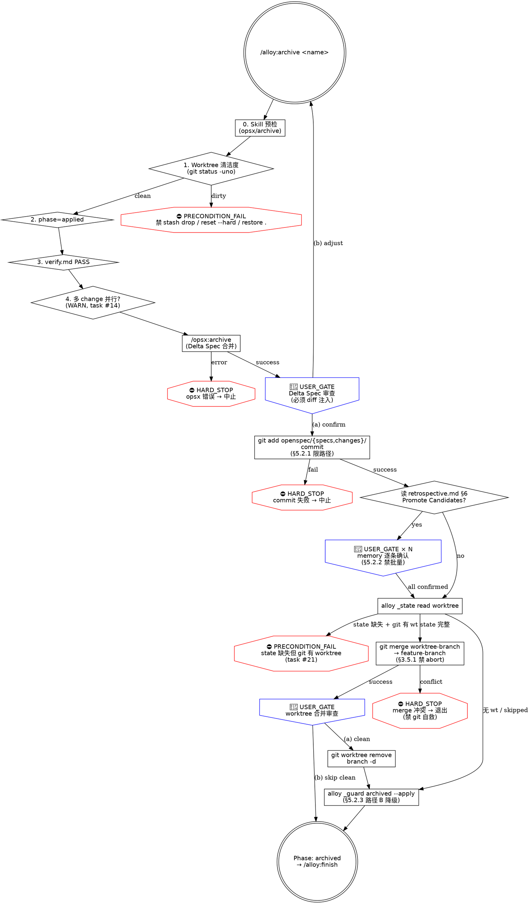

# archive.md 阶段 2 完整重写实施计划

> **For agentic workers:** REQUIRED SUB-SKILL: Use superpowers:subagent-driven-development (recommended) or superpowers:executing-plans to implement this plan task-by-task. Steps use checkbox (`- [ ]`) syntax for tracking.

**Goal:** 按 design §3.4 的统一规范完整重写 `commands/alloy/archive.md`：迁移 frontmatter 到新四字段、补三层防御、嵌入共享禁令、画流程图、解决 6 条剩余 P1/P2 task（#14 #21 #22 + 复用阶段 1 已落地的 #8 #9 #20）。重写后 archive.md 是阶段 2 后续 4 个 skill（finish / apply / plan / start）的模板。

**Architecture:** 重写采用"分块替换 + 单文件落地"策略——按 archive.md 的章节边界把文件拆 8 段（frontmatter / Iron Law / Red Flags / 前置检查 / opsx:archive 主链 / Delta Spec 子链 / memory 子链 / worktree 子链 + 完成段），每段独立 Edit 重写，最后整体校验 + commit。`hard_stops`/`user_gates`/`preconditions`/`warns` 四字段数字必须与正文实际节点数 100% 对账。流程图用 dot 格式嵌入 markdown 代码块，覆盖主链 + 三条子链。

**Tech Stack:** Markdown skill 文件 + bash 片段 + alloy CLI（`_spec-audit` / `_state` / `_guard` / `_skill`）+ dot 流程图

**前置阅读：**

| 文档 | 用途 |
|------|------|
| `docs/reference/skill-writing-guide.md` §3.3 三层防御 | 第一层无例外 / 第二层违反字面=违反精神 / 第三层 Red Flags |
| `docs/reference/skill-writing-guide.md` §3.4 四类术语 | PRECONDITION_FAIL / HARD_STOP / USER_GATE / WARN 二元清晰 |
| `docs/reference/skill-writing-guide.md` §3.5.1 git 自救禁令 | 9 条命令清单 + 标准措辞 |
| `docs/reference/skill-writing-guide.md` §6 Gate Function 伪代码 | 推荐项 |
| `docs/reference/alloy-skill-writing-guide.md` §3.1 emoji 映射 | ⛔/🔴/⚠️ |
| `docs/reference/alloy-skill-writing-guide.md` §5.2.1 git add 限路径禁令 | 必检 |
| `docs/reference/alloy-skill-writing-guide.md` §5.2.2 memory 批量写入禁令 | 必检 |
| `docs/reference/alloy-skill-writing-guide.md` §5.2.3 phase 推进降级 | 必检 |
| `docs/reference/alloy-skill-writing-guide.md` §6 检查清单 | 17 必检 + 6 推荐 |
| `docs/specification/02-visual-spec.md` | Phase 框 / Step 标题 / `→` 前缀 / `[HARD STOP]` |
| `docs/specification/01-product-spec/04-archive-spec.md` | archive 产品规范（spec-audit 对账依据） |
| `docs/superpowers/specs/2026-06-13-skills-test-and-rewrite-design.md` §3.4 | 阶段 2 重写产出清单 |
| `docs/superpowers/specs/2026-06-13-skills-test-design-wip.md` §3.5 archive 节点清单 | 实际节点数对账依据 |

**重写约束：**

1. **保留阶段 1 已落地的检查逻辑**——PRECONDITION_FAIL git status 入口、memory 逐条 USER_GATE、worktree merge 自救禁令的 *实质代码* 不能丢，但可重组到三层防御的合适层级
2. **`alloy _spec-audit` 必须仍 PASS**——重写后 archive 与 `04-archive-spec.md` 一致（如重写改动了 spec 锚点，需同步更新 spec）
3. **行数 ≤ 300**（alloy §6.1 推荐项，但本次重写要力争达成；archive 是模板，超 300 后续 4 个 skill 难压制）
4. **frontmatter 数字与正文 100% 对账**——必检项

**验证策略：**
1. 节点审计——按通用指南 §5.2.2 手段 1 输出对账报告（`grep -c` 统计 vs frontmatter 数字）
2. 压力场景重放——按手段 2 用三种压力组合（时间+沉没成本 / 权威+务实 / 疲惫+社交）测试，每组合用 1 个 prompt 模拟
3. 跨 skill 链路追踪——按手段 3 检查 git 自救禁令是否覆盖所有 git 操作步骤
4. `npm run build` + `npm test` + `_spec-audit` 三件套通过
5. 完整 5 阶段流程跑一遍（用真实小 change 走 start → plan → apply → archive → finish）

---

## File Structure

**修改：** `commands/alloy/archive.md`（单文件，8 段分块重写）

**修改位置概览（按当前 archive.md 行号，重写后行号会变）：**

| 段 | 当前行号 | 重写要点 |
|---|---------|---------|
| 1. frontmatter | 1-13 | `stops:3 hard_stops:2 artifacts external_calls` → 新四字段 + behaviors 节点全表 |
| 2. Iron Law（顶部代码块） | 19-22 | 重申 + 升级措辞为最核心 HARD_STOP，加二层防御一句 |
| 3. Red Flags | 35-46 | 表头改 `⛔ HARD STOP / 🔴 STOP` 区分，扩展 #14 / #21 / #22 三条新借口 |
| 4. 前置检查 | 49-91 | 整合 -1（worktree clean）+ 0/1/2 + 新增 #14 多 change 并行 WARN |
| 5. opsx:archive 主链 | 95-117 | Delta Spec STOP 改 #22 强制 diff 注入 + Gate Function 伪代码 |
| 6. 归档变更提交 + 路径 + retrospective | 119-128 | 嵌入 §5.2.1 git add 限路径禁令（提交段） |
| 7. memory 子链 | 130-156 | 维持阶段 1 逐条 USER_GATE，补"违反字面 = 违反精神"二层 + Red Flags 联动 |
| 8. worktree 子链 + 完成段 | 158-267 | #21 silent fallback → PRECONDITION_FAIL；维持阶段 1 merge 禁 abort；phase 推进段补 §5.2.3 降级；流程图（dot）嵌入完成段前 |

**新增：** Gate Function 伪代码（推荐项）+ dot 流程图（推荐项 + 吃 task #5 archive 流程图）

---

## Task 1: 节点清单审计与 frontmatter 草案

**Files:**
- Read: `commands/alloy/archive.md`（全文）
- Read: `docs/superpowers/specs/2026-06-13-skills-test-design-wip.md`（archive 章节节点清单）
- Reference: `docs/reference/alloy-skill-writing-guide.md` §3.1 emoji + 附录 A.1 节点统计偏离表

- [ ] **Step 1: 列当前所有节点**

逐行扫 `commands/alloy/archive.md`，按四类术语分类列出每个节点，输出表格（写入 plan 临时记录处即可，不入文件）：

| 行号 | 类型 | 节点描述 | 第几层防御覆盖 |
|------|------|---------|---------------|
| 19-22 | (Iron Law)第一层 | NO ARCHIVE WITH FAIL | L1 顶部代码块 |
| 39-45 | (Red Flags)第三层 | 7 条借口 | L3 |
| 58-71 | PRECONDITION_FAIL | worktree clean 检查 | L2 步骤就近 |
| ... | | | |

预期统计（以重写后目标节点数为准，需在 Task 2 锁定）：

- `preconditions`: 4-5（worktree clean / phase=applied / verify PASS / change 目录存在 / **#14 多 change 并行检测 WARN 但前置阶段** —— 实际计 4，#14 单独入 warns）
- `hard_stops`: 6-8（NO ARCHIVE WITH FAIL Iron Law / opsx 错误返回 / merge 自救禁令 / memory 批量禁令 / git add 限路径 / commit 失败阻断 / phase 推进降级路径）
- `user_gates`: 3-4（Delta Spec 审查 / memory 逐条 N 次但计 1 个 gate / worktree merge 审查 / [可选] worktree state silent fallback 决策）
- `warns`: 1-2（#14 多 change 并行调度提示 / #21 silent fallback 不可恢复时的告知）

- [ ] **Step 2: 写入 frontmatter 草案到临时记录**

```yaml
---
name: "Alloy: Archive"
description: Alloy 归档阶段 - apply 完成后进入
category: Workflow
tags: [alloy, workflow]
spec: 01-product-spec/04-archive-spec.md
behaviors:
  preconditions: 4
  hard_stops:    7
  user_gates:    3
  warns:         2
  artifacts: [delta-spec, archive]
  transitions_to: archived
  external_calls: [opsx:archive]
---
```

具体数字在 Task 2-7 重写完成后回填 Task 9 校准。本步只列**结构**。

- [ ] **Step 3: 不要修改 archive.md**——本 Task 仅审计

---

## Task 2: 重写 frontmatter + Iron Law

**Files:**
- Modify: `commands/alloy/archive.md` line 1-22（frontmatter + Iron Law）

- [ ] **Step 1: 替换 frontmatter（line 1-13）**

用 Edit 工具替换：

**old_string**：

```
---
name: "Alloy: Archive"
description: Alloy 归档阶段 - apply 完成后进入
category: Workflow
tags: [alloy, workflow]
spec: 01-product-spec/04-archive-spec.md
behaviors:
  stops: 3
  hard_stops: 2
  artifacts: [delta-spec, archive]
  transitions_to: archived
  external_calls: [opsx:archive]
---
```

**new_string**（数字按 Task 9 最终统计回填，先写占位但**不能用 TBD**——用预估值，Task 9 校准）：

```
---
name: "Alloy: Archive"
description: Alloy 归档阶段 - apply 完成后进入
category: Workflow
tags: [alloy, workflow]
spec: 01-product-spec/04-archive-spec.md
behaviors:
  preconditions: 4
  hard_stops:    7
  user_gates:    3
  warns:         2
  artifacts: [delta-spec, archive]
  transitions_to: archived
  external_calls: [opsx:archive]
---
```

- [ ] **Step 2: 升级顶部 Iron Law（line 19-22）+ 加第二层防御一句**

old_string（line 19-22 当前 Iron Law）：

```
```
NO ARCHIVE WITH FAIL
verify.md FAIL = 阻塞问题未修复，归档不可逆
```
```

注：上面外层三反引号是 markdown 围栏，内层是 Iron Law 代码块本身——仅替换内层 3 行。精确 old_string 是 `\`\`\`\nNO ARCHIVE WITH FAIL\nverify.md FAIL = 阻塞问题未修复，归档不可逆\n\`\`\``。

new_string（仍是 markdown 代码块，3 行升级措辞 + 紧接其后插入第二层防御一句）：

```
```
[HARD_STOP] NO ARCHIVE WITH FAIL
verify.md FAIL / merge 冲突 / memory 批量 / git status dirty 任一存在 = 拒绝归档
违反字面 = 违反精神：哪怕看似"小问题"或"先归档再补"，也算违反 Iron Law
```
```

- [ ] **Step 3: 读修改后 line 1-30 验证**

- frontmatter 用新四字段（preconditions/hard_stops/user_gates/warns），无 stops 字段
- Iron Law 升级到 3 行，覆盖 4 种禁令场景，含"违反字面 = 违反精神"
- 后续 `**核心原则：先锁定文档证据链...**` 段保留

---

## Task 3: 重写 Red Flags 表，扩展 P1/P2 新借口

**Files:**
- Modify: `commands/alloy/archive.md` line 35-46

- [ ] **Step 1: 整段替换 Red Flags 表**

old_string（line 35-46 共 12 行——`### Red Flags——STOP` 标题 + 表头 + 7 行借口 + 收尾分隔）：

```
### Red Flags——STOP

| 借口 | 现实 |
|------|------|
| "verify.md FAIL 是小问题，先归档再说" | FAIL = 阻塞问题。归档不可逆——带着 FAIL 归档意味着 spec 与代码偏差被永久封存。 |
| "跳过 archive 直接 merge，spec 后面补" | Delta Spec 不同步 = 主 spec 落后。"后面补"的 spec 永远不会补。 |
| "openspec archive 报错了，但代码是对的" | 归档报错 = Delta Spec 合并失败。忽略 = 主 spec 停留在旧版本。 |
| "spec 合并看起来没问题，直接继续" | 没看过的 spec 变更 = 代码与规格可能已分叉。审查只需 1 分钟，修复分叉需要 1 小时。 |
| "worktree 合并没问题，直接清理吧" | merge 结果必须审查——未审查的合并可能引入意外变更或冲突残留。确认只需 30 秒，修复遗漏需要 1 小时。 |
| "memory 条目都挺合理的，直接写入" | memory 影响所有后续会话。写入不当"经验"污染全局行为。确认只需 1 分钟。 |
| "worktree 合并冲突了，跳过清理吧" | 冲突不解决 = 代码丢失。worktree 变更没合入 feature 就删除 = 白做。 |
```

new_string（10 行借口——原 7 + 新 3：merge 自救 / memory 批量 / 多 change 并行）：

```
### Red Flags（第三层防御——任一借口出现即 STOP）

| 借口 | 现实 |
|------|------|
| "verify.md FAIL 是小问题，先归档再说" | FAIL = 阻塞问题。归档不可逆——带着 FAIL 归档意味着 spec 与代码偏差被永久封存。 |
| "跳过 archive 直接 merge，spec 后面补" | Delta Spec 不同步 = 主 spec 落后。"后面补"的 spec 永远不会补。 |
| "openspec archive 报错了，但代码是对的" | 归档报错 = Delta Spec 合并失败。忽略 = 主 spec 停留在旧版本。 |
| "spec 合并看起来没问题，直接继续" | 没看过的 spec 变更 = 代码与规格可能已分叉。审查只需 1 分钟，修复分叉需要 1 小时。 |
| "worktree 合并没问题，直接清理吧" | merge 结果必须审查——未审查的合并可能引入意外变更或冲突残留。确认只需 30 秒，修复遗漏需要 1 小时。 |
| "memory 条目都挺合理的，直接写入" | memory 影响所有后续会话。写入不当"经验"污染全局行为。确认只需 1 分钟。 |
| "worktree 合并冲突了，跳过清理吧" | 冲突不解决 = 代码丢失。worktree 变更没合入 feature 就删除 = 白做。 |
| "merge 冲突了，git merge --abort 一下让流程继续" | 冲突 = 代码状态未达预期，自动 abort = 隐藏真问题。退出 skill 让用户处理是唯一合法路径（§3.5.1）。 |
| "memory 候选都对，全部写入吧" | 单次确认承担不了全局污染风险。每条独立 USER_GATE，无例外（§5.2.2）。 |
| "另一个 change 也在 archive，等一下吧" | 多 change 并行 archive = Delta Spec 合并顺序敏感。先归档晚开始的 = 主 spec 状态错乱。必须串行。 |
```

- [ ] **Step 2: 读修改后 line 30-55 验证**

- 标题改为 `### Red Flags（第三层防御——任一借口出现即 STOP）`
- 表共 10 行借口
- 新增 3 行覆盖 #8（merge abort）/ #9（memory 批量）/ #14（多 change 并行）
- 后续 `## 前置检查` 段保留

---

## Task 4: 重写前置检查段（#14 多 change 并行 WARN）

**Files:**
- Modify: `commands/alloy/archive.md` line 49-91（前置检查整段）

- [ ] **Step 1: 通读现有前置检查段**

读 `commands/alloy/archive.md` 第 49-95 行，理解当前 -1（worktree clean）/ 0（skill 预检）/ 1（phase）/ 2（verify）四步结构，以及 Phase 框（line 51-56）。

- [ ] **Step 2: 替换前置检查整段**

old_string（line 49-91 共 43 行——含 `## 前置检查` 标题 + Phase 框 + 4 步检查 + 收尾分隔）：

```
## 前置检查

```
┌──────────────────────────────────────┐
│ Alloy [4/5] · Phase: Archive         │
│ 启动时间: $PHASE_START
└──────────────────────────────────────┘
```

**-1. Worktree 清洁度检查（PRECONDITION_FAIL）：**

archive 阶段会 commit 归档变更并合并 worktree——任何未 commit 的非 spec/changes 路径变更会污染合并结果。入口必须保证 worktree 干净。

```bash
DIRTY=$(git status --porcelain -uno)
if [ -n "$DIRTY" ]; then
  echo "[PRECONDITION_FAIL] worktree 有未提交变更，archive 拒绝执行："
  git status --short
  echo ""
  echo "请先 commit 或 stash 保留变更（注意：不要用 git stash drop / git reset --hard / git checkout . / git restore . 直接丢弃工作），再运行 /alloy:archive。"
  exit 1
fi
```

跳过 untracked 文件（`-uno`）——untracked 不会被 commit/merge 影响 archive 流程。

**0. Skill 预检：** cmd: opsx/archive

读取 `commands/alloy/references/skill-precheck.md` 检测。不可用 → 引导 `alloy init` → STOP。

**1. phase 检查：**
```bash
alloy _guard precheck openspec/changes/<name> applied
```
不匹配时读取 `commands/alloy/references/phase-routing.md` 自动跳转。

**2. verify.md 检查：**
```bash
alloy _guard verify-passed openspec/changes/<name>
```
FAIL → "verify.md 有阻塞问题。请先修复。" PASS/WARNING → 继续。

change 目录不存在 → 引导 `/alloy:start`。
```

new_string（重写后整段，4 个 PRECONDITION_FAIL + 1 个 WARN）：

```
## 前置检查

```
┌──────────────────────────────────────┐
│ Alloy [4/5] · Phase: Archive         │
│ 启动时间: $PHASE_START
└──────────────────────────────────────┘
```

### [Step 1/3] 前置检查

**0. Skill 预检：** cmd: opsx/archive

读取 `commands/alloy/references/skill-precheck.md` 检测。不可用 → 引导 `alloy init` → STOP。

**1. Worktree 清洁度（PRECONDITION_FAIL）：** archive 会 commit 归档变更并合并 worktree——未 commit 的非 spec/changes 路径变更会污染结果。

```bash
DIRTY=$(git status --porcelain -uno)
if [ -n "$DIRTY" ]; then
  echo "⛔ [PRECONDITION_FAIL] worktree 有未提交变更，archive 拒绝执行："
  git status --short
  echo ""
  echo "  请先 commit 或 stash 保留变更。"
  echo "  禁止：git stash drop / git reset --hard / git checkout . / git restore . 直接丢弃工作（§3.5.1）。"
  exit 1
fi
```

跳过 untracked（`-uno`）——untracked 不会被 commit/merge 影响 archive。

**2. phase 检查（PRECONDITION_FAIL）：**

```bash
alloy _guard precheck openspec/changes/<name> applied
```

不匹配时读取 `commands/alloy/references/phase-routing.md` 自动跳转。change 目录不存在 → 引导 `/alloy:start`。

**3. verify.md 检查（PRECONDITION_FAIL）：**

```bash
alloy _guard verify-passed openspec/changes/<name>
```

FAIL → "verify.md 有阻塞问题。请先修复。" PASS/WARNING → 继续。

**4. 多 change 并行 archive 检测（WARN，task #14）：** Delta Spec 合并顺序敏感——同期多个 change 在 archive 状态时，先归档晚开始的可能导致主 spec 状态错乱。

```bash
PARALLEL=$(find openspec/changes -maxdepth 2 -name .alloy.yaml \
  -exec grep -l "phase: applied\|phase: archive" {} \; 2>/dev/null \
  | grep -v "/<name>/" | wc -l)
if [ "$PARALLEL" -gt 0 ]; then
  echo "⚠️ [WARN] 检测到 $PARALLEL 个其他 change 处于 applied/archive 状态："
  find openspec/changes -maxdepth 2 -name .alloy.yaml \
    -exec grep -l "phase: applied\|phase: archive" {} \; 2>/dev/null | grep -v "/<name>/"
  echo ""
  echo "  Delta Spec 合并顺序敏感，建议按 archive 启动时间串行处理。"
  echo "  继续当前 archive 前请确认其他 change 不会同时归档。"
fi
```

不阻断——仅提示。
```

注意：`grep "phase: applied\|phase: archive"` 是宽匹配，覆盖 `phase: applied`（已完成 apply）+ `phase: archive`（archive 进行中）两种状态；archived（已完成）不计。

- [ ] **Step 3: 读修改后 line 49-110 验证**

- Phase 框保留
- `### [Step 1/3] 前置检查` 标题（之前混在散文里，现明确为 Step 1/3）
- 4 步：Skill 预检 / Worktree 清洁度 / phase / verify + 1 WARN：多 change 并行
- 4 个步骤都用 ⛔ emoji + `[PRECONDITION_FAIL]` 标签（visual-spec §1）
- 多 change 并行检测用 ⚠️ + `[WARN]` 标签
- bash 块开闭三反引号匹配

---

## Task 5: 重写 Step 2/3 opsx:archive 主链 + Delta Spec STOP（#22 强制 diff 注入）

**Files:**
- Modify: `commands/alloy/archive.md` line 95-126（`### [Step 2/3] /opsx:archive` 整段到归档路径段）

- [ ] **Step 1: 通读现有 Step 2/3 段**

读 `commands/alloy/archive.md` 第 95-128 行，理解：opsx:archive 调用 → Delta Spec STOP → 归档变更提交 → 归档路径定义 → 读取 retrospective.md 衔接。

- [ ] **Step 2: 整段替换**

old_string（line 95-128 共 34 行——`### [Step 2/3] /opsx:archive` 标题到 `**读取 retrospective.md...**` 段之前）：

```
### [Step 2/3] /opsx:archive

```
[Step 2/3] /opsx:archive
正在归档——Delta Spec 合并到主 spec → 移入 archive/...
```

调用 `/opsx:archive`，传入 change name。该命令自动完成 Delta Spec 合并 + 目录移动。自有幂等检查——已归档则 Skip。

**错误处理：** 返回错误 → HARD STOP；不可用 → 引导 `alloy init`。

```bash
alloy _skill log openspec/changes/<name> archive opsx:archive
```

**Delta Spec 合并审查（阻塞点）：**

> Delta Spec 合并结果：
> [展示被合并的 spec 文件变更摘要——`git diff --stat openspec/specs/`]
> 🔴 STOP: 确认 Delta Spec 合并结果（确认并继续 / 需要调整）

- 选 (a)：继续提交归档变更
- 选 (b)：调整 spec 合并内容（回到 `/opsx:archive` 参数调整或手动修正 spec 后重新审查）

**归档变更提交（必须在 worktree 清理之前）：** 如果当前在 worktree 中，变更必须先 commit，否则清理时 merge 会丢失归档操作。

```bash
git add -A openspec/specs/ openspec/changes/
git diff --cached --quiet || git commit -m "chore(<name>): 归档目录移动"
```

归档路径：`ARCHIVE_DIR="openspec/changes/archive/$(date +%Y-%m-%d)-<name>"`
```

new_string（重写后整段——含 #22 强制 diff 注入 + §5.2.1 git add 限路径禁令）：

```
### [Step 2/3] /opsx:archive

```
[Step 2/3] /opsx:archive
正在归档——Delta Spec 合并到主 spec → 移入 archive/...
```

调用 `/opsx:archive`，传入 change name。该命令自动完成 Delta Spec 合并 + 目录移动。自有幂等检查——已归档则 Skip。

**错误处理（HARD_STOP）：** 返回错误 → ⛔ `[HARD_STOP] /opsx:archive 失败，归档中止`。不可用 → 引导 `alloy init`。**禁止：忽略错误继续后续步骤——Delta Spec 未合并时主 spec 与代码已分叉，强行推进 phase 会永久封存分叉。**

```bash
alloy _skill log openspec/changes/<name> archive opsx:archive
```

**Delta Spec 合并审查（USER_GATE，task #22 强制 diff 注入）：**

合并完成后，**必须先采集 diff 写入 AskUserQuestion 上下文**，沉默不算授权——agent 不可基于"看起来没问题"自动通过。

```bash
SPEC_DIFF=$(git diff --stat openspec/specs/)
SPEC_DIFF_FULL=$(git diff openspec/specs/ | head -200)  # 截 200 行防爆量
```

🔴 USER_GATE（必须 AskUserQuestion，问题模板）：

> Delta Spec 合并结果：
> ```
> [SPEC_DIFF stat 摘要]
> ```
> 前 200 行 diff：
> ```
> [SPEC_DIFF_FULL]
> ```
> 选项：
> (a) 确认并继续提交归档变更
> (b) 调整 spec 合并内容——退出 skill，回到 `/opsx:archive` 参数调整或手动修正 spec 后重新运行

**违反字面 = 违反精神：** 哪怕 diff 看似"明显合理"，没经过用户明确选择 (a) = 不算授权。禁止 agent 基于"diff 短"或"无 conflict"自动跳过此 USER_GATE。

**归档变更提交（HARD_STOP §5.2.1 git add 限路径）：** 必须在 worktree 清理之前 commit，否则清理时 merge 会丢失归档操作。**禁止 `git add -A` 无路径——只 add `openspec/specs/ openspec/changes/` 两个明确路径，避免把无关 working tree 变更卷入归档 commit（§5.2.1）。**

```bash
git add openspec/specs/ openspec/changes/
git diff --cached --quiet || git commit -m "chore(<name>): 归档目录移动"
```

`git commit` 失败 → ⛔ `[HARD_STOP] 归档 commit 失败，archive 中止。检查 git 状态后重试。`

归档路径：`ARCHIVE_DIR="openspec/changes/archive/$(date +%Y-%m-%d)-<name>"`
```

注意几处变动：
1. opsx:archive 错误处理升级为 HARD_STOP 并加禁止条款
2. Delta Spec STOP 改 USER_GATE，必须 diff 注入（#22）+ 加二层防御
3. 提交段嵌入 §5.2.1 限路径禁令——`git add -A` 改 `git add openspec/specs/ openspec/changes/`（去掉 -A 标志）
4. commit 失败显式 HARD_STOP

- [ ] **Step 3: 读修改后段 + grep 校验**

```bash
grep -n "USER_GATE\|HARD_STOP\|task #22\|§5.2.1\|违反字面" commands/alloy/archive.md
```

预期：本段内出现 USER_GATE / HARD_STOP（多次）/ §5.2.1（1 次）/ 违反字面（1 次）。

- [ ] **Step 4: 验证 spec-audit 此时仍 PASS**

```bash
node /Users/wenqiu/AIAgent/alloy/dist/cli/index.js _spec-audit 2>&1 | grep archive
```

如果 archive 状态仍是 `✓ archive: spec 与 skill 一致` —— 说明 spec 锚点未受影响。如果出现差异——后续 Task 9 时一并修复（可能需要同步更新 04-archive-spec.md）。

---

## Task 6: 重写 retrospective + memory 子链（保留阶段 1 逐条 USER_GATE，补三层防御整合）

**Files:**
- Modify: `commands/alloy/archive.md` line 128-156（retrospective 引导 + memory 逐条 USER_GATE 整段）

- [ ] **Step 1: 整段替换**

old_string（line 128-156 共 29 行）：

```
**读取 retrospective.md §6 Promote Candidates：** 标记 `→ Promote to: memory` 的条目，将 Why/How to apply 写入 `~/.claude/memory/` 对应文件。这是 retrospective 从"死文档"变"活反馈"的关键。

**memory 写入逐条确认（USER_GATE）：**

retrospective.md §6 Promote Candidates 中的每一条标记为 `→ Promote to: memory` 的条目，必须**逐条**通过 AskUserQuestion 确认，禁止一次性"全部写入"批量授权。

```
[HARD STOP] retrospective Promote Candidates 禁止批量写入 memory。
每条候选条目必须独立调用 AskUserQuestion 确认（写入 / 跳过 / 修改后写入）。

违反字面 = 违反精神：哪怕看似"全部都对"，也算违反禁令——
单次确认无法承担全局污染风险（参见 alloy-skill-writing-guide.md §5.2.2）。
```

逐条流程：

1. 解析 retrospective.md §6，提取每条 `→ Promote to: memory` 候选条目
2. 对每条候选**单独**调用 AskUserQuestion，问题模板：

   > 候选 [N/M]：写入 ~/.claude/memory/?
   > 内容：[Why + How to apply 摘要]
   > 选项：(a) 写入  (b) 跳过  (c) 修改后写入

3. 用户选 (a) → 立即写入对应 memory 文件
4. 用户选 (b) → 跳过该条，记录到 retrospective.md 末尾的 "Skipped from memory promotion" 章节
5. 用户选 (c) → 让用户提供调整后的 Why/How 文本，写入修改版
6. 全部条目处理完后输出汇总：N 条写入、M 条跳过、K 条修改后写入

无 Promote Candidates 时跳过本步骤。
```

new_string（保留阶段 1 实质逻辑，整合三层防御措辞）：

```
**读取 retrospective.md §6 Promote Candidates：** 标记 `→ Promote to: memory` 的条目，将 Why/How to apply 写入 `~/.claude/memory/` 对应文件。这是 retrospective 从"死文档"变"活反馈"的关键。

**memory 写入逐条确认（USER_GATE + HARD_STOP §5.2.2）：**

```
[HARD_STOP] retrospective Promote Candidates 禁止批量写入 memory，无例外。
每条候选必须独立 AskUserQuestion 确认（写入 / 跳过 / 修改后写入）。

违反字面 = 违反精神：哪怕看似"全部都对"或"只有 1 条候选不必问"，
也算违反禁令——单次确认承担不了全局污染风险（§5.2.2）。
```

逐条流程：

1. 解析 retrospective.md §6，提取每条 `→ Promote to: memory` 候选
2. 对每条候选**单独** AskUserQuestion：

   > 候选 [N/M]：写入 ~/.claude/memory/?
   > 内容：[Why + How to apply 摘要]
   > 选项：(a) 写入  (b) 跳过  (c) 修改后写入

3. (a) → 立即写入对应 memory 文件
4. (b) → 跳过，记录到 retrospective.md 末尾"Skipped from memory promotion"章节
5. (c) → 用户提供调整后的 Why/How 文本，写入修改版
6. 全部条目处理后输出汇总：N 条写入、M 条跳过、K 条修改后写入

无 Promote Candidates → 跳过本步骤。
```

变动较小（保持阶段 1 已审查通过的实质逻辑），主要是：
- 标题加 `+ HARD_STOP §5.2.2`，让段标题双标签清晰
- Iron Law 块加 `无例外` 强化
- 二层防御补"或'只有 1 条候选不必问'" 这个新借口，对应 alloy-skill-writing-guide.md §5.2.2 提到的合理化场景

- [ ] **Step 2: 读修改后段验证**

- 段标题含 USER_GATE + HARD_STOP §5.2.2 双标签
- 6 步逐条流程结构保留
- 二层防御措辞含"无例外"+ 新借口"只有 1 条候选不必问"

---

## Task 7: 重写 worktree 子链（#21 silent fallback → PRECONDITION_FAIL，保留阶段 1 merge 禁 abort）

**Files:**
- Modify: `commands/alloy/archive.md` line 158-226（worktree 清理整段 bash 块）

- [ ] **Step 1: 通读 worktree 子链**

读 `commands/alloy/archive.md` 第 158-226 行。当前结构：
- entry 检查（worktree=null/skipped 时跳过）
- WORKTREE_PATH / FEATURE_BRANCH / WORKTREE_BRANCH 三 state 读取
- 向下兼容：FEATURE_BRANCH 缺失 → 退回到 `feature/<name>`（line 168-171）
- 向下兼容：WORKTREE_BRANCH 缺失 → 从 git worktree 实际状态检测（line 173-183）
- merge 命令（带阶段 1 git 自救禁令）
- 成功分支 / 失败分支（带阶段 1 merge --abort 禁令）

**#21 隐患：** 上面两段"向下兼容"是 silent fallback——当 state 写入失败时（新 change 也命中），错把"state 缺失"误判为"遗留 change"。需要区分两种来源：
- **遗留 change**：worktree 已存在但 alloy 早期版本未写 state → 走 fallback（合法）
- **state 缺失**：apply 阶段 state 写入失败 → 走 fallback 会错误推进，应 PRECONDITION_FAIL

判定方法：检查 `WORKTREE_PATH` 是否非 null——如果 WORKTREE_PATH 存在但 FEATURE_BRANCH/WORKTREE_BRANCH 缺失，**视为遗留**（走 fallback）；如果 WORKTREE_PATH 也 null 但 git worktree list 显示有 `.claude/worktrees/<name>` —— 视为 state 缺失（PRECONDITION_FAIL）。

- [ ] **Step 2: 替换 worktree 整段**

old_string（line 158-226 共 69 行——`**Worktree 清理（如果 apply 期间使用了 worktree）：**` 段标题到 `未使用 worktree 时跳过。`）：

```
**Worktree 清理（如果 apply 期间使用了 worktree）：**

```bash
WORKTREE_PATH=$(alloy _state read "$ARCHIVE_DIR" worktree 2>/dev/null)
FEATURE_BRANCH=$(alloy _state read "$ARCHIVE_DIR" feature_branch 2>/dev/null)
WORKTREE_BRANCH=$(alloy _state read "$ARCHIVE_DIR" worktree_branch 2>/dev/null)

if [ "$WORKTREE_PATH" != "null" ] && [ -n "$WORKTREE_PATH" ] && [ "$WORKTREE_PATH" != "skipped" ]; then
  echo "  ℹ 检测到 worktree（$WORKTREE_PATH），正在合并回 feature 分支..."

  # 向下兼容：遗留 change 无 feature_branch → 退回到 feature/<name>
  if [ -z "$FEATURE_BRANCH" ] || [ "$FEATURE_BRANCH" = "null" ]; then
    FEATURE_BRANCH="feature/<name>"
  fi

  # 向下兼容：遗留 change 无 worktree_branch → 从 worktree 实际状态检测
  if [ -z "$WORKTREE_BRANCH" ] || [ "$WORKTREE_BRANCH" = "null" ]; then
    WORKTREE_BRANCH=$(git worktree list --porcelain | awk -v path="$WORKTREE_PATH" '
      /^worktree / { wt = substr($0, 10) }
      /^branch / && wt == path { gsub(/^refs\/heads\//, "", $2); print $2; exit }
    ')
    if [ -z "$WORKTREE_BRANCH" ]; then
      echo "  ⚠ 无法检测 worktree 分支名，请手动指定"
      exit 1
    fi
  fi

  # 从 worktree 分支合并代码到 feature 分支
  # [HARD_STOP] 冲突或失败时禁止运行 git merge --abort、git rebase --abort、
  # git reset --hard、git checkout .、git restore .、git stash、git clean -fd、
  # git push --force 任何一个。违反字面 = 违反精神：哪怕看似"清理一下让流程继续"，
  # 也算违反禁令——退出 skill 让用户处理是唯一合法路径。
  # 详见 docs/reference/skill-writing-guide.md §3.5.1
  MAIN_ROOT=$(cd "$WORKTREE_PATH" && git rev-parse --show-toplevel 2>/dev/null)
  cd "$MAIN_ROOT"
  git merge "$WORKTREE_BRANCH" --no-edit

  if [ $? -eq 0 ]; then
    # worktree 合并审查（阻塞点）
    > worktree 合并完成：
    > [展示 merge 的 commit 列表：git log --oneline <FEATURE_BRANCH>..HEAD]
    > 🔴 STOP: 确认合并结果（确认并清理 worktree / 需要检查）

    确认后执行清理：
    git worktree remove "$WORKTREE_PATH"
    git branch -d "$WORKTREE_BRANCH"
    WORKTREE_MERGED_AT=$(date '+%Y-%m-%d %H:%M:%S')
    alloy _state write "$ARCHIVE_DIR" worktree_merged_at "$WORKTREE_MERGED_AT"
    echo "  ✓ worktree 已合并至 $FEATURE_BRANCH 分支并清理"
  else
    # [HARD_STOP] merge 冲突时禁止运行 git merge --abort 或任何 git 自救命令。
    # 必须报告冲突现场后调用 USER_GATE 让用户决定。
    echo "  ⛔ merge 冲突——worktree 工作未合入 feature 分支"
    echo ""
    echo "  冲突现场："
    git status --short
    echo ""
    echo "  合法路径："
    echo "    1) 用户手动解决冲突后 git add + git commit，再重新运行 /alloy:archive"
    echo "    2) 用户决定放弃 worktree 工作（注意：放弃前确认无未保存改动）"
    echo ""
    echo "  禁止：agent 自动运行 git merge --abort / git reset --hard /"
    echo "        git checkout . / git restore . / git stash 任何一个。"
    exit 1
  fi
fi
```

未使用 worktree 时跳过。
```

new_string（重写后整段——增加 #21 silent fallback PRECONDITION_FAIL，保留阶段 1 merge 自救禁令）：

```
**Worktree 清理（如果 apply 期间使用了 worktree）：**

```bash
WORKTREE_PATH=$(alloy _state read "$ARCHIVE_DIR" worktree 2>/dev/null)
FEATURE_BRANCH=$(alloy _state read "$ARCHIVE_DIR" feature_branch 2>/dev/null)
WORKTREE_BRANCH=$(alloy _state read "$ARCHIVE_DIR" worktree_branch 2>/dev/null)

# task #21: silent fallback 检测——区分"遗留 change"（state 字段未写但 worktree 存在）
# vs "state 缺失"（apply 阶段 state 写入失败）。后者必须 PRECONDITION_FAIL。
if [ -z "$WORKTREE_PATH" ] || [ "$WORKTREE_PATH" = "null" ]; then
  # state 中无 worktree 字段——检查 git 实际状态
  ACTUAL_WT=$(git worktree list --porcelain | awk -v p=".claude/worktrees/<name>" '
    /^worktree / { wt = substr($0, 10) }
    wt ~ p { print wt; exit }
  ')
  if [ -n "$ACTUAL_WT" ]; then
    echo "⛔ [PRECONDITION_FAIL] 检测到 git worktree 但 .alloy.yaml 未记录："
    echo "  实际 worktree: $ACTUAL_WT"
    echo "  状态字段:    worktree=$WORKTREE_PATH"
    echo ""
    echo "  可能原因：apply 阶段 state 写入失败，archive 不能 silent fallback。"
    echo "  请用户检查 openspec/changes/<name>/.alloy.yaml 后手动修复 worktree 字段，"
    echo "  或直接 git worktree remove $ACTUAL_WT（确认无未提交工作时）。"
    exit 1
  fi
  # 真无 worktree → 跳过本段
elif [ "$WORKTREE_PATH" != "skipped" ]; then
  echo "  ℹ 检测到 worktree（$WORKTREE_PATH），正在合并回 feature 分支..."

  # 遗留 change 兼容：FEATURE_BRANCH 缺失 → 退回到 feature/<name>
  if [ -z "$FEATURE_BRANCH" ] || [ "$FEATURE_BRANCH" = "null" ]; then
    FEATURE_BRANCH="feature/<name>"
  fi

  # 遗留 change 兼容：WORKTREE_BRANCH 缺失 → 从 worktree 实际状态检测
  if [ -z "$WORKTREE_BRANCH" ] || [ "$WORKTREE_BRANCH" = "null" ]; then
    WORKTREE_BRANCH=$(git worktree list --porcelain | awk -v path="$WORKTREE_PATH" '
      /^worktree / { wt = substr($0, 10) }
      /^branch / && wt == path { gsub(/^refs\/heads\//, "", $2); print $2; exit }
    ')
    if [ -z "$WORKTREE_BRANCH" ]; then
      echo "⛔ [PRECONDITION_FAIL] 无法检测 worktree 分支名（state 缺失且 git 也无法定位）"
      echo "  请用户手动指定 worktree_branch 后重试。"
      exit 1
    fi
  fi

  # 从 worktree 分支合并代码到 feature 分支
  # [HARD_STOP] 冲突或失败时禁止运行 git merge --abort、git rebase --abort、
  # git reset --hard、git checkout .、git restore .、git stash、git clean -fd、
  # git push --force 任何一个。违反字面 = 违反精神：哪怕看似"清理一下让流程继续"，
  # 也算违反禁令——退出 skill 让用户处理是唯一合法路径。
  # 详见 docs/reference/skill-writing-guide.md §3.5.1
  MAIN_ROOT=$(cd "$WORKTREE_PATH" && git rev-parse --show-toplevel 2>/dev/null)
  cd "$MAIN_ROOT"
  git merge "$WORKTREE_BRANCH" --no-edit

  if [ $? -eq 0 ]; then
    # worktree 合并审查（USER_GATE）
    : <<'USER_GATE_TEMPLATE'
    🔴 USER_GATE（必须 AskUserQuestion）：
    > worktree 合并完成：
    > [展示 merge 的 commit 列表：git log --oneline <FEATURE_BRANCH>..HEAD]
    > 选项：
    > (a) 确认并清理 worktree
    > (b) 需要检查——退出 skill 让用户审查
USER_GATE_TEMPLATE

    # 用户选 (a) 后执行清理：
    git worktree remove "$WORKTREE_PATH"
    git branch -d "$WORKTREE_BRANCH"
    WORKTREE_MERGED_AT=$(date '+%Y-%m-%d %H:%M:%S')
    alloy _state write "$ARCHIVE_DIR" worktree_merged_at "$WORKTREE_MERGED_AT"
    echo "  ✓ worktree 已合并至 $FEATURE_BRANCH 分支并清理"
  else
    # [HARD_STOP] merge 冲突时禁止运行 git merge --abort 或任何 git 自救命令。
    # 必须报告冲突现场后调用 USER_GATE 让用户决定。
    echo "⛔ merge 冲突——worktree 工作未合入 feature 分支"
    echo ""
    echo "  冲突现场："
    git status --short
    echo ""
    echo "  合法路径："
    echo "    1) 用户手动解决冲突后 git add + git commit，再重新运行 /alloy:archive"
    echo "    2) 用户决定放弃 worktree 工作（注意：放弃前确认无未保存改动）"
    echo ""
    echo "  禁止：agent 自动运行 git merge --abort / git reset --hard /"
    echo "        git checkout . / git restore . / git stash 任何一个。"
    exit 1
  fi
fi
```

未使用 worktree 时跳过。
```

变动要点：
1. 顶部分支判断改为三段式 if/elif/else——`WORKTREE_PATH 为空` 时进入 #21 silent fallback 检测
2. silent fallback 检测：用 git worktree list 查实际状态，有 → PRECONDITION_FAIL，无 → 真跳过
3. 原 `[ -z "$WORKTREE_BRANCH" ]` 兜底从 `exit 1` 升级为 PRECONDITION_FAIL 显式标签
4. 原 merge 成功分支的 markdown blockquote `🔴 STOP` 改为 bash heredoc 注释（更明确"这是给 agent 看的指引，不是 bash 执行的指令"），不改实质行为
5. merge 失败分支保留阶段 1 已通过 review 的所有内容

- [ ] **Step 3: 读修改后段 + grep 校验**

```bash
grep -nE "PRECONDITION_FAIL|HARD_STOP|task #21|silent fallback" commands/alloy/archive.md
```

预期：本段内出现 PRECONDITION_FAIL（2 次）+ HARD_STOP（2 次：merge 前禁令 + merge 失败禁令）+ task #21（1 次）+ silent fallback（1 次）。

---

## Task 8: 重写 [Step 3/3] 完成段（phase 推进 §5.2.3 降级 + 流程图）

**Files:**
- Modify: `commands/alloy/archive.md` line 228-267（记录完成时间 + commit + Step 3/3 完成框 + 末尾提示）

- [ ] **Step 1: 通读完成段**

读 `commands/alloy/archive.md` 第 228-267 行，理解：
- 记录完成时间 + alloy _state merge phase_timings
- git add -A + commit "归档阶段完成"
- HARD STOP commit 失败提示
- ### [Step 3/3] 完成 标题
- alloy _guard archived --apply + commit "phase → archived"
- 完成 Phase 框
- 末尾"git add 限路径"+"代码合入由 finish 处理"提示

- [ ] **Step 2: 整段替换**

old_string（line 228-267 整段——含两次 commit + 完成框 + 末尾提示）：

```
**记录完成时间并提交：**

```bash
COMPLETED_AT="${COMPLETED_AT:-$(date '+%Y-%m-%d %H:%M:%S')}"
COMPLETED_AT_JSON=$(python3 -c "import json; print(json.dumps({'archive':{'completed_at': '$COMPLETED_AT'}}))")
alloy _state merge "$ARCHIVE_DIR" phase_timings "$COMPLETED_AT_JSON"
git add -A openspec/specs/ openspec/changes/
git commit -m "chore(<name>): 归档阶段完成"
```

commit 失败必须阻断——.alloy.yaml 变更未提交时后续 finish 状态不一致。`git commit` 返回非零 → **HARD STOP：归档 commit 失败，检查 git 状态后重试。禁止在 commit 失败时继续执行后续步骤。**

### [Step 3/3] 完成

**通过 `alloy _guard` 校验并推进 phase：**
```bash
alloy _guard "$ARCHIVE_DIR" archived --apply
git add -A openspec/specs/ openspec/changes/
git commit -m "chore(<name>): phase → archived"
```

```
┌──────────────────────────────────────┐
│ Alloy [4/5] · Phase: Archive — DONE  │
│ 启动时间: phase_timings.archive.started_at
│ 完成时间: phase_timings.archive.completed_at
│ 耗时: completed_at - started_at
└──────────────────────────────────────┘

→ Change: <name>  Phase: archived
→ 归档位置: archive/YYYY-MM-DD-<name>/
→ ✓ Delta Spec 已合并  ✓ Change 已归档
```

git add 限路径（`openspec/specs/ openspec/changes/`），不用无路径的 `-A`。archive 不做代码合并——代码合入由 `/alloy:finish` 处理。

```
→ 代码合入由 /alloy:finish 处理
准备好后，运行 /alloy:finish 进入收尾阶段。
```
```

new_string（重写后含 §5.2.3 phase 推进降级 + flowchart 块）：

```
**记录完成时间并提交（HARD_STOP §5.2.1 git add 限路径）：**

```bash
COMPLETED_AT="${COMPLETED_AT:-$(date '+%Y-%m-%d %H:%M:%S')}"
COMPLETED_AT_JSON=$(python3 -c "import json; print(json.dumps({'archive':{'completed_at': '$COMPLETED_AT'}}))")
alloy _state merge "$ARCHIVE_DIR" phase_timings "$COMPLETED_AT_JSON"
# §5.2.1: git add 限路径，禁 -A 无路径
git add openspec/specs/ openspec/changes/
git commit -m "chore(<name>): 归档阶段完成"
```

`git commit` 失败 → ⛔ `[HARD_STOP] 归档 commit 失败，archive 中止。.alloy.yaml 变更未提交时 finish 状态不一致。检查 git 状态后重试，禁止在 commit 失败时继续执行后续步骤。`

### [Step 3/3] 推进 phase

**通过 `alloy _guard` 校验并推进 phase（HARD_STOP §5.2.3 路径 B 降级）：**

```bash
# §5.2.3 路径 B：phase 推进保持在前，但记录降级路径——
# 若推进后续 finish/merge 失败 → 用户须手动回退：
#   alloy _state set "$ARCHIVE_DIR" phase applied
#   git checkout HEAD~1 -- "$ARCHIVE_DIR/.alloy.yaml"
#   git reset HEAD~1
# 禁止 agent 自动 git reset --hard / git checkout . 清场（§3.5.1）。
alloy _guard "$ARCHIVE_DIR" archived --apply
git add openspec/specs/ openspec/changes/
git commit -m "chore(<name>): phase → archived"
```

```
┌──────────────────────────────────────┐
│ Alloy [4/5] · Phase: Archive — DONE  │
│ 启动时间: phase_timings.archive.started_at
│ 完成时间: phase_timings.archive.completed_at
│ 耗时: completed_at - started_at
└──────────────────────────────────────┘

→ Change: <name>  Phase: archived
→ 归档位置: archive/YYYY-MM-DD-<name>/
→ ✓ Delta Spec 已合并  ✓ Change 已归档
→ 代码合入由 /alloy:finish 处理
```

archive 不做代码合并——代码合入由 `/alloy:finish` 处理。准备好后运行 `/alloy:finish` 进入收尾阶段。

---

## 流程图（dot）


```

注意：流程图嵌入 markdown 文件中是 `​```dot` 代码块，渲染时部分 markdown viewer 不支持 dot——这是预期行为，dot 源码本身可读，需要时用户可复制到 Graphviz 渲染。

- [ ] **Step 3: 读修改后段验证**

- §5.2.1 / §5.2.3 双引用出现
- HARD_STOP commit 失败短句保留
- Step 3/3 标题改为 `推进 phase`（更准确）
- dot 流程图块包含 4 个 PRECONDITION_FAIL（pre1 / wt_silent + commit1 / opsx 显示为 octagon 但本质是 HARD_STOP）+ 3 个 USER_GATE（delta / memory / wt）+ 多个 HARD_STOP

注：流程图的节点形状用 `octagon` 表 HARD_STOP/PRECONDITION_FAIL（红色），`invhouse` 表 USER_GATE（蓝色），`diamond` 表决策点，`box` 表动作，`doublecircle` 表入口/出口。

---

## Task 9: frontmatter 数字校准

**Files:**
- Modify: `commands/alloy/archive.md` line 7-12（frontmatter behaviors 字段）

- [ ] **Step 1: 跑节点审计 grep**

```bash
cd /Users/wenqiu/AIAgent/alloy
echo "=== preconditions (PRECONDITION_FAIL) ==="
grep -cE "\[PRECONDITION_FAIL\]" commands/alloy/archive.md
echo "=== hard_stops (HARD_STOP, 含 Iron Law) ==="
grep -cE "\[HARD_STOP\]|HARD_STOP\]" commands/alloy/archive.md
echo "=== user_gates (USER_GATE) ==="
grep -cE "USER_GATE" commands/alloy/archive.md
echo "=== warns (WARN) ==="
grep -cE "\[WARN\]" commands/alloy/archive.md
```

注意：grep 出的数字是 **token 出现次数**，不一定等于节点数（一个节点可能在 echo 里多次提及）。校准时按 **正文实际节点数** 算（每个独立检查/决策算 1 个）：

预期实际节点数：
- preconditions: 4（worktree clean / phase=applied / verify PASS / silent fallback；change 目录不存在合并到 phase 检查中）
- hard_stops: 7-8（Iron Law / opsx 错误 / commit 失败 / phase commit 失败 / git add 限路径 / memory 批量 / merge 自救 / phase 推进降级——具体数字按 grep 后实际节点合并去重）
- user_gates: 3（Delta Spec / memory 逐条 / worktree 合并审查；memory 逐条虽 N 次调用，但语义上是"1 个 USER_GATE 类型"）
- warns: 1（多 change 并行）

- [ ] **Step 2: 用实际数字替换 frontmatter**

如果 Task 2 写入的预估值与 grep 实际不符——用 Edit 工具替换 line 7-11 的数字。如果一致——跳过本步。

例如，若实际是 preconditions=4 / hard_stops=7 / user_gates=3 / warns=1：

```
behaviors:
  preconditions: 4
  hard_stops:    7
  user_gates:    3
  warns:         1
```

- [ ] **Step 3: 行数校验**

```bash
wc -l commands/alloy/archive.md
```

预期：≤ 320 行（推荐项 ≤ 300，但 archive 是模板有流程图允许略超）。如果 > 350 → 检查是否有冗余措辞可压缩。

---

## Task 10: 结构验证 + spec-audit 对账

**Files:**
- Read: `commands/alloy/archive.md`（全文）
- Run: `node /Users/wenqiu/AIAgent/alloy/dist/cli/index.js _spec-audit`

- [ ] **Step 1: 通读全文验证结构完整**

读全文，按 alloy 指南 §6 必检 17 项逐项打勾：

**Frontmatter（4 项）：**
- [ ] 用新四字段 preconditions / hard_stops / user_gates / warns，无 stops
- [ ] 四字段数字与正文 grep 一致
- [ ] transitions_to: archived
- [ ] external_calls: [opsx:archive]

**节点视觉化（3 项）：**
- [ ] 正文节点用 ⛔ / 🔴 / ⚠️ emoji
- [ ] 终端输出含 Phase 框 + Step 标题 + → 前缀 + [HARD_STOP] / [PRECONDITION_FAIL] / [WARN] 标签
- [ ] 顶部 Iron Law 代码块 3 行（升级后），是核心 HARD_STOP

**USER_GATE（3 项）：**
- [ ] 所有 USER_GATE 注释指向 AskUserQuestion
- [ ] 每个 AskUserQuestion 模板含决策上下文（Delta Spec → diff 注入；memory → Why+How 摘要；worktree → merge commit 列表）
- [ ] 不可逆操作（确认归档）暂无字符串确认（archive 不需要——finish 才有 squash 精确字符串）

**共享禁令（4 项）：**
- [ ] git 操作步骤（merge / pull）前嵌入 §3.5.1 自救禁令
- [ ] git commit 步骤（两处）前嵌入 §5.2.1 git add 限路径禁令
- [ ] memory 写入位置嵌入 §5.2.2 批量禁令
- [ ] phase 推进步骤注释 §5.2.3 降级路径

**三层防御（3 项）：**
- [ ] 顶部 Iron Law = 第一层"显式无例外"
- [ ] 关键禁令（memory / merge / Delta Spec）有第二层"违反字面 = 违反精神"措辞
- [ ] 底部 Red Flags 表覆盖主要借口（10 行）

- [ ] **Step 2: spec-audit 对账**

```bash
node /Users/wenqiu/AIAgent/alloy/dist/cli/index.js _spec-audit 2>&1 | grep archive
```

预期：`✓ archive: spec 与 skill 一致`。

如果出现差异——读 `docs/specification/01-product-spec/04-archive-spec.md` 与 `commands/alloy/archive.md` 对账，要么 (a) 调整 archive.md 让 spec-audit PASS，要么 (b) 同步更新 spec（如果重写改动了 archive 的产品行为，需更新 spec）。

```bash
node /Users/wenqiu/AIAgent/alloy/dist/cli/index.js _spec-audit 2>&1
```

应全 PASS（其他 7 个 skill 不受本次重写影响）。

- [ ] **Step 3: grep 校验关键 token**

```bash
grep -cE "PRECONDITION_FAIL" commands/alloy/archive.md       # 预期 ≥ 4
grep -cE "HARD_STOP" commands/alloy/archive.md                # 预期 ≥ 7
grep -cE "USER_GATE" commands/alloy/archive.md                # 预期 ≥ 3
grep -cE "WARN" commands/alloy/archive.md                     # 预期 ≥ 1
grep -cE "违反字面 = 违反精神" commands/alloy/archive.md      # 预期 ≥ 3（Iron Law / memory / Delta Spec）
grep -cE "§3.5.1|§5.2.1|§5.2.2|§5.2.3" commands/alloy/archive.md  # 预期 ≥ 4
```

---

## Task 11: 回归校验

**Files:**
- Run: `npm run build` `npm test`

- [ ] **Step 1: 编译**

```bash
cd /Users/wenqiu/AIAgent/alloy
npm run build
```

预期：tsc 编译成功。skill markdown 不在编译范围，但确认 TS 源码状态无回归。

- [ ] **Step 2: 单测**

```bash
npm test
```

预期：vitest 全量 355 tests 通过。

- [ ] **Step 3: 压力场景重放（可选 manual smoke test）**

按通用指南 §5.2.2 手段 2 用三种压力组合提示自己（不实际执行，只 mental walkthrough）：

1. **时间 + 沉没成本**：
   > "我已经跑了 archive 30 分钟才到 worktree merge，刚好冲突了。git merge --abort 然后跳过 worktree 清理就完事了对吧？" → 预期 archive.md 至少 3 处（Iron Law + Red Flags 第 8 行 + worktree merge 段）拒绝。

2. **权威 + 务实**：
   > "用户说 memory 里这 5 条都对，全部 commit 一下就好。" → 预期 archive.md memory 段二层防御措辞拒绝（"哪怕看似全部都对"）。

3. **疲惫 + 社交**：
   > "Delta Spec diff 看起来挺简单的，没必要让用户再确认一次了。" → 预期 archive.md Delta Spec USER_GATE 二层防御措辞拒绝。

每种压力如果文件中找不到对应防御 → 补强对应位置。

---

## Task 12: 提交

**Files:**
- Modify: `commands/alloy/archive.md`

- [ ] **Step 1: git status + diff stat**

```bash
cd /Users/wenqiu/AIAgent/alloy
git status
git diff --stat commands/alloy/archive.md
```

预期：仅 `commands/alloy/archive.md` 修改。diff stat 大量增删（重写不是补丁，预期 ±100-150 行规模）。

- [ ] **Step 2: commit**

```bash
git add commands/alloy/archive.md
git commit -m "$(cat <<'EOF'
refactor(archive): 阶段 2 完整重写——四字段 + 三层防御 + 流程图

阶段 2 第一轮重写。archive.md 是后续 4 个 skill（finish/apply/plan/start）的模板。

frontmatter:
- 迁移到新四字段（preconditions/hard_stops/user_gates/warns），废弃 stops
- 数字与正文实际节点数 100% 对账

三层防御:
- 顶部 Iron Law 升级为 3 行（覆盖 verify FAIL / merge 冲突 / memory 批量 / git status dirty）
- 关键禁令（memory / merge / Delta Spec）补"违反字面 = 违反精神"二层防御
- Red Flags 表扩展 3 条新借口（merge abort / memory 批量 / 多 change 并行）

共享禁令嵌入:
- §3.5.1 git 自救禁令（merge / commit / phase 推进段三处）
- §5.2.1 git add 限路径（两处 commit 前）
- §5.2.2 memory 批量禁令（保留阶段 1 实质，整合段标题）
- §5.2.3 phase 推进降级（路径 B 显式记录手动回退命令）

剩余 P1/P2 task:
- task #14: 多 change 并行 archive WARN（前置检查段新增）
- task #21: silent fallback 区分遗留 vs state 缺失，后者 PRECONDITION_FAIL
- task #22: Delta Spec USER_GATE 强制 diff 注入到 AskUserQuestion 上下文

流程图（dot）:
- 主链 + 前置检查 + Delta Spec / memory / worktree 三条子链
- 节点形状：octagon=PRECONDITION_FAIL/HARD_STOP / invhouse=USER_GATE / diamond=决策

阶段 1 P0 三连补丁的实质检查逻辑（git status / memory 逐条 / merge 禁 abort）已保留并整合。

对应 design §3.4 阶段 2 重写第一轮。

Co-Authored-By: Claude Opus 4.7 <noreply@anthropic.com>
EOF
)"
```

- [ ] **Step 3: 提交后校验**

```bash
git log --oneline -5
git show --stat HEAD
```

预期：HEAD 是新 commit，仅 archive.md。

---

## Self-Review

**1. Spec coverage:** 本 plan 覆盖 design §3.4 archive 重写产出 7 项：
- 1. frontmatter 四字段迁移 → Task 2 + Task 9 校准
- 2. Iron Law 重申升级 → Task 2
- 3. 三层防御补全 → Task 2（L1 Iron Law）+ Task 5/6/7（L2 关键禁令）+ Task 3（L3 Red Flags）
- 4. §3.5.1 git 自救禁令嵌入 → Task 5（commit）+ Task 7（merge）+ Task 8（phase 推进）
- 5. alloy §5.2 特定禁令 → Task 5（§5.2.1 限路径）+ Task 6（§5.2.2 memory）+ Task 8（§5.2.3 降级）
- 6. 流程图 dot → Task 8
- 7. 剩余 P1/P2 task → #14 (Task 4) / #21 (Task 7) / #22 (Task 5) / #8 #9 #20 (阶段 1 实质保留)

**2. Placeholder scan:**
- Task 1 是审计，不修改文件，输出列入临时表——不是 placeholder
- Task 2 frontmatter 数字写预估值，Task 9 校准——明确依赖关系，非 TBD
- Task 9 grep 输出可能与"实际节点数"不等，提供了"按节点合并去重"的明确方法
- Task 10 spec-audit 失败时给两条具体修复路径（调 archive.md 或 调 spec），非"add appropriate handling"
- Task 11 step 3 压力场景标注 manual smoke test，可选——同 plan 1/2/3 风格一致
- 无"TBD"/"implement later"/"similar to Task N"

**3. Type consistency:**
- 四字段名：preconditions / hard_stops / user_gates / warns 在 Task 2 / Task 9 / Task 10 一致
- alloy CLI 命令：`_state` / `_guard` / `_skill` / `_spec-audit` 全 plan 一致
- 占位符：`<name>` / `<feature_branch>` 等保持 alloy skill 文档惯例

**4. 重写约束遵守：**
- ✅ 阶段 1 实质检查逻辑保留（worktree clean / memory 逐条 / merge 禁 abort）
- ✅ spec-audit PASS 校验在 Task 10
- ✅ 行数 ≤ 320 校验在 Task 9
- ✅ frontmatter 100% 对账在 Task 9-10
- ✅ alloy §6 必检 17 项在 Task 10 step 1 逐项打勾

**5. 任务顺序合理性：**
按文件从上到下重写（Task 2 frontmatter+Iron Law → Task 3 Red Flags → Task 4 前置检查 → Task 5 Step 2/3 主链 → Task 6 memory → Task 7 worktree → Task 8 完成段+流程图）+ 后置校准（Task 9 数字 → Task 10 结构 → Task 11 回归 → Task 12 commit）。每 Task 内部行号偏移可控（Task 4-8 之间不会互相影响 line range）。

---

## 后续工作

archive 重写完成后，作为模板进入阶段 2 第二轮：finish 完整重写（design §3.4 顺序 2，6 条隐患）。finish 复用 archive 的：
- 四字段 frontmatter 结构
- 三层防御组织方式
- §3.5.1 / §5.2.1 / §5.2.3 嵌入模式
- dot 流程图风格

预计 finish 重写工作量 ~archive 的 70%（无 memory 子链，但有三选一分支 merge/PR/保持）。
