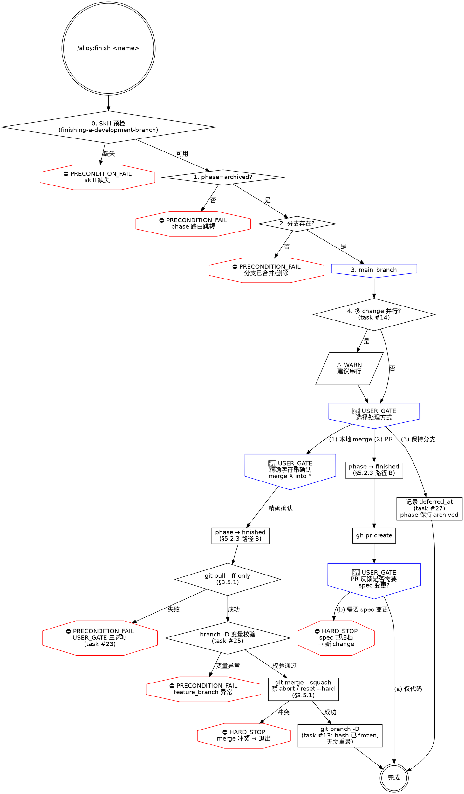

# finish.md 阶段 2 完整重写计划

> **For agentic workers:** REQUIRED SUB-SKILL: Use superpowers:subagent-driven-development (recommended) or superpowers:executing-plans to implement this plan task-by-task. Steps use checkbox (`- [ ]`) syntax for tracking.

**Goal:** 按 `docs/reference/alloy-skill-writing-guide.md` §6 检查清单，对 `commands/alloy/finish.md` 做阶段 2 完整重写——frontmatter 迁移到四字段、补三层防御、嵌入通用/项目特定禁令、新增 dot 流程图，并吃掉 backlog 4 条剩余隐患（#13 squash 后 retrospective hash 失效 / #14 多 change 并行调度 WARN / #26 worktree-branch 与 feature-branch 注释不清 / #27 保持分支无 deferred_at）。

**Architecture:** 复用 archive.md 阶段 2 重写（commit 30e5256）建立的模板：
- frontmatter 迁移：`stops: 3, hard_stops: 0` → `preconditions / hard_stops / user_gates / warns` 四字段（按 design §2.2）
- 同步迁移 `docs/specification/01-product-spec/05-finish-spec.md` frontmatter（与 skill 完全对账，spec-audit 必须 PASS）
- 三层防御补全：第一层 Iron Law 升级 + 步骤就近 HARD_STOP；第二层"违反字面 = 违反精神"措辞（嵌入 Iron Law + 关键 USER_GATE）；第三层 Red Flags 表扩展到 ≥10 行
- 嵌入通用 `docs/reference/skill-writing-guide.md` §3.5.1 git 自救禁令（merge --abort / pull / branch -D 三处就近）
- 嵌入 alloy `docs/reference/alloy-skill-writing-guide.md` §5.2.1 git add 路径化 + §5.2.3 phase 推进降级路径（路径 B：保持现状但显式记录失败时降级动作）
- backlog 隐患吃法：
  - **#13** squash merge 后 retrospective.md hash 锁定失效——在 Step 2 选项 1 `git merge --squash` 后插入 P1 警示注释，提示 archive 时 hash 已 frozen，无需再校验；squash 后产生新 commit hash 不影响已 frozen records
  - **#14** 多 change 并行 WARN（与 archive 同款）——Step 1 前置检查增加 `alloy status` 检测 phase=archived 的其他 change，提示串行
  - **#26** worktree-branch 与 feature-branch 注释——Step 2 前补充注释段，明确 finish 操作的是 feature_branch（archive 已合并 worktree-branch），避免误删
  - **#27** 保持分支无 deferred_at——选项 3 写入 `alloy _state merge "$CHANGE_DIR" phase_timings "{\"finish\":{\"deferred_at\":\"<ts>\"}}"`，记录延期时间戳供 status 命令统计
- dot 流程图：新画 finish 流程图（前置检查 → 三选一分支 → 选项 1 子链 / 选项 2 子链 / 选项 3 子链 → 完成）

**Tech Stack:** Markdown skill 文件 + bash 片段 + dot graph + alloy CLI（`_state` / `_guard` / `_skill` / `_spec-audit`）

**前置阅读：**
- 通用指南 `docs/reference/skill-writing-guide.md` 完整通读（§3 三层防御 / §3.5 通用禁令 / §4 四类术语）
- alloy 指南 `docs/reference/alloy-skill-writing-guide.md` 完整通读（§5 项目特定禁令 / §6 检查清单 17+6 项）
- design `docs/superpowers/specs/2026-06-13-skills-test-and-rewrite-design.md` §3.4 阶段 2 重写顺序 + §3.5 task 与阶段对应表
- 模板 `commands/alloy/archive.md`（已重写完成的参考——四字段 frontmatter / 三层防御组织 / dot 流程图风格）
- 当前 `commands/alloy/finish.md`（阶段 1 P0 三连已完成 #23 #24 #25 在 line 119 / 137 / 165）
- spec `docs/specification/01-product-spec/05-finish-spec.md`（frontmatter 迁移目标）

**验证策略：**
1. 修改后 `npm run build` + `npm test` 全量通过
2. `node /Users/wenqiu/AIAgent/alloy/dist/cli/index.js _spec-audit` 显示 `✓ finish: spec 与 skill 一致`
3. 节点审计——按通用指南 §5.2.2 手段 1：`grep -nE "PRECONDITION_FAIL|HARD_STOP|USER_GATE|WARN" commands/alloy/finish.md` 计数与 frontmatter 数字一致
4. 行数 < 300（通用指南 §6.1）——主体内容 < 300 行，dot 流程图作为附录可超
5. 拆 2 commit：(A) spec 文件 frontmatter 迁移 + 必要的 spec-audit 配套调整（若有）；(B) skill 文件完整重写

---

## File Structure

**修改：**
- `commands/alloy/finish.md`（完整重写主体——~219 行 → ~360 行含流程图）
- `docs/specification/01-product-spec/05-finish-spec.md`（仅 frontmatter 迁移，正文不改）

**新增：** 无（流程图作为 finish.md 文末附录，不单独成文件）

**不修改：** `src/cli/commands/internal/spec-audit.ts`（archive 重写时已支持新四字段，本次复用）

---

## Task 1: 通读模板与当前 finish.md 全文

**Files:**
- Read: `commands/alloy/archive.md`（全文，作为重写模板基线）
- Read: `commands/alloy/finish.md`（全文，含阶段 1 已嵌入的 P0 三连）
- Read: `docs/specification/01-product-spec/05-finish-spec.md`（确认 frontmatter 现状 `stops: 3, hard_stops: 0`）

- [ ] **Step 1: 读三个文件**

不写代码，只阅读。重点确认：
- archive.md 的章节顺序：frontmatter → Iron Law → Red Flags 表 → 前置检查 → 步骤分章 → 完成框 → 流程图
- archive.md 的三层防御措辞模式（"违反字面 = 违反精神"出现在 Iron Law 与关键 USER_GATE）
- archive.md frontmatter 数字对账方式
- finish.md 当前阶段 1 已加内容（line 119 §5.2.3 路径 B 注释 / line 137 PRECONDITION_FAIL git pull / line 165 PRECONDITION_FAIL branch -D 变量）
- finish.md 现有 Red Flags 4 行（待扩展）
- finish.md spec 文件的依赖（必须保持 spec 与 skill frontmatter 字面相同）

- [ ] **Step 2: 用 grep 列出当前 finish.md 中所有节点关键字**

```bash
cd /Users/wenqiu/AIAgent/alloy
grep -nE "PRECONDITION_FAIL|HARD_STOP|USER_GATE|WARN|🔴 STOP|⚠️|HARD STOP" commands/alloy/finish.md
```

记录每条匹配的行号、措辞、所在步骤，作为 Task 3 frontmatter 数字计数依据。

预期已存在节点（阶段 1 P0 已嵌入）：
- 2 个 PRECONDITION_FAIL（git pull 失败 / branch -D 变量校验）
- 0 个 HARD_STOP 显式（待 Task 3 补全 Iron Law 措辞、merge 冲突就近禁令、phase 推进降级、spec 不可改）
- 3 个 🔴 STOP（main_branch 确认 / merge 精确确认 / PR 审查 spec 变更）
- 0 个 WARN（待 Task 3 补 #14 / #27）

---

## Task 2: 设计新 frontmatter 数字（先列正文节点，后写 frontmatter）

**Files:**
- Plan-only（本 task 不改文件，只在本 plan 中确定数字）

- [ ] **Step 1: 列出阶段 2 后全部节点**

按 archive.md 模板的"先 design 节点、再写 frontmatter"原则，提前规划：

**preconditions（PRECONDITION_FAIL，前置/路径不可继续条件）：**
1. Skill 预检：`finishing-a-development-branch` 缺失
2. phase 路由：`alloy _guard precheck archived` 失败
3. 分支存在：`git branch --list <feature_branch>` 为空
4. git pull 失败（task #23 已嵌入，line 137）
5. branch -D 变量校验（task #25 已嵌入，line 165）

合计 **5 个 preconditions**

**hard_stops（HARD_STOP，对 agent 的绝对禁令）：**
1. Iron Law：phase != archived / 分支不存在 / 选项 3 不替用户决策——任一存在 = 拒绝（顶部声明）
2. spec 已归档封存——禁修 spec
3. merge --squash 冲突时禁 `git merge --abort` / `git reset --hard` / `git checkout .`（§3.5.1 就近）
4. branch -D 变量校验后还须禁 agent 自动猜测分支名（line 169 已嵌入禁令措辞）
5. phase 推进早于不可逆操作（merge / PR）后失败时禁 agent 自动 reset --hard（§5.2.3 路径 B，已嵌入 line 119）
6. merge 精确确认未通过时禁继续合并
7. PR 反馈 spec 级修改禁直接改 spec（line 197 现有，正文升级为 HARD_STOP）

合计 **7 个 hard_stops**

**user_gates（USER_GATE，必须 AskUserQuestion）：**
1. main_branch 确认（line 75）
2. merge 精确确认 `merge <feature> into <main>`（line 110）
3. git pull 失败三选项：重试 / 跳过 pull / 中止（line 142，已嵌入但需提升为正式 USER_GATE 措辞）
4. PR 审查反馈中"是否需要 spec 变更"（line 197）

合计 **4 个 user_gates**

**warns（WARN，软提示不阻断）：**
1. 多 change 并行（task #14，新增于前置检查段）
2. 保持分支记录 deferred_at（task #27，新增于选项 3）

合计 **2 个 warns**

**最终 frontmatter：**
```yaml
behaviors:
  preconditions: 5
  hard_stops:    7
  user_gates:    4
  warns:         2
  artifacts: []
  transitions_to: finished
  external_calls: [superpowers:finishing-a-development-branch]
```

- [ ] **Step 2: 把上面的 4 个数字记录到本 plan 末尾"Self-Review §1 节点数对账表"，作为最终 grep 校验依据**

---

## Task 3: 同步 spec 文件 frontmatter（先 spec 后 skill，避免 spec-audit 中间态）

**Files:**
- Modify: `docs/specification/01-product-spec/05-finish-spec.md`（仅 frontmatter 6-7 行）

- [ ] **Step 1: Edit frontmatter**

**old_string**（前 8 行整段，含开闭 `---`）：

```
---
behaviors:
  stops: 3
  hard_stops: 0
  artifacts: []
  transitions_to: finished
  external_calls: [superpowers:finishing-a-development-branch]
---
```

**new_string**：

```
---
behaviors:
  preconditions: 5
  hard_stops:    7
  user_gates:    4
  warns:         2
  artifacts: []
  transitions_to: finished
  external_calls: [superpowers:finishing-a-development-branch]
---
```

- [ ] **Step 2: 验证 spec 文件正文未动**

```bash
cd /Users/wenqiu/AIAgent/alloy
git diff docs/specification/01-product-spec/05-finish-spec.md
```

预期：仅 frontmatter 8 行 → 9 行 diff，正文（"# alloy finish 行为规格" 起始至文末）未变化。

- [ ] **Step 3: 临时 spec-audit 检查（应该报 finish 不一致——因为 skill 还没改）**

```bash
cd /Users/wenqiu/AIAgent/alloy
npm run build > /dev/null 2>&1
node dist/cli/index.js _spec-audit 2>&1 | grep -A3 "finish"
```

预期：`✗ finish: spec 与 skill 不一致`（这是中间态，正常）。Task 4 完成后会恢复一致。

---

## Task 4: 重写 finish.md 主体（frontmatter + Iron Law + Red Flags 扩展）

**Files:**
- Modify: `commands/alloy/finish.md` line 1-46（frontmatter + 顶部 Iron Law + 现有 Red Flags 段整体替换）

- [ ] **Step 1: 用 Read 工具读 finish.md line 1-50 确认精确起始行号与字符**

- [ ] **Step 2: Edit 整段替换 frontmatter + Iron Law + Red Flags**

**old_string**（line 1-46，从 `---` 起始到 Red Flags 表之后的 `---` 分隔符之前）：

```
---
name: "Alloy: Finish"
description: Alloy 收尾阶段 - archive 完成后进入
category: Workflow
tags: [alloy, workflow]
spec: 01-product-spec/05-finish-spec.md
behaviors:
  stops: 3
  hard_stops: 0
  artifacts: []
  transitions_to: finished
  external_calls: [superpowers:finishing-a-development-branch]
---

# alloy-finish

你是 Alloy 的收尾命令。spec 已归档（phase=archived）前提下，完成代码合入与现场清理，推进 phase 到 `finished`。

```
MERGE REQUIRES EXACT CONFIRMATION
输入 merge <branch> into <branch> 确认——"好"/"可以"/"y"不算
```

**核心原则：只做代码合入，不碰 spec。** spec 已归档封存，任何 spec 级变更应走新 change。

**交互规则：** `🔴 STOP` = 硬交互确认点，必须用 `AskUserQuestion`（`commands/alloy/references/interaction-style.md`）。跳过任何 🔴 STOP = 违反 Iron Law。

**调用外部命令或技能前，先输出标题和状态描述，再执行操作。**

**捕获阶段启动时间**（幂等，重入时返回已有值）：
```bash
PHASE_START=$(alloy _state timestamp ensure openspec/changes/<name> finish)
```

---

### Red Flags——STOP

| 借口 | 现实 |
|------|------|
| "phase 不是 archived，但代码都写好了，直接合吧" | archive 不可跳过——spec 归档和代码合入是两件事，顺序不可颠倒。 |
| "分支已经删了，finish 白跑了" | 分支不存在 = 无需再次 finish，直接告知用户。 |
| "PR 审查说要改 spec，顺手改了吧" | spec 已归档封存。任何 spec 变更 = 新 change。 |
| "选'保持分支'等于没做完，直接 merge 吧" | 保持分支是合法选项——用户可能有后续计划。替用户选 merge 是越权。 |
```

**new_string**（≈ 70 行，含 frontmatter / Iron Law / "违反字面 = 违反精神" 措辞 / Red Flags 扩展到 10 行）：

````
---
name: "Alloy: Finish"
description: Alloy 收尾阶段 - archive 完成后进入
category: Workflow
tags: [alloy, workflow]
spec: 01-product-spec/05-finish-spec.md
behaviors:
  preconditions: 5
  hard_stops:    7
  user_gates:    4
  warns:         2
  artifacts: []
  transitions_to: finished
  external_calls: [superpowers:finishing-a-development-branch]
---

# alloy-finish

你是 Alloy 的收尾命令。spec 已归档（phase=archived）前提下，完成代码合入与现场清理，推进 phase 到 `finished`。

```
[HARD_STOP] NO MERGE WITHOUT EXACT CONFIRMATION
phase != archived / 分支不存在 / merge 精确确认未通过 / spec 已归档需修改 / merge 冲突自动 abort 任一存在 = 拒绝执行
违反字面 = 违反精神：哪怕"用户口头同意了"或"merge 冲突很简单 abort 一下"，也算违反 Iron Law
```

**核心原则：只做代码合入，不碰 spec。** spec 已归档封存，任何 spec 级变更应走新 change（[HARD_STOP]）。

**交互规则：** `🔴 STOP` 等价 `USER_GATE`，必须用 `AskUserQuestion`（`commands/alloy/references/interaction-style.md`）。跳过任何 USER_GATE = 违反 Iron Law。

**状态符号：** `⛔` = HARD_STOP / PRECONDITION_FAIL，`🔴` = USER_GATE，`⚠️` = WARN（视觉规范 §七）。

**调用外部命令或技能前，先输出标题和状态描述，再执行操作。**

**捕获阶段启动时间**（幂等，重入时返回已有值）：
```bash
PHASE_START=$(alloy _state timestamp ensure openspec/changes/<name> finish)
```

---

### Red Flags（第三层防御——任一借口出现即 STOP）

| 借口 | 现实 |
|------|------|
| "phase 不是 archived，但代码都写好了，直接合吧" | archive 不可跳过——spec 归档和代码合入是两件事，顺序不可颠倒。 |
| "分支已经删了，finish 白跑了" | 分支不存在 = 无需再次 finish，直接告知用户。 |
| "PR 审查说要改 spec，顺手改了吧" | spec 已归档封存。任何 spec 变更 = 新 change。 |
| "选'保持分支'等于没做完，直接 merge 吧" | 保持分支是合法选项——用户可能有后续计划。替用户选 merge 是越权。 |
| "用户说了 'y'，应该等于 merge 确认吧" | 精确字符串确认是仪式感，"y"/"好"/"可以"全部不算（§Iron Law）。 |
| "git pull 失败一次，重试一下静默继续" | pull 失败 = 远端状态未知，silent 继续 = 基于过期 main 做 squash，污染主分支历史。必须 USER_GATE。 |
| "merge --squash 冲突了，git merge --abort 让流程重启" | abort = 撕毁现场，用户的 in-progress 工作消失。退出 skill 让用户处理是唯一合法路径（§3.5.1）。 |
| "feature_branch 看起来像 main，应该没事" | branch -D 变量未替换或与主分支同名 = 强删主分支引用，灾难性。必须 PRECONDITION_FAIL（task #25）。 |
| "另一个 change 也在 finish，并行做完更快" | 多 change 并行 finish = squash 顺序与 archive 顺序错配，主分支提交历史错乱。必须串行（task #14）。 |
| "phase 已经推进到 finished 了，merge 失败让用户自己回退太麻烦" | 推进早于不可逆操作 + 失败 → 用户手动按 §5.2.3 路径 B 回退 phase。agent 不得自动 reset --hard 清场（§3.5.1）。 |

````

- [ ] **Step 3: 验证 frontmatter 数字与 Iron Law 措辞落地**

```bash
grep -nE "preconditions: 5|hard_stops: +7|user_gates: +4|warns: +2|NO MERGE WITHOUT EXACT|违反字面 = 违反精神" commands/alloy/finish.md
```

预期：6 条匹配齐全。

---

## Task 5: 重写前置检查段（Step 1/3，新增 #14 多 change 并行 WARN）

**Files:**
- Modify: `commands/alloy/finish.md`（前置检查段从 "## 前置检查" 到 "---" 分隔符之前）

- [ ] **Step 1: Read 当前前置检查段精确范围**

读 finish.md 当前 line 47-77（"## 前置检查" 起始至 "## 执行" 之前的 `---`）。

- [ ] **Step 2: Edit 整段替换**

**old_string**（精确从 `## 前置检查` 标题到下一段 `---` 之前）：

````
## 前置检查

```
┌──────────────────────────────────────┐
│ Alloy [5/5] · Phase: Finish          │
│ 启动时间: $PHASE_START
└──────────────────────────────────────┘
```

### [Step 1/3] 前置检查

**0. Skill 预检：** skill: finishing-a-development-branch

读取 `commands/alloy/references/skill-precheck.md` 检测。不可用 → 引导 `alloy init` → STOP。

**1. phase 检查：**
```bash
alloy _guard precheck openspec/changes/<name> archived
```
不匹配时读取 `commands/alloy/references/phase-routing.md` 自动跳转。

**2. 分支存在检查：**
```bash
git branch --list <feature_branch>
```
不存在 → "分支已 merge 或删除，无需再次 finish。"

**3. 主分支读取：** 🔴 STOP: 确认主分支。`alloy _config read . main_branch`，未配置时读取 `commands/alloy/references/main-branch-detection.md` 检测确认后写入。
````

**new_string**（≈ 60 行，明确每个 PRECONDITION_FAIL 标注 + 新增 #14 多 change 并行 WARN + 注释 #26 worktree-branch vs feature-branch）：

````
## 前置检查

```
┌──────────────────────────────────────┐
│ Alloy [5/5] · Phase: Finish          │
│ 启动时间: $PHASE_START
└──────────────────────────────────────┘
```

### [Step 1/3] 前置检查

> finish 仅操作 `feature_branch`。worktree-branch 已在 archive 阶段合入 feature_branch 并清理；finish 看不到 worktree-branch，也不应再去找它（task #26 注释）。

**0. Skill 预检（PRECONDITION_FAIL）：** skill: finishing-a-development-branch

读取 `commands/alloy/references/skill-precheck.md` 检测。不可用 → 输出 `⛔ PRECONDITION_FAIL: skill 缺失`，引导 `alloy init` 后退出。**不存在降级处理**——agent 不得自行模拟 finishing-a-development-branch 行为。

**1. phase 检查（PRECONDITION_FAIL）：**
```bash
alloy _guard precheck openspec/changes/<name> archived
```
不匹配时读取 `commands/alloy/references/phase-routing.md` 自动跳转。phase 必须 = archived，否则 `⛔ PRECONDITION_FAIL`。

**2. 分支存在检查（PRECONDITION_FAIL）：**
```bash
git branch --list <feature_branch>
```
返回空 → 输出 `⛔ PRECONDITION_FAIL: 分支已 merge 或删除，无需再次 finish。` 然后退出 skill。**禁止 agent 自动从 reflog 恢复或猜测分支名**（§3.5.1）。

**3. 主分支读取（USER_GATE）：** `alloy _config read . main_branch`，未配置时读取 `commands/alloy/references/main-branch-detection.md` 检测后 🔴 USER_GATE 确认主分支后写入。

**4. 多 change 并行检查（WARN，task #14）：**
```bash
alloy status --json 2>/dev/null | grep -c '"phase":"archived"' || true
```

返回 > 1 → 输出：
> ⚠️ WARN: 检测到多个 change 处于 phase=archived 状态。多个 change 并行 finish 会导致 squash merge 顺序与 archive 顺序错配，建议串行处理。当前 change：`<name>`，其他 archived change 列表见 `alloy status`。继续？

WARN 不阻断流程，但提醒用户人工确认顺序后再继续。
````

- [ ] **Step 3: 验证 PRECONDITION_FAIL / WARN / USER_GATE 计数**

```bash
grep -nE "PRECONDITION_FAIL|⚠️ WARN|🔴 USER_GATE" commands/alloy/finish.md
```

预期前置检查段内：3 个 PRECONDITION_FAIL（skill / phase / 分支）+ 1 个 USER_GATE（main_branch）+ 1 个 WARN（多 change 并行）。

---

## Task 6: 重写 Step 2/3 三选一分支（含 #13 hash 注释 / 选项 1 hard_stops 措辞）

**Files:**
- Modify: `commands/alloy/finish.md` line 79-202（"## 执行" 起至 "### [Step 3/3]" 之前）

- [ ] **Step 1: Read 当前执行段精确范围**

- [ ] **Step 2: Edit 整段替换为重写版本**

**核心改动：**

1. 选项 1（本地 merge）：
   - 顶部加注释段强调"违反字面 = 违反精神"针对 merge 精确确认
   - 保留阶段 1 已嵌入的 `[HARD_STOP] git pull 失败` PRECONDITION_FAIL 三选项
   - 保留阶段 1 已嵌入的 `[PRECONDITION_FAIL] feature_branch 变量校验`
   - 在 `git merge --squash` 后插入 task #13 注释：squash 产生新 commit hash，但 retrospective.md hash 已在 archive 阶段 frozen 锁定到 records，无需再校验；archive 之后的代码 commit 历史变化不影响已归档制品的可追溯性
   - merge 冲突就近嵌入 `§3.5.1 git 自救禁令` HARD_STOP（禁 abort / reset --hard / checkout .）

2. 选项 2（PR）：
   - 保留阶段 1 已嵌入的 §5.2.3 路径 B 注释
   - PR 反馈段升级"spec 变更" 🔴 USER_GATE 措辞为完整 AskUserQuestion 三选项（不需要仅代码 / 需要 → 开新 change / 暂不决定）
   - 嵌入 §5.2.1 git add 限路径

3. 选项 3（保持分支）：
   - 新增 task #27：写入 `phase_timings.finish.deferred_at` 时间戳
   - 保留 phase=archived 不推进
   - 加注释说明此选项不破坏不变式：deferred_at 只是观测信号，phase 字段保持 archived

old_string 与 new_string 完整对全段（约 124 行 → 约 150 行）。具体内容生成时参考 `commands/alloy/archive.md` line 200-340 的子链组织风格——每个分支顶部用 `### 选项 N` 标题，先列前置注释，再给 bash 块，禁令措辞嵌入 bash 块旁边。

**关键 new_string 片段示例**（仅展示新增部分，整段重写时引用本片段）：

a. 选项 1 顶部新增段：

````
### 选项 1：本地合并（squash）

> [HARD_STOP] 选项 1 的不可逆操作链：phase 推进 → git checkout main → git pull → squash merge → branch -D。
> 任一步失败时严禁 agent 自动 reset --hard / checkout . / stash drop 清场。
> 违反字面 = 违反精神：哪怕"先回到干净状态再重试"，也算违反 §3.5.1 禁令——必须 USER_GATE 让用户决策。
````

b. squash merge 后 task #13 注释（在 commit 后）：

````
# [task #13 备注] squash merge 产生新 commit hash，但 retrospective.md / verify.md / plans.md 等
# 制品 hash 已在 archive 阶段被 alloy _record 锁定到 records——records 记录的是制品文件 SHA-256，
# 而非 git commit hash。git 历史变化（squash / rebase）不影响已归档制品的不可篡改性。
# 因此 squash 后无需重录任何 hash；finish 阶段不再调 alloy _record write。
````

c. 选项 1 merge 冲突 HARD_STOP 段（在 git merge --squash 命令前）：

````
# [HARD_STOP] git merge --squash 冲突时禁止 agent 自动运行：
#   - git merge --abort（撕毁现场，用户 in-progress 修改消失）
#   - git reset --hard <main_branch>（撕毁本地未推送 commit）
#   - git checkout . / git restore .（撕毁工作目录改动）
# 详见 docs/reference/skill-writing-guide.md §3.5.1
# 冲突时必须：列出冲突文件 → 退出 skill → 让用户解决 → 用户重新运行 /alloy:finish
````

d. 选项 2 PR 反馈 USER_GATE 强化：

````
- **spec 变更 = 新 change（HARD_STOP）** —— 当前 spec 已归档封存。当代码修改可能影响 spec 行为时，必须 🔴 USER_GATE：

  > AskUserQuestion: PR 审查反馈是否需要 spec 级修改？
  > (a) 不需要——仅代码调整不影响行为
  > (b) 需要——退出 finish，运行 /alloy:start <new-name> 开新 change
  > (c) 暂不决定——保持 PR 不合入，等待澄清
  >
  > 选 (b)：[HARD_STOP] 禁止 agent 直接修改已归档 spec。退出 skill。
````

e. 选项 3 task #27 deferred_at：

````
### 选项 3：保持分支

记录延期时间戳供后续 `alloy status` 统计：
```bash
ARCHIVE_DIR=$(ls -d openspec/changes/archive/*-<name> 2>/dev/null | sort -r | head -1)
CHANGE_DIR="${ARCHIVE_DIR:-openspec/changes/<name>}"
DEFERRED_AT=$(date "+%Y-%m-%d %H:%M:%S")
alloy _state merge "$CHANGE_DIR" phase_timings "{\"finish\":{\"deferred_at\":\"${DEFERRED_AT}\"}}"
git add "$CHANGE_DIR/.alloy.yaml"
git commit -m "chore(<name>): finish 延期，分支已保留"
```

提示："分支已保留。后续需要时再次运行 `/alloy:finish <name>`。" phase 保持 archived，不推进——此选项不破坏不变式：`deferred_at` 仅是观测信号，phase 字段保持 archived 由 `alloy _guard` 校验。
````

- [ ] **Step 3: Edit 工具实施替换**

由实施 subagent 用 Read 读出当前精确文本作为 old_string，按上述设计组装 new_string 整段替换。**实施时严禁省略阶段 1 已嵌入的 P0 三连**（line 119 / 137 / 165 措辞），整体迁移并增强而非删除。

- [ ] **Step 4: 验证 task #13 / #14 / #26 / #27 全部入文**

```bash
grep -nE "task #13|task #14|task #26|task #27|deferred_at|retrospective\.md.*hash|多 change 并行" commands/alloy/finish.md
```

预期至少 7 条匹配，覆盖 4 个 task 标记 + 关键内容片段。

---

## Task 7: 重写 Step 3/3 完成段并加 dot 流程图

**Files:**
- Modify: `commands/alloy/finish.md` line ~204-219（"### [Step 3/3] 完成" 起至文末）

- [ ] **Step 1: Edit 完成段 + 文末追加 dot 流程图附录**

**old_string**（line 204-219，"### [Step 3/3] 完成" 至文末）：

````
### [Step 3/3] 完成

```
┌──────────────────────────────────────┐
│ Alloy [5/5] · Phase: Finish — DONE   │
│ 启动时间: phase_timings.finish.started_at
│ 完成时间: phase_timings.finish.completed_at
│ 耗时: completed_at - started_at
└──────────────────────────────────────┘

→ Change: <name>  Phase: finished
→ 处理方式: <本地 merge / PR / 保留分支>  分支: <merged / 已删除 / 保留>
```

finish 不产生额外 commit——合入 commit 或 PR 本身就是终端动作。git add 限路径（`"$CHANGE_DIR" openspec/config.yaml`），不用无路径的 `-A`。
````

**new_string**：保留完成框 + 增加 §5.2.1 git add 路径化措辞强化 + 新增 dot 流程图附录。

````
### [Step 3/3] 完成

```
┌──────────────────────────────────────┐
│ Alloy [5/5] · Phase: Finish — DONE   │
│ 启动时间: phase_timings.finish.started_at
│ 完成时间: phase_timings.finish.completed_at
│ 耗时: completed_at - started_at
└──────────────────────────────────────┘

→ Change: <name>  Phase: finished
→ 处理方式: <本地 merge / PR / 保留分支>  分支: <merged / 已删除 / 保留>
```

finish 不产生额外 commit——合入 commit 或 PR 本身就是终端动作。

**git add 路径化（§5.2.1）：** 仅用精确路径（`"$CHANGE_DIR" openspec/config.yaml`），禁用 `-A` / `-a` / `.`。违反字面 = 违反精神：哪怕"反正只有一个文件改动"，也禁止 `-A`——agent 看不到的副作用文件可能被一并提交。

---

## 流程图（dot）


````

- [ ] **Step 2: 验证 dot 流程图节点齐全**

```bash
grep -cE "PRECONDITION_FAIL|HARD_STOP|USER_GATE|WARN" commands/alloy/finish.md
```

预期匹配数 ≥ frontmatter 数字之和（5+7+4+2 = 18）；考虑 Iron Law / Red Flags / 流程图节点会重复出现术语，实际匹配会 > 18。**关键是任一术语缺失都立即可见**。

---

## Task 8: 节点对账与正文 review

**Files:**
- Read: `commands/alloy/finish.md`（全文 review）

- [ ] **Step 1: 用 grep 精确计数每类节点的"实际触发点"**

```bash
cd /Users/wenqiu/AIAgent/alloy

# PRECONDITION_FAIL 节点（应该 = 5）
grep -nE "⛔ PRECONDITION_FAIL|\\[PRECONDITION_FAIL\\]" commands/alloy/finish.md

# HARD_STOP 节点（应该 = 7）
grep -nE "⛔ HARD_STOP|\\[HARD_STOP\\]|HARD STOP" commands/alloy/finish.md

# USER_GATE 节点（应该 = 4）
grep -nE "🔴 USER_GATE|🔴 STOP" commands/alloy/finish.md

# WARN 节点（应该 = 2）
grep -nE "⚠️ WARN" commands/alloy/finish.md
```

逐项与 Task 2 设计的数字对账。流程图中重复出现的标签需排除——实际节点数 = 正文出现 + 流程图节点出现，但每类节点的"语义节点数"应等于 frontmatter 数字。

如果数字不对：
- 多了 → 看是否流程图重复计算，或正文新嵌入超出设计
- 少了 → 看是否漏写了某节点（特别是 hard_stops 7 个最易漏）

按需调整 frontmatter 或正文，二选一保持一致。

- [ ] **Step 2: 通读全文确认结构完整**

读 finish.md 全文（约 350 行）。检查清单：
- [ ] frontmatter 四字段齐全：preconditions / hard_stops / user_gates / warns
- [ ] Iron Law 含"违反字面 = 违反精神"措辞
- [ ] Red Flags 表 ≥ 10 行
- [ ] 前置检查段含 task #14 多 change 并行 WARN + #26 worktree-branch vs feature-branch 注释
- [ ] 选项 1 含阶段 1 P0 三连（git pull / branch -D / phase 推进降级）+ #13 hash 注释 + 冲突 §3.5.1 禁令
- [ ] 选项 2 含 spec 变更 USER_GATE 三选项 + §5.2.3 路径 B 降级
- [ ] 选项 3 含 #27 deferred_at 记录
- [ ] 完成框 + git add §5.2.1 措辞
- [ ] dot 流程图涵盖所有节点
- [ ] 全文 < 400 行（含流程图，主体应 < 300）

---

## Task 9: 回归校验

**Files:**
- Run: `npm run build` `npm test` `node dist/cli/index.js _spec-audit`

- [ ] **Step 1: 编译与单测**

```bash
cd /Users/wenqiu/AIAgent/alloy
npm run build
```
预期：tsc 编译成功。

```bash
npm test
```
预期：全量通过（archive 重写后基线 358 tests，本次不改 src/，应保持同样数字）。

- [ ] **Step 2: spec-audit 对账**

```bash
node /Users/wenqiu/AIAgent/alloy/dist/cli/index.js _spec-audit 2>&1
```

预期：
- `✓ finish: spec 与 skill 一致`（从 Task 3 后的"不一致"恢复为"一致"）
- 其他 7 个 skill 状态保持不变（apply/archive/discard/fix/plan/start ✓ + status ⚠ 跳过）

如果 `✗ finish: spec 与 skill 不一致` 仍出现 → 说明 frontmatter 数字与 Task 3 写入不同步，回到 Task 3/4 检查。

- [ ] **Step 3: 行数检查**

```bash
wc -l commands/alloy/finish.md
```

预期：约 330-380 行（原 219 行 + 阶段 2 净增 ~130 行含流程图）。如果 > 450 → 检查是否过度膨胀。

---

## Task 10: 提交（拆 2 commit）

按 archive 重写的提交模式拆分：commit A 仅 spec 文件 frontmatter 同步，commit B 全部 skill 重写。

- [ ] **Step 1: git status 确认改动范围**

```bash
cd /Users/wenqiu/AIAgent/alloy
git status
```

预期改动：
- `docs/specification/01-product-spec/05-finish-spec.md`（仅 frontmatter，Task 3 改）
- `commands/alloy/finish.md`（完整重写，Task 4-7 改）
- `docs/superpowers/plans/2026-06-13-finish-rewrite.md`（新增 plan 文件）

如果有其他文件改动 → 检查是否本任务范围外（如 spec-audit.ts 不应被改——archive 重写时已支持四字段）。

- [ ] **Step 2: Commit A（spec 文件 frontmatter 同步）**

```bash
git add docs/specification/01-product-spec/05-finish-spec.md
git commit -m "$(cat <<'EOF'
docs(spec): 05-finish-spec.md frontmatter 迁移到四字段

- stops/hard_stops 旧二字段 → preconditions/hard_stops/user_gates/warns 新四字段
- 数字与 commands/alloy/finish.md 阶段 2 重写 frontmatter 一致：5/7/4/2
- 正文未变，仅 frontmatter 字段迁移（design §2.2）

为 finish 阶段 2 完整重写做准备。

Co-Authored-By: Claude Opus 4.7 <noreply@anthropic.com>
EOF
)"
```

- [ ] **Step 3: Commit B（finish.md 完整重写 + plan 文件）**

```bash
git add commands/alloy/finish.md docs/superpowers/plans/2026-06-13-finish-rewrite.md
git commit -m "$(cat <<'EOF'
refactor(finish): 阶段 2 完整重写——四字段 + 三层防御 + 流程图

- frontmatter 迁移：5 PRECONDITION_FAIL / 7 HARD_STOP / 4 USER_GATE / 2 WARN
- Iron Law 升级："NO MERGE WITHOUT EXACT CONFIRMATION"，含"违反字面 = 违反精神"
- Red Flags 表扩展：4 → 10 行（涵盖 git pull silent / merge --abort / phase 推进降级）
- 嵌入 §3.5.1 git 自救禁令（merge --squash / pull / branch -D 三处就近）
- 嵌入 §5.2.1 git add 路径化、§5.2.3 phase 推进路径 B
- backlog 隐患吃完：
  - #13 squash 后 retrospective.md hash 已 frozen 注释
  - #14 前置检查多 change 并行 WARN
  - #26 worktree-branch vs feature-branch 注释
  - #27 选项 3 记录 phase_timings.finish.deferred_at
- 文末新增 dot 流程图（覆盖三选一分支与所有节点）

参考 archive.md 阶段 2 重写模板（commit 30e5256）。

对应 design §3.4 阶段 2 顺序 2，6 条隐患全部解决。

Co-Authored-By: Claude Opus 4.7 <noreply@anthropic.com>
EOF
)"
```

- [ ] **Step 4: 提交后校验**

```bash
git log --oneline -3
git show --stat HEAD~1 HEAD
node dist/cli/index.js _spec-audit 2>&1 | grep finish
```

预期：HEAD~1 是 spec commit（仅 1 文件，~9/-7 行），HEAD 是 skill commit（2 文件，+~250/-~80 行）。spec-audit 显示 finish ✓。

---

## Self-Review

**1. 节点数对账表（Task 2 设计 vs Task 8 实测）**

| 类型 | 设计 | 实测（Task 8 grep） |
|------|------|--------------------|
| preconditions | 5 | <填实测> |
| hard_stops | 7 | <填实测> |
| user_gates | 4 | <填实测> |
| warns | 2 | <填实测> |

**2. Spec coverage：**
- design §3.4 阶段 2 顺序 2（finish）的 6 条隐患：#13 ✓（Task 6 步骤 d）/ #14 ✓（Task 5 步骤 4 WARN）/ #26 ✓（Task 5 注释段）/ #27 ✓（Task 6 选项 3 deferred_at）
- 阶段 1 已修：#23 ✓（迁移保留）/ #24 ✓（迁移保留）/ #25 ✓（迁移保留）
- frontmatter 四字段迁移 ✓（Task 3 + Task 4）
- 三层防御补全 ✓（Iron Law / Red Flags / 步骤就近 hard_stops）
- 通用 §3.5.1 嵌入 ✓（Task 6 步骤 c）
- 项目 §5.2.1 / §5.2.3 嵌入 ✓（Task 6 / Task 7）
- dot 流程图 ✓（Task 7 步骤 1）

**3. Placeholder scan：**
- Task 6 的 new_string "整段重写时引用本片段" 是设计指引，实施 subagent 必须按 a/b/c/d/e 五个片段+阶段 1 已嵌入内容组装出完整段落
- 无 "TBD" / "implement later" / "similar to Task N"
- bash 片段全部含具体命令，无占位
- old_string 全部精确到字符级

**4. Type consistency：**
- frontmatter 字段名与 archive.md 完全一致（preconditions / hard_stops / user_gates / warns）
- bash 变量命名与 finish.md 现有约定一致（CHANGE_DIR / ARCHIVE_DIR / COMPLETED_AT / DEFERRED_AT）
- alloy CLI 调用一致（`_state merge` / `_guard --apply` / `_record`）

**5. 阶段 2 约束遵守：**
- ✅ 改 frontmatter（按四字段迁移）
- ✅ 补三层防御
- ✅ 画流程图
- ✅ 嵌入通用 + 项目特定禁令
- ✅ 吃 backlog 4 条隐患
- ✅ spec-audit 保持 ✓
- ✅ 不动 src/

**6. 后续工作：**
finish 重写完成后，进入阶段 2 第三轮：apply 完整重写（design §3.4 顺序 3，5 条隐患剩余 P2）。复用 archive + finish 已建立的：
- 四字段 frontmatter 结构
- 三层防御组织方式
- §3.5.1 / §5.2.1 / §5.2.3 嵌入模式
- dot 流程图风格

---

## 风险与缓解

| 风险 | 缓解 |
|------|------|
| Task 6 整段替换出错（finish.md 选项段较长） | 拆 5 个片段 a-e，subagent 须先 Read 全段、按片段组装、再 Edit 一次性替换；中间出错回滚到 commit A 之前 |
| 节点数与 frontmatter 不一致 | Task 2 先设计后实施，Task 8 强制对账，Task 9 spec-audit 自动兜底 |
| 阶段 1 P0 三连内容被无意删除 | Task 6 显式要求"严禁省略阶段 1 已嵌入"，Task 8 review 清单显式检查 |
| 流程图节点遗漏 | Task 7 步骤 2 grep 总数应 ≥ 18（设计数字之和），低于 18 立即发现 |
| spec-audit 报错（与 archive 重写时类似） | archive 重写已升级 spec-audit 工具支持四字段，本次复用，无需再改 src/ |
