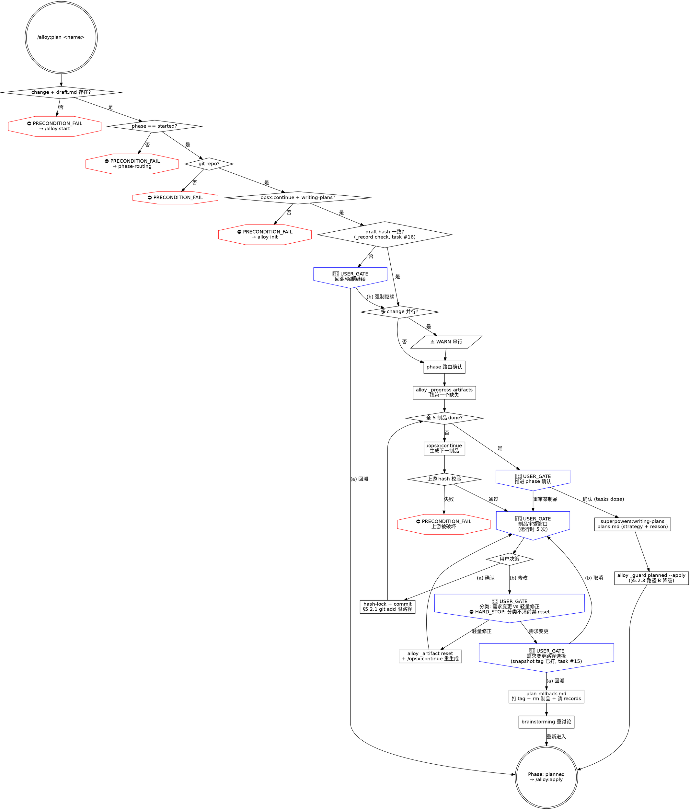

# plan.md 阶段 2 完整重写计划

> **For agentic workers:** REQUIRED SUB-SKILL: Use superpowers:subagent-driven-development (recommended) or superpowers:executing-plans to implement this plan task-by-task. Steps use checkbox (`- [ ]`) syntax for tracking.

**Goal:** 按 `docs/reference/alloy-skill-writing-guide.md` §6 检查清单，对 `commands/alloy/plan.md` 做阶段 2 完整重写——frontmatter 迁移到四字段、补三层防御、嵌入通用/项目特定禁令、新增 dot 流程图，吃掉 backlog 2 条 P2 隐患（#15 rollback 前未打 snapshot tag / #16 draft 来源验证用 commit msg 字符串解析弱）。

**Architecture:** 复用 archive.md（commit 30e5256）+ finish.md（commit 0a38d8e）+ apply.md（commit 267aede）已建立的模板：

- frontmatter 迁移：`stops: 6, hard_stops: 3` → `preconditions / hard_stops / user_gates / warns` 四字段（按 design §2.2）
- 同步迁移 `docs/specification/01-product-spec/02-plan-spec.md` frontmatter（与 skill 完全对账）
- 三层防御补全：
  - 第一层：Iron Law 升级 `[HARD_STOP] NO DIRECT EDITING OF GENERATED ARTIFACTS + NO SKIP REVIEW WINDOW`
  - 第二层：每个关键禁令加"违反字面 = 违反精神"措辞（artifacts 直接编辑、跳过审查窗口、需求变更绕路径分类）
  - 第三层：Red Flags 表 8 行 → ≥ 12 行（涵盖 #15 / #16 / draft 完整性 / 一次性生成全部制品 / 跨制品互相替代等）
- 嵌入通用 §3.5.1 git 自救禁令（rollback 路径删除前禁 `git stash` / `git reset --hard`；制品 commit 失败时禁 `git checkout .` / `git restore .`）
- 嵌入 alloy §5.2.1 git add 路径化（每个制品 commit 前——5 处共享，正文 1 处声明）
- 嵌入 alloy §5.2.3 phase 推进路径 B（plans 完成后 `alloy _guard ... planned --apply` 失败时降级注释）
- backlog 隐患吃法：
  - **#15** rollback 前未打 snapshot tag——`plan-rollback.md` 需求变更路径在 `rm -f` 删除 plan 制品**之前**先打 `git tag rollback-<name>-<timestamp>`，给用户事后恢复路径。`plan.md` 主文件在 USER_GATE (a) 选择回溯路径时显式提及"已打 snapshot tag <tag_name>，可用 `git checkout <tag>` 恢复"
  - **#16** commit msg 字符串解析弱——`plan.md` line 73-76 `git log -1 --format="%s"` 检查 commit message 不含 `docs(<name>): draft 已确认` 改用 `alloy _record check openspec/changes/<name> draft` 验证 hash 链。`_record check` 命令已存在（archive/apply/finish 均使用），不需新增 CLI
- dot 流程图：新画 plan 流程图（前置检查 → Step 1 确认 change → Step 2 制品生成循环（5 制品 × 审查窗口 × 需求变更/轻量修正/确认三选项）→ writing-plans → Step 3 完成）

**Tech Stack:** Markdown skill 文件 + bash 片段 + dot graph + alloy CLI（`_state` / `_guard` / `_record` / `_skill` / `_artifact reset` / `_progress`）

**前置阅读：**
- 通用指南 `docs/reference/skill-writing-guide.md` 完整通读
- alloy 指南 `docs/reference/alloy-skill-writing-guide.md` 完整通读
- design `docs/superpowers/specs/2026-06-13-skills-test-and-rewrite-design.md` §3.4 阶段 2 顺序 4 + §3.5 task 与阶段对应表
- 模板 `commands/alloy/archive.md` + `commands/alloy/finish.md` + `commands/alloy/apply.md`（三个已重写完成的参考）
- 当前 `commands/alloy/plan.md`（194 行，最简洁的 5 阶段 skill）
- spec `docs/specification/01-product-spec/02-plan-spec.md`
- `commands/alloy/references/plan-rollback.md`（需求变更/轻量修正回溯逻辑——本次需嵌入 #15 snapshot tag）

**验证策略：**
1. `npm run build` + `npm test` 全量通过
2. `node dist/cli/index.js _spec-audit` 显示 `✓ plan: spec 与 skill 一致`
3. 节点审计——grep 计数与 frontmatter 数字一致
4. 行数 < 400（plan 是较简单 skill，5 制品循环但每个制品流程一致，行数应在 350-400 之间）
5. 拆 2 commit：(A) spec frontmatter 迁移 + plan-rollback.md 嵌入 #15 snapshot tag；(B) plan.md skill 完整重写 + plan 文件

---

## File Structure

**修改：**
- `commands/alloy/plan.md`（完整重写主体——194 行 → ~360 行含流程图）
- `docs/specification/01-product-spec/02-plan-spec.md`（仅 frontmatter，正文不改）
- `commands/alloy/references/plan-rollback.md`（需求变更路径 #15 snapshot tag 嵌入——3-5 行新增）

**不修改：** `src/cli/commands/internal/spec-audit.ts`（archive 重写时已支持四字段）；`alloy _record check` 已支持，无需扩展 CLI。

---

## Task 1: 通读模板与当前 plan.md

**Files:**
- Read: `commands/alloy/archive.md` + `commands/alloy/finish.md` + `commands/alloy/apply.md`（三个已完成模板）
- Read: `commands/alloy/plan.md`（当前 194 行）
- Read: `docs/specification/01-product-spec/02-plan-spec.md`
- Read: `commands/alloy/references/plan-rollback.md`

- [ ] **Step 1: 读 5 个文件，重点确认**

- archive/finish/apply 的 frontmatter 数字、Iron Law 措辞、Red Flags 表风格、dot 流程图风格
- plan 现有结构：3 步流程（确认 → 制品生成 → 完成）+ 5 制品循环（proposal/design/specs/tasks/plans）+ 需求变更/轻量修正双路径
- plan 现有节点（参照 plan.md grep 基线）：
  - HARD STOP 2 处（line 78 git rev-parse / line 122 上游 hash）
  - 🔴 STOP 4 处（line 100 全 done 后推进确认 / line 110 制品审查 / line 125 需求变更路径选择 / line 131 轻量修正确认）
  - ⚠️ 1 处（line 76 commit msg 未含确认标记）
  - PRECONDITION_FAIL 0 处（待补——draft.md 缺失、phase 不匹配、技能预检全是隐式）
- plan-rollback.md 现有删除步骤（line 27 起 `rm -f` / `rm -rf`）——这是 #15 嵌入位置

- [ ] **Step 2: grep 全节点关键字记录基线**

```bash
cd /Users/wenqiu/AIAgent/alloy
grep -nE "PRECONDITION_FAIL|HARD_STOP|HARD STOP|🔴 STOP|⚠️|USER_GATE" commands/alloy/plan.md
```

记录每条匹配作为 Task 2 重组依据。

---

## Task 2: 设计新 frontmatter 数字

**Files:** Plan-only（不改文件）

- [ ] **Step 1: 列出阶段 2 后全部节点（按四类分组）**

**preconditions（PRECONDITION_FAIL，前置/状态校验失败）：**
1. change 目录不存在（line 56 现状隐式 → 显式）
2. draft.md 缺失（line 56 现状隐式）
3. phase 不匹配（line 77 `alloy _guard precheck started` 失败 → 路由到 phase-routing；非 phase-routing 处理的情况显式 PRECONDITION_FAIL）
4. git 仓库不存在（line 78 现状 HARD STOP 升级）
5. Skill 预检失败（opsx:continue + writing-plans，line 57）
6. 上游制品 hash 失效（line 122 现状 HARD STOP 升级——生成下游前校验上游）
7. **NEW #16：** draft 来源验证用 `_record check`——draft 未通过 hash 链验证则 PRECONDITION_FAIL（替换原 commit msg 字符串解析的 ⚠️ WARN）

合计 **7 个 preconditions**

**hard_stops（HARD_STOP，对 agent 的绝对禁令）：**
1. Iron Law：NO DIRECT EDITING OF GENERATED ARTIFACTS + NO SKIP REVIEW WINDOW（顶部声明，含"违反字面 = 违反精神"）
2. 制品禁直接编辑——5 制品任何修改必须重新生成（Step 2 就近，含轻量修正路径仍走 `_artifact reset`）
3. git add 路径化（§5.2.1）——5 个制品 commit 共享，正文 1 处声明
4. 一次性生成全部制品禁——5 制品 = 5 审查窗口，禁 agent "用户在等，一起生成"
5. 跨制品互相替代禁——draft/proposal/design/specs 四个层面不可互相替代（line 43 红旗中已隐含，升级为 HARD_STOP）
6. 需求变更不走 `_artifact reset` 禁——line 124 已有规则升级为 HARD_STOP（path 分类清晰前禁执行 reset）
7. rollback 失败时禁 git 自救（§3.5.1 联合——rollback 路径中 `rm -f` 失败、`alloy _state write` 失败时禁 reset --hard / checkout .）
8. phase 推进失败时禁 reset --hard 清场（§5.2.3 路径 B + §3.5.1 联合）

合计 **8 个 hard_stops**

**user_gates（USER_GATE，必须 AskUserQuestion）：**
1. 全制品 done 后推进确认（line 100，确认 / 重新审查某个制品）
2. 制品审查窗口（5 制品共用同款 USER_GATE，措辞抽象为单一 USER_GATE，但运行时执行 5 次——按设计文档"一个语义节点计 1 次"规则计数为 1）
3. 需求变更路径选择（line 125，回溯到 brainstorming / 取消调整继续审查）
4. 轻量修正确认（line 131，仅限"措辞/格式调整"，确认后才执行 `_artifact reset`）
5. **NEW #16 升级：** draft hash 验证失败时——给用户两条路径：(a) 回溯到 /alloy:start 重新确认 draft；(b) 强制继续（标记 hash 不一致）

合计 **5 个 user_gates**

**warns（WARN，软提示不阻断）：**
1. 多 change 并行（与 archive/finish/apply 同款，前置检查段新增）
2. **变更：** 旧 line 76 "commit msg 未含确认标记" ⚠️ → 升级为 #16 PRECONDITION_FAIL（不再是 WARN）

合计 **1 个 warn**

**最终 frontmatter：**
```yaml
behaviors:
  preconditions: 7
  hard_stops:    8
  user_gates:    5
  warns:         1
  artifacts: [proposal, design, specs, tasks, plans]
  transitions_to: planned
  external_calls: [opsx:continue, superpowers:writing-plans]
```

- [ ] **Step 2: 把 4 个数字记录到 Self-Review §1 节点对账表，作为 Task 9 grep 校验依据**

---

## Task 3: 同步 spec 文件 frontmatter

**Files:**
- Modify: `docs/specification/01-product-spec/02-plan-spec.md`（仅前 8 行 frontmatter）

- [ ] **Step 1: Edit frontmatter**

**old_string**：

```
---
behaviors:
  stops: 6
  hard_stops: 3
  artifacts: [proposal, design, specs, tasks, plans]
  transitions_to: planned
  external_calls: [opsx:continue, superpowers:writing-plans]
---
```

**new_string**：

```
---
behaviors:
  preconditions: 7
  hard_stops:    8
  user_gates:    5
  warns:         1
  artifacts: [proposal, design, specs, tasks, plans]
  transitions_to: planned
  external_calls: [opsx:continue, superpowers:writing-plans]
---
```

- [ ] **Step 2: 验证 spec 正文未动**

```bash
git diff docs/specification/01-product-spec/02-plan-spec.md
```

预期：仅 frontmatter 行 diff，正文 `# alloy plan 行为规格` 起未变。

---

## Task 4: 嵌入 #15 snapshot tag 到 plan-rollback.md

**Files:**
- Modify: `commands/alloy/references/plan-rollback.md`（需求变更回溯路径，"# 1. 删除 plan 制品文件" 之前新增 snapshot tag 步骤）

- [ ] **Step 1: Read 现有 line 24-30 范围确认**

- [ ] **Step 2: Edit 在 `rm -f` 之前插入 snapshot tag 步骤**

**old_string**（plan-rollback.md 需求变更路径起首步骤）：

```bash
# 1. 删除 plan 制品文件（保留 draft.md）
rm -f openspec/changes/<name>/proposal.md
```

**new_string**：

```bash
# 1. 打 snapshot tag（task #15）——回溯前留恢复入口
# 不可逆删除前必须留 git tag，事后用户可 git checkout <tag> 完整恢复 plan 制品
TS=$(date +%Y%m%d-%H%M%S)
SNAPSHOT_TAG="rollback-<name>-${TS}"
git tag "$SNAPSHOT_TAG"
echo "已打 snapshot tag: $SNAPSHOT_TAG（事后恢复：git checkout $SNAPSHOT_TAG -- openspec/changes/<name>/）"

# 2. 删除 plan 制品文件（保留 draft.md）
rm -f openspec/changes/<name>/proposal.md
```

并将后续步骤编号顺延（`# 2.` → `# 3.`，`# 3.` → `# 4.`）。

- [ ] **Step 3: 验证**

```bash
grep -nE "snapshot tag|rollback-<name>-|task #15" commands/alloy/references/plan-rollback.md
```

预期 ≥ 3 条匹配。

---

## Task 5: 重写 plan.md frontmatter + Iron Law + Red Flags

**Files:**
- Modify: `commands/alloy/plan.md` line 1-49（frontmatter + 顶部 Iron Law + 旧 Red Flags 表整段替换）

- [ ] **Step 1: Edit 整段替换**

**old_string**（line 1-49，完整覆盖 frontmatter + 简介 + 旧 Iron Law 框 + 旧 Red Flags 表）：

```
---
name: "Alloy: Plan"
description: Alloy 规划阶段 - draft.md 完成后进入
category: Workflow
tags: [alloy, workflow]
spec: 01-product-spec/02-plan-spec.md
behaviors:
  stops: 6
  hard_stops: 3
  artifacts: [proposal, design, specs, tasks, plans]
  transitions_to: planned
  external_calls: [opsx:continue, superpowers:writing-plans]
---

# alloy-plan

你是 Alloy 的规划阶段编排器。按 OpenSpec schema DAG 依赖顺序，制品生成设计文档，每步生成后提供审查窗口。

```
NO SKIP REVIEW WINDOW
5 个制品 = 5 个审查窗口，跳过审查 = 跳过需求验证
```

**核心原则：按 schema DAG 依赖顺序逐一产出制品，每步有审查闸门，不跳过上游直接产下游。**

**交互规则：** `🔴 STOP` = 硬交互确认点，必须用 `AskUserQuestion`（`commands/alloy/references/interaction-style.md`）。跳过任何 🔴 STOP = 违反 Iron Law。

**调用外部命令或技能前，先输出标题和状态描述，再执行操作。**

**捕获阶段启动时间**（幂等，重入时返回已有值）：
```bash
PHASE_START=$(alloy _state timestamp ensure openspec/changes/<name> plan)
```

---

### Red Flags——STOP

| 借口 | 现实 |
|------|------|
| "一次性生成全部制品，提高效率" | 5 个制品 = 5 个审查窗口。跳过审查 = 跳过需求验证，后期返工代价远大于审查时间。 |
| "太慢了，直接出全部吧" | 审查时间远小于后期返工。未审查的 specs 缺陷到 apply 才发现 = 重做全部代码。 |
| "我看过 draft 了，后面的不用看了" | draft 是方案设计，proposal 是提案范围，design 是技术方案，specs 是行为契约——四个层面不可互相替代。 |
| "只是改个错别字，直接编辑文件吧" | 已生成制品禁止直接编辑——哪怕错别字也必须重新生成，直接编辑绕过了 hash 完整性链。 |
| "用户要加功能，我重置 proposal 重新生成就行" | 功能变更必须回溯清理所有下游制品——重置单个制品 = 上下游需求不一致。`alloy _artifact reset` 仅限措辞/格式修正。 |
| "需求变更了，直接回溯清理吧" | 回溯是不可逆操作——删除所有 plan 制品。必须让用户看到两条路径的后果后主动选择。 |
| "需求变更和轻量修正差不多" | 需求变更 = 删除全部 plan 制品重新来，轻量修正 = 只重置一个制品。后果完全不同。 |
| "这个项目很小，不需要那么正式" | 小项目和大项目的闸门完全一样。不存在"规模分级的保护等级"。 |

---
```

**new_string**（≈ 75 行——新 frontmatter + Iron Law 升级 + Red Flags 表扩展到 12 行）：

````
---
name: "Alloy: Plan"
description: Alloy 规划阶段 - draft.md 完成后进入
category: Workflow
tags: [alloy, workflow]
spec: 01-product-spec/02-plan-spec.md
behaviors:
  preconditions: 7
  hard_stops:    8
  user_gates:    5
  warns:         1
  artifacts: [proposal, design, specs, tasks, plans]
  transitions_to: planned
  external_calls: [opsx:continue, superpowers:writing-plans]
---

# alloy-plan

你是 Alloy 的规划阶段编排器。按 OpenSpec schema DAG 依赖顺序，制品生成设计文档，每步生成后提供审查窗口。

```
[HARD_STOP] NO DIRECT EDITING OF GENERATED ARTIFACTS + NO SKIP REVIEW WINDOW
5 个制品 = 5 个审查窗口；已生成制品禁止直接编辑，必须重新生成
违反字面 = 违反精神：哪怕"只改一个错别字直接编辑"或"已经看过 draft 后面跳过审查"，也算违反 Iron Law
```

**核心原则：按 schema DAG 依赖顺序逐一产出制品，每步有审查闸门，不跳过上游直接产下游。** 5 制品（proposal/design/specs/tasks/plans）以 hash-lock + 单独 commit 入 records，禁直接编辑，禁互相替代。

**交互规则：** `🔴 STOP` 等价 `USER_GATE`，必须用 `AskUserQuestion`（`commands/alloy/references/interaction-style.md`）。跳过任何 USER_GATE = 违反 Iron Law。

**状态符号：** `⛔` = HARD_STOP / PRECONDITION_FAIL，`🔴` = USER_GATE，`⚠️` = WARN（视觉规范 §七）。

**调用外部命令或技能前，先输出标题和状态描述，再执行操作。**

**捕获阶段启动时间**（幂等，重入时返回已有值）：
```bash
PHASE_START=$(alloy _state timestamp ensure openspec/changes/<name> plan)
```

---

### Red Flags（第三层防御——任一借口出现即 STOP）

| 借口 | 现实 |
|------|------|
| "一次性生成全部制品，提高效率" | 5 个制品 = 5 个审查窗口。跳过审查 = 跳过需求验证，后期返工代价远大于审查时间（Iron Law 第一层）。 |
| "太慢了，直接出全部吧" | 审查时间远小于后期返工。未审查的 specs 缺陷到 apply 才发现 = 重做全部代码。 |
| "我看过 draft 了，后面的不用看了" | draft 是方案设计，proposal 是提案范围，design 是技术方案，specs 是行为契约——四个层面不可互相替代（⛔ HARD_STOP）。 |
| "只是改个错别字，直接编辑文件吧" | 已生成制品禁止直接编辑——哪怕错别字也必须重新生成（违反字面 = 违反精神）。 |
| "用户要加功能，我重置 proposal 重新生成就行" | 功能变更必须回溯清理所有下游制品——重置单个制品 = 上下游需求不一致。`alloy _artifact reset` 仅限措辞/格式修正。 |
| "需求变更了，直接回溯清理吧" | 回溯是不可逆删除——必须让用户看到两条路径后主动选择 + 已自动打 snapshot tag（task #15）。 |
| "需求变更和轻量修正差不多，先 reset 试试看" | ⛔ HARD_STOP：分类不清前禁执行 `_artifact reset`。需求变更 = 删除全部 plan 制品，轻量修正 = 只重置一个制品。后果完全不同。 |
| "draft 的 commit message 看着像是确认了，跳过 hash 校验吧" | ⛔ PRECONDITION_FAIL：draft 来源必须 `alloy _record check` 验证 hash 链（task #16），commit msg 字符串解析不可靠。 |
| "rollback 失败了，git reset --hard 清场重来" | ⛔ HARD_STOP：rollback 失败时禁 reset --hard / checkout . / stash drop（§3.5.1 git 自救禁令）。退出 skill 让用户处理。 |
| "phase 推进失败但 plans 已生成，git reset 回退一下" | ⛔ HARD_STOP：phase 推进路径 B 降级——手动 `alloy _state set` 回退 phase，禁 git reset 清场（§5.2.3）。 |
| "用户在等，分类先按轻量修正走，错了再说" | 分类不清 = 默认需求变更（plan-rollback.md 已写）。USER_GATE 必须用户明确选择。 |
| "这个项目很小，不需要那么正式" | 小项目和大项目的闸门完全一样。不存在"规模分级的保护等级"。 |

---
````

- [ ] **Step 2: 验证关键 token 落地**

```bash
grep -nE "preconditions: 7|hard_stops: +8|user_gates: +5|warns: +1|NO DIRECT EDITING|违反字面 = 违反精神" commands/alloy/plan.md
```

预期 ≥ 6 条匹配。

---

## Task 6: 重写前置检查段（task #14 多 change 并行 WARN + #16 draft hash 验证）

**Files:**
- Modify: `commands/alloy/plan.md`（"## 前置检查" 起至 "### [Step 1/3]" 之前，约 line 51-62）

- [ ] **Step 1: Read line 50-65 确认精确范围**

- [ ] **Step 2: Edit 整段替换为重写版本**

**old_string**（精确匹配现有"## 前置检查"段——包含 `### [Step 1/3]` 之前所有内容）：

```
## 前置检查

1. 确认 change 目录存在且 `.alloy.yaml` phase 为 `started`
2. 若 `draft.md` 缺失 → 异常状态，提示重新运行 `/alloy:start`
3. 若 change 不存在 → "未找到 change，请先运行 `/alloy:start`"
4. **Skill 预检：** cmd: opsx/continue, skill: writing-plans

   读取 `commands/alloy/references/skill-precheck.md` 检测。任一不可用 → 引导 `alloy init` → STOP。

---
```

**new_string**：

```
## [Step 0/3] 前置检查

1. **change 目录存在 + draft.md 存在**（⛔ PRECONDITION_FAIL）：
   - change 不存在 → 引导 `/alloy:start <name>` 创建
   - draft.md 缺失 → 异常状态，引导重新运行 `/alloy:start`

2. **phase 校验**：`alloy _guard precheck openspec/changes/<name> started`
   - phase ≠ started 时读取 `commands/alloy/references/phase-routing.md` 自动跳转
   - 路由不到合法状态 → ⛔ PRECONDITION_FAIL

3. **git 仓库检查**（⛔ PRECONDITION_FAIL）：`git rev-parse --git-dir`，失败 → 引导初始化或退出。

4. **Skill 预检**（⛔ PRECONDITION_FAIL）：cmd: opsx/continue, skill: writing-plans
   读取 `commands/alloy/references/skill-precheck.md` 检测。任一不可用 → 引导 `alloy init`，不存在降级。

5. **draft 来源验证**（⛔ PRECONDITION_FAIL，task #16）：用 hash 链验证 draft 完整性，**禁用 commit msg 字符串解析**：

   ```bash
   if ! alloy _record check openspec/changes/<name> draft 2>/dev/null; then
     echo "⛔ PRECONDITION_FAIL: draft hash 验证失败"
     echo "  原因：draft.md 内容与 records 中记录的 hash 不一致"
     echo "  可能：draft 被手动编辑 / records 被破坏 / 未经完整 start 流程"
     echo "  禁止：agent 自动接受不一致的 draft 继续生成下游制品"
     echo ""
     echo "🔴 USER_GATE: 选择处理路径"
     echo "  (a) 回溯到 /alloy:start 重新确认 draft"
     echo "  (b) 强制继续——下游制品将基于不可信 draft 生成（不推荐）"
   fi
   ```

   _record check 命令已存在并被 archive/apply/finish 使用，参照实现保持一致。

6. **多 change 并行检查**（⚠️ WARN）：扫描其他 change 是否处于 plan/apply 阶段，提示用户 plan 阶段是单 change 串行（避免 schema DAG 跨 change 干扰）：

   ```bash
   ACTIVE=$(find openspec/changes -maxdepth 2 -name '.alloy.yaml' -exec grep -l 'phase: \(started\|planned\|applied\)' {} \; 2>/dev/null | wc -l | tr -d ' ')
   if [ "$ACTIVE" -gt 1 ]; then
     echo "⚠️ WARN: 检测到 $ACTIVE 个活跃 change，建议串行处理"
   fi
   ```

前置检查通过：draft.md ✓ phase=started ✓ git ✓ 技能 ✓ draft hash ✓

---
```

- [ ] **Step 3: 验证**

```bash
grep -nE "PRECONDITION_FAIL|⚠️ WARN|task #16|_record check" commands/alloy/plan.md | head -10
```

预期：5 个 PRECONDITION_FAIL（change/draft / phase / git / 技能 / draft hash）+ 1 个 WARN（多 change 并行）+ task #16 标识。

---

## Task 7: 重写 [Step 1/3] 确认 Change

**Files:**
- Modify: `commands/alloy/plan.md`（"### [Step 1/3] 确认 Change" 起至 "### [Step 2/3]" 之前，约 line 64-86）

- [ ] **Step 1: Read 整段确认**

- [ ] **Step 2: Edit 整段替换**

**核心改动：**

1. 标题改为"### [Step 1/3] 确认 Change"（保留原编号风格）
2. 移除原 line 73-76 commit msg 字符串解析的 ⚠️ 检查（已在 Step 0 #16 升级到 PRECONDITION_FAIL）
3. 标准 Phase 框 + 启动时间显示
4. phase 校验 + 路由说明保留并加 PRECONDITION_FAIL 标识

**new_string**：

````
### [Step 1/3] 确认 Change

```
┌──────────────────────────────────────┐
│ Alloy [2/5] · Phase: Plan            │
│ 启动时间: $PHASE_START
└──────────────────────────────────────┘
```

draft.md 来源已在 Step 0 完成 hash 验证（task #16）。本步聚焦 phase 校验和路由：

1. 阶段校验：`alloy _guard precheck openspec/changes/<name> started`（已在 Step 0 通过，本步幂等重检）
2. **若 phase 不匹配：** 读取 `commands/alloy/references/phase-routing.md` 自动跳转到对应 skill。
3. **若 change 不存在或 draft.md 缺失：** 引导 `/alloy:start <name>`——前序阶段完全没做时保留 ⛔ PRECONDITION_FAIL。

前置检查通过：draft.md ✓ phase=started ✓ git ✓ 技能 ✓ draft hash ✓

---
````

- [ ] **Step 3: 验证**

```bash
grep -nE "Step 1/3|启动时间.*PHASE_START|phase-routing" commands/alloy/plan.md
```

预期 ≥ 3 条匹配。

---

## Task 8: 重写 [Step 2/3] 制品生成（Step 2 是核心——5 制品循环 + 双路径回溯）

**Files:**
- Modify: `commands/alloy/plan.md`（"### [Step 2/3] 制品生成" 起至 "### [Step 3/3]" 之前，约 line 88-162）

- [ ] **Step 1: Read 整段确认**

- [ ] **Step 2: Edit 整段替换**

**核心改动（最大的一段——含审查窗口、双路径回溯）：**

1. 标题保留 "### [Step 2/3] 制品生成 · /opsx:continue + writing-plans"
2. 顶部加 §3.5.1 git 自救禁令链路声明（制品 commit 失败时禁 git checkout . / restore . / reset --hard）
3. 顶部加 §5.2.1 git add 路径化声明（5 制品 commit 共享）
4. 制品进度扫描保留
5. 制品审查流程：
   - "🔴 USER_GATE" 升级标识
   - 选 (a) hash-lock + commit 步骤保留，加 §5.2.1 注释
   - 选 (b) 修改后**先分类再行动**升级为显式 ⛔ HARD_STOP："分类不清前禁执行 `_artifact reset`"
   - 需求变更路径：USER_GATE 措辞强化"已自动打 snapshot tag <tag>，事后可恢复"（task #15）
   - 轻量修正路径：USER_GATE 强调"仅限'措辞/格式调整'"
6. tasks → writing-plans 加载段保留并加 §5.2.1 注释
7. 全制品 done 后 USER_GATE 推进确认保留并加 emoji 标识

**new_string**（约 110 行——基于现有 line 88-162 结构改写）：

````
### [Step 2/3] 制品生成 · /opsx:continue + writing-plans

**每个制品必须通过 `/opsx:continue` 生成。禁止手动编写制品文件。**

使用 Skill 工具加载 `opsx:continue`，传入 change name。`/opsx:continue` 自动获取 schema 指令并生成制品——不要自行编写，不要一次生成多个。

**制品 DAG：** `proposal → design → specs → tasks → plans`（specs 还依赖 proposal 只读 Capabilities）

**git add 规则（§5.2.1 内嵌约束，HARD_STOP）：** 每个制品 commit 必须用精确路径（`openspec/changes/<name>/`），禁 `-A`/`-a`/`.`。违反字面 = 违反精神：哪怕"反正只改一个 markdown 文件"，也禁止 `-A`——agent 看不到的副作用文件可能被一并提交。

**git 自救禁令（§3.5.1 内嵌约束，HARD_STOP）：** 制品生成或 commit 失败时禁 `git checkout .` / `git restore .` / `git reset --hard` / `git stash` / `git clean -fd`——退出 skill 让用户处理是唯一合法路径。

**制品进度扫描**（调用 `/opsx:continue` 之前）：
```bash
alloy _progress artifacts openspec/changes/<name>
```
从第一个缺失/hash-mismatch 的制品开始生成。全部 done 时 🔴 USER_GATE：所有制品已锁定，确认推进 phase（确认 / 重新审查某个制品——指定制品名）。

> [N/M] 是阶段内局部编号（M=5），不输出全局制品进度。全局进度由 `alloy status` 管理。

### 逐个制品审查流程

每个制品生成后，展示完整内容 + 🔴 USER_GATE 审查窗口：

> 制品 [N/5] \<artifact\> ✓ 完成
> [展示制品完整内容]
> 🔴 USER_GATE: 确认锁定 <artifact>（确认并继续 / 需要调整）

- **选 (a)：** hash 锁定 + commit（详见 `commands/alloy/references/artifact-hash-commit.md`）：
  ```bash
  HASH=$(alloy _record compute openspec/changes/<name> <artifact>)
  APPROVED_AT=$(date "+%Y-%m-%d %H:%M:%S")
  APPROVER=$(alloy _record approver openspec/changes/<name>)
  alloy _record write openspec/changes/<name> <artifact> "$HASH" "$APPROVED_AT" "$APPROVER"
  # §5.2.1 git add 限路径
  git add openspec/changes/<name>/
  git commit -m "docs(<name>): <artifact> 已确认"
  ```

  生成下一制品前校验上游 hash：`alloy _record check openspec/changes/<name> <upstream>`，失败 → ⛔ PRECONDITION_FAIL（上游被破坏，必须修复后才能继续生成下游）。

- **选 (b)：** 用户提出修改后，**先分类再行动**：

  > [HARD_STOP] 分类不清前禁执行 `alloy _artifact reset`。
  > 违反字面 = 违反精神：哪怕"看起来像措辞修正"，分类不清就是分类不清——必须 USER_GATE 让用户明确。

  - **需求变更**（功能增删、行为变更、用户主动提出"加入/删除/修改"功能）→ 🔴 USER_GATE：选择处理路径：

    > AskUserQuestion: 检测到需求变更，选择处理路径
    > (a) 回溯到 brainstorming 重新讨论（删除所有 plan 制品，保留 draft.md）
    > (b) 取消调整，继续当前审查
    >
    > 注意：选 (a) 会自动打 snapshot tag `rollback-<name>-<timestamp>`，
    > 事后可用 `git checkout <tag> -- openspec/changes/<name>/` 恢复（task #15）。

    选 (a)：执行回溯清理（详见 `commands/alloy/references/plan-rollback.md`），然后加载 `superpowers:brainstorming` 重新讨论。**此类场景禁止使用 `alloy _artifact reset`。**
    选 (b)：回到审查窗口，重新展示制品内容。

  - **轻量修正**（措辞/格式，不改变功能边界）→ 🔴 USER_GATE：确认走轻量修正路径（仅限用户明确说"措辞/格式调整"）。确认后：`alloy _artifact reset openspec/changes/<name> <artifact>` → `/opsx:continue` 重新生成 → 重新审查。下游已锁定制品保持不变。

  **判断规则：** 用户主动提出"加入/删除/修改功能"= 需求变更，直接回溯，不问路径。只有用户明确说"措辞/格式调整"才走轻量修正（且需 🔴 USER_GATE 确认）。不确定时默认需求变更。

  **无论哪条路径，都不直接编辑已生成的制品文件**（违反字面 = 违反精神：制品禁直接编辑）。

**审查窗口只展示制品内容，不打印 schema instructions 模板。**

### tasks 审批后 → writing-plans

tasks 审批通过并 commit 后，加载 `superpowers:writing-plans` 生成 plans.md：

- 传入 tasks + specs + design 作为上下文
- **遵循 writing-plans 完整原始流程**——从任务拆解到执行交接
- 保存路径：`openspec/changes/<name>/plans.md`（非默认的 `docs/superpowers/plans/`）
- writing-plans 自行决定执行策略，写入 frontmatter（`strategy` + `reason`）

```bash
alloy _skill log openspec/changes/<name> plan superpowers:writing-plans
```

plans.md frontmatter 格式：
```yaml
---
strategy: sdd
reason: <writing-plans 执行交接环节的策略分析理由>
---
```

plans 审批通过后，phase_timings + hash-lock 合并为**一个 commit**（详见 `commands/alloy/references/artifact-hash-commit.md`"阶段最后一个制品"部分）。

---
````

- [ ] **Step 3: 验证 task #15 / #16 / §5.2.1 / §3.5.1 全部入文**

```bash
grep -nE "task #15|task #16|§5.2.1|§3.5.1|snapshot tag|分类不清前禁" commands/alloy/plan.md
```

预期 ≥ 6 条匹配。

---

## Task 9: 重写 [Step 3/3] 完成段 + 文末追加 dot 流程图

**Files:**
- Modify: `commands/alloy/plan.md`（"### [Step 3/3] 完成" 起至文末，约 line 164-194）

- [ ] **Step 1: Edit 完成段 + 追加流程图**

**核心改动：**

1. Phase 框保留
2. phase=planned 推进段保留 `alloy _guard ... planned --apply`
3. 追加 §5.2.3 路径 B 注释——推进失败时禁 agent reset --hard 清场，用户须手动回退
4. 文末追加 dot 流程图

**new_string**（替换原 line 164-194 完整段，加流程图）：

````
### [Step 3/3] 完成

```bash
alloy _state read openspec/changes/<name> records
```

```
┌──────────────────────────────────────┐
│ Alloy [2/5] · Phase: Plan — DONE     │
│ 启动时间: phase_timings.plan.started_at
│ 完成时间: phase_timings.plan.completed_at
│ 耗时: completed_at - started_at
└──────────────────────────────────────┘

→ Change: <name>  Phase: planned
→ 制品: draft ✓ proposal ✓ design ✓ specs ✓ tasks ✓ plans ✓
```

**通过 `alloy _guard` 校验并更新 phase：**
```bash
alloy _guard openspec/changes/<name> planned --apply
```

guard 校验 hash 一致性后推进 phase。返回非零时检查缺哪个制品或 hash 不匹配。

**§5.2.3 路径 B 降级（HARD_STOP）：** 如果 guard --apply 推进 phase 成功，但后续命令意外失败（不可恢复状态），**禁 agent 运行 `git reset --hard` / `git checkout .` 清场**。降级路径：

```bash
# 手动回退 phase（仅限用户确认后执行）
alloy _state set openspec/changes/<name> phase started
# 不要 reset 已 commit 的制品——hash 链保留，用户可重入 plan 阶段决定下一步
```

违反字面 = 违反精神：哪怕"只是为了让流程干净"，也禁 reset 清场——制品 hash 链是用户的工作记录。

**plans 完成后不要自动进入 apply** — 给用户空间审视完整规划。

```
制品文件禁止手动修改。如需变更，回到 brainstorming 在当前 change 内重新讨论。
准备好后，运行 /alloy:apply 进入执行阶段。
```

---

## 流程图（dot）


````

- [ ] **Step 2: 验证流程图节点齐全**

```bash
grep -cE "PRECONDITION_FAIL|HARD_STOP|USER_GATE|WARN" commands/alloy/plan.md
```

预期 > 25（正文 + 流程图节点）。

---

## Task 10: 节点对账与正文 review

**Files:**
- Read: `commands/alloy/plan.md`（全文 review）

- [ ] **Step 1: grep 精确计数语义节点**

```bash
cd /Users/wenqiu/AIAgent/alloy
grep -nE "⛔ PRECONDITION_FAIL|\\[PRECONDITION_FAIL\\]" commands/alloy/plan.md  # 应 ≈ 7
grep -nE "⛔ HARD_STOP|\\[HARD_STOP\\]" commands/alloy/plan.md                    # 应 ≈ 8
grep -nE "🔴 USER_GATE|🔴 STOP" commands/alloy/plan.md                            # 应 ≈ 5
grep -nE "⚠️ WARN" commands/alloy/plan.md                                          # 应 ≈ 1
```

逐项与 Task 2 设计数字对账。语义节点（不算流程图重复）应等于 frontmatter 数字。如果数字不对：
- 多了 → 看流程图重复或正文超设计
- 少了 → 看具体哪个节点漏写

按需调整 frontmatter 或正文，二选一。**最终 frontmatter 与 spec frontmatter 必须一致——如果调整数字，spec 文件也要同步**。

- [ ] **Step 2: 通读全文检查清单**

- [ ] frontmatter 四字段齐全（preconditions: 7 / hard_stops: 8 / user_gates: 5 / warns: 1）
- [ ] Iron Law 含"违反字面 = 违反精神"
- [ ] Red Flags 表 ≥ 12 行
- [ ] task #15（snapshot tag）入文（plan.md 主文件提及 + plan-rollback.md 嵌入步骤）
- [ ] task #16（draft hash 验证）入文（替换 commit msg 字符串解析）
- [ ] §3.5.1 git 自救禁令嵌入（Step 2 顶部）
- [ ] §5.2.1 git add 路径化嵌入（Step 2 顶部 + 制品 commit 示例注释）
- [ ] §5.2.3 phase 推进路径 B 降级（Step 3）
- [ ] dot 流程图齐全（覆盖所有 5 制品循环 + 双路径回溯）
- [ ] 行数 280-380

---

## Task 11: 回归校验

**Files:**
- Run: `npm run build` `npm test` `node dist/cli/index.js _spec-audit`

- [ ] **Step 1: 编译与单测**

```bash
cd /Users/wenqiu/AIAgent/alloy
npm run build && npm test 2>&1 | tail -10
```

预期：358 tests pass，无回归。

- [ ] **Step 2: spec-audit 对账**

```bash
node dist/cli/index.js _spec-audit 2>&1
```

预期：`✓ plan: spec 与 skill 一致`。其他 7 个 skill 状态保持。

- [ ] **Step 3: 行数检查**

```bash
wc -l commands/alloy/plan.md
```

预期：280-380 行。

---

## Task 12: 提交（拆 2 commit）

- [ ] **Step 1: git status 确认**

预期：
- `docs/specification/01-product-spec/02-plan-spec.md`（仅 frontmatter）
- `commands/alloy/references/plan-rollback.md`（snapshot tag 嵌入）
- `commands/alloy/plan.md`（完整重写）
- `docs/superpowers/plans/2026-06-13-plan-rewrite.md`（新增）

- [ ] **Step 2: Commit A（spec frontmatter 同步 + plan-rollback snapshot tag）**

```bash
git add docs/specification/01-product-spec/02-plan-spec.md commands/alloy/references/plan-rollback.md
git commit -m "$(cat <<'EOF'
docs(spec): 02-plan-spec.md frontmatter 迁移到四字段 + plan-rollback 嵌入 snapshot tag

- stops/hard_stops 旧二字段 → preconditions/hard_stops/user_gates/warns 新四字段
- 数字与 commands/alloy/plan.md 阶段 2 重写 frontmatter 一致：7/8/5/1
- plan-rollback.md 需求变更路径在 rm 删除前打 git tag rollback-<name>-<ts>（task #15）
- 正文未变（spec），仅 frontmatter 字段迁移

为 plan 阶段 2 完整重写做准备。

Co-Authored-By: Claude Opus 4.7 <noreply@anthropic.com>
EOF
)"
```

- [ ] **Step 3: Commit B（plan.md 完整重写 + plan 文件）**

```bash
git add commands/alloy/plan.md docs/superpowers/plans/2026-06-13-plan-rewrite.md
git commit -m "$(cat <<'EOF'
refactor(plan): 阶段 2 完整重写——四字段 + 三层防御 + 流程图

- frontmatter 迁移：7 PRECONDITION_FAIL / 8 HARD_STOP / 5 USER_GATE / 1 WARN
- Iron Law 升级 "NO DIRECT EDITING OF GENERATED ARTIFACTS + NO SKIP REVIEW WINDOW" + "违反字面 = 违反精神"
- Red Flags 表扩展：8 → 12 行（新增 #15 snapshot tag / #16 draft hash / 分类不清前禁 reset / phase 推进路径 B 等）
- 嵌入 §3.5.1 git 自救禁令（Step 2 制品 commit 失败处理）
- 嵌入 §5.2.1 git add 路径化（Step 2 顶部声明 + 5 制品 commit 共享）
- 嵌入 §5.2.3 phase 推进路径 B 降级（Step 3 完成段）
- backlog 隐患吃完：
  - #15 plan-rollback.md 需求变更路径打 snapshot tag（rollback-<name>-<ts>）+ plan.md 主文件 USER_GATE 显式提及
  - #16 draft 来源验证从 commit msg 字符串解析升级为 alloy _record check hash 链验证（PRECONDITION_FAIL）
- 文末新增 dot 流程图（前置 0 + Step 1-3，覆盖 5 制品循环 + 需求变更/轻量修正双路径）

参考 archive.md (commit 30e5256) + finish.md (commit 0a38d8e) + apply.md (commit 267aede) 阶段 2 重写模板。

对应 design §3.4 阶段 2 顺序 4，2 条 P2 隐患全部解决。

Co-Authored-By: Claude Opus 4.7 <noreply@anthropic.com>
EOF
)"
```

- [ ] **Step 4: 提交后校验**

```bash
git log --oneline -3
node dist/cli/index.js _spec-audit 2>&1 | grep plan
```

---

## Self-Review

**1. 节点对账表**

| 类型 | 设计 | 实测（Task 10 grep） |
|------|------|---------------------|
| preconditions | 7 | <填> |
| hard_stops | 8 | <填> |
| user_gates | 5 | <填> |
| warns | 1 | <填> |

数字若与设计偏离 ±1 内可调 frontmatter（同步改 spec），偏离更多需检查节点遗漏。

**2. Spec coverage：**
- design §3.4 阶段 2 顺序 4（plan）的 backlog 隐患：#15 ✓（Task 4 + Task 8）/ #16 ✓（Task 6）
- frontmatter 四字段迁移 ✓（Task 3 + Task 5）
- 三层防御补全 ✓（Task 5 / 6 / 8 / 9）
- 通用 §3.5.1 嵌入 ✓（Task 8 / 9）
- 项目 §5.2.1 / §5.2.3 嵌入 ✓（Task 8 / 9）
- dot 流程图 ✓（Task 9）

**3. Placeholder scan：**
- Task 6 / 7 / 8 / 9 的 new_string 完全展开（含 bash 块、AskUserQuestion 文本、流程图骨架）
- 无 "TBD" / "implement later"
- Task 8 含整段 110 行 new_string 较长，但每段都是具体内容，无占位

**4. Type consistency：**
- frontmatter 字段名与 archive.md / finish.md / apply.md 一致
- bash 变量命名（CHANGE_DIR / SNAPSHOT_TAG / TS / ACTIVE 等）首次出现即定义，跨段一致
- alloy CLI 调用与现有约定一致：`_record check` / `_artifact reset` / `_progress artifacts` / `_guard` / `_state set` / `_skill log`

**5. 阶段 2 约束遵守：**
- ✅ 改 frontmatter
- ✅ 补三层防御
- ✅ 画流程图
- ✅ 嵌入通用 + 项目特定禁令
- ✅ 吃 backlog 2 条 P2 隐患
- ✅ spec-audit 保持 ✓
- ✅ 不动 src/

**6. 后续工作：**
plan 重写完成后进入阶段 2 第五轮（最后）：start.md（design §3.4 顺序 5，1 条隐患 #12 opsx:new 目录冲突未检查）。复用 archive + finish + apply + plan 已建立的全部模式。

---

## 风险与缓解

| 风险 | 缓解 |
|------|------|
| Task 8 段落最大（5 制品循环 + 双路径），整段 Edit 容易出错 | 提供完整 new_string 骨架（含所有 bash 块、AskUserQuestion 文本），implementer 直接组装；Task 10 review 兜底 |
| frontmatter 数字偏离设计 | Task 10 grep 强制对账；spec-audit 工具自动检查 spec/skill 一致 |
| #16 _record check draft 在某些场景未被 records 记录（旧 change 未走完整 start 流程） | USER_GATE (b) 强制继续路径保留，agent 不能自动跳过但用户可选 |
| #15 snapshot tag 名重复（同一 change 多次回溯） | 时间戳精确到秒（`%Y%m%d-%H%M%S`），同秒内连续两次回溯极不可能 |
| dot 流程图节点过多导致渲染混乱 | Task 9 提供完整骨架，implementer 直接组装不需自行设计 |
| 双路径回溯（需求变更 vs 轻量修正）混淆 | Iron Law + Red Flags 双重声明 + Task 8 USER_GATE 显式分类 + plan-rollback.md 文档兜底 |
