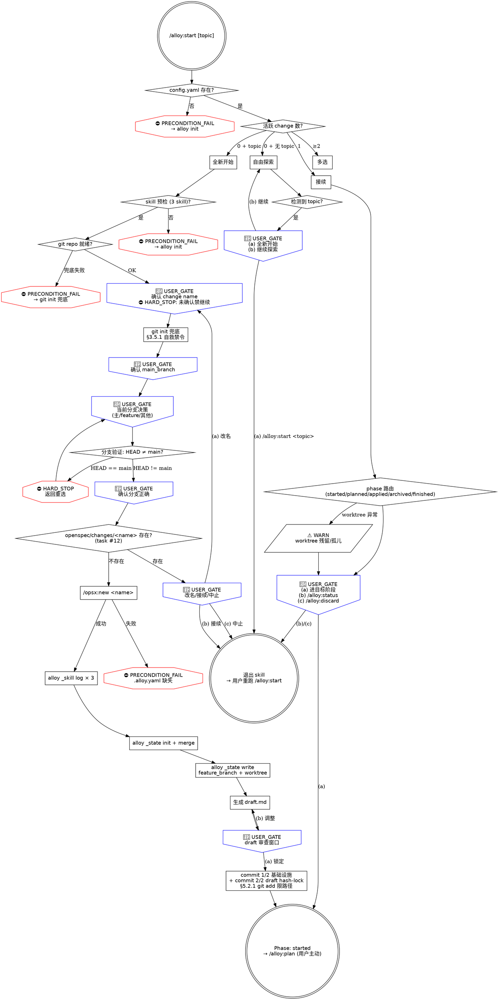

# start.md 阶段 2 完整重写计划

> **For agentic workers:** REQUIRED SUB-SKILL: Use superpowers:subagent-driven-development (recommended) or superpowers:executing-plans to implement this plan task-by-task. Steps use checkbox (`- [ ]`) syntax for tracking.

**Goal:** 按 `docs/reference/alloy-skill-writing-guide.md` §6 检查清单，对 `commands/alloy/start.md` 做阶段 2 完整重写——frontmatter 迁移到四字段、补三层防御、嵌入通用/项目特定禁令、新增 dot 流程图，吃掉 backlog 1 条 P1 隐患（#12 opsx:new 目录冲突未检查）。

**Architecture:** 复用 archive.md（commit 30e5256）+ finish.md（commit 0a38d8e）+ apply.md（commit 267aede）+ plan.md（commits 044575b/84fa173/43d4fd2/a3a7e77）已建立的模板：

- frontmatter 迁移：`stops: 15, hard_stops: 5` → `preconditions / hard_stops / user_gates / warns` 四字段（按 design §2.2）
  - 新数字：`preconditions: 5 / hard_stops: 8 / user_gates: 8 / warns: 2`
  - 旧 `stops: 15` 是按"每个 🔴 STOP 出现位置计数"，新计数按"一个语义节点计 1 次"原则——5 路径 × 多子段重复出现的 USER_GATE 合并为 1 个节点
- 同步迁移 `docs/specification/01-product-spec/01-start-spec.md` frontmatter（与 skill 完全对账）
- 三层防御补全：
  - 第一层：Iron Law 升级 `[HARD_STOP] NO WORK ON MAIN BRANCH + NO AUTO ADVANCE`（保留原"不在主分支开发"+ 加"start 完成后绝不自动进 plan"）
  - 第二层：每个关键禁令加"违反字面 = 违反精神"措辞（主分支位置 / 自动推进 / change name 未确认 / draft 未审查）
  - 第三层：Red Flags 表 7 行 → ≥ 12 行（涵盖 #12 / 主分支污染 / 自动推进 / brainstorming 跳过 / 分支验证绕过 / opsx:new 失败硬抗 等）
- 嵌入通用 §3.5.1 git 自救禁令（git init / branch checkout 失败时禁 reset / clean / push --force）
- 嵌入 alloy §5.2.1 git add 路径化（步骤 9 commit 1/2 + commit 2/2 + main_branch commit 三处共享，正文 1 处声明）
- alloy §5.2.3 phase 推进路径 B 在 start 不适用（start 是 phase 推进起点，但加 §5.2.3 注释说明本阶段没有降级压力——说明边界）
- backlog 隐患吃法：
  - **#12** opsx:new 目录冲突未检查——在「全新开始」流程步骤 4 调用 `/opsx:new <name>` **之前**，新增 ⛔ PRECONDITION_FAIL 检查 + 🔴 USER_GATE：
    ```bash
    if [ -d "openspec/changes/<name>" ]; then
      echo "⛔ PRECONDITION_FAIL: openspec/changes/<name> 已存在"
      # USER_GATE 三选项：(a) 改用其他 name 回到步骤 1 / (b) 接续已有 change（退出 start，由用户重新跑 /alloy:start 触发"接续"路径）/ (c) 中止
    fi
    ```
- dot 流程图：新画 start 流程图——整体 5 路径（全新开始 / 自由探索 / 强制新建 / 接续 / 多选）+ 全新开始的 9 步骤 + 接续的 6 phase 路由

**Tech Stack:** Markdown skill 文件 + bash 片段 + dot graph + alloy CLI（`_state` / `_record` / `_skill` / `_config` / `_guard` 不参与——start 是阶段起点）

**前置阅读：**
- 通用指南 `docs/reference/skill-writing-guide.md` 完整通读
- alloy 指南 `docs/reference/alloy-skill-writing-guide.md` 完整通读
- design `docs/superpowers/specs/2026-06-13-skills-test-and-rewrite-design.md` §3.4 阶段 2 顺序 5 + §3.5 task 与阶段对应表
- 模板 `commands/alloy/archive.md` + `commands/alloy/finish.md` + `commands/alloy/apply.md` + `commands/alloy/plan.md`（四个已重写完成的参考）
- 当前 `commands/alloy/start.md`（327 行——5 阶段中最复杂的，5 路径 + 多子段）
- spec `docs/specification/01-product-spec/01-start-spec.md`
- `commands/alloy/references/main-branch-detection.md`（被 step 3① 引用）
- `commands/alloy/references/skill-precheck.md`（被 step 1 引用）

**验证策略：**
1. `npm run build` + `npm test` 全量通过（358 tests）
2. `node dist/cli/index.js _spec-audit` 显示 `✓ start: spec 与 skill 一致`
3. 节点审计——grep 计数与 frontmatter 数字一致（语义节点，不算流程图重复）
4. 行数 < 500（start 比 plan 复杂——5 路径 + 9 步骤 + 接续 6 phase 路由 + 流程图，行数预计 420-480）
5. 拆 2 commit：(A) spec frontmatter 迁移；(B) skill 完整重写 + plan 文件

---

## File Structure

**修改：**
- `commands/alloy/start.md`（完整重写主体——327 行 → ~450 行含流程图）
- `docs/specification/01-product-spec/01-start-spec.md`（仅 frontmatter，正文不改）

**不修改：** `src/cli/commands/internal/spec-audit.ts`（archive 重写时已支持四字段）；`commands/alloy/references/main-branch-detection.md`（不变）。

---

## Task 1: 通读模板与当前 start.md

**Files:**
- Read: `commands/alloy/archive.md` + `commands/alloy/finish.md` + `commands/alloy/apply.md` + `commands/alloy/plan.md`（四个已完成模板）
- Read: `commands/alloy/start.md`（当前 327 行）
- Read: `docs/specification/01-product-spec/01-start-spec.md`
- Read: `commands/alloy/references/main-branch-detection.md`

- [ ] **Step 1: 读 6 个文件，重点确认**

- archive/finish/apply/plan 的 frontmatter 数字、Iron Law 措辞、Red Flags 表风格、dot 流程图风格
- start 现有结构：5 路径（全新开始 / 自由探索 / 强制新建 / 接续 / 多选）+ 全新开始 9 步骤 + 接续 6 phase 路由
- start 现有节点（参照 grep 基线）：
  - 🔴 STOP 13 处（line 126/140/152/153/154/166/202/270/301/302/304/305/306）
  - HARD STOP 4 处（line 152/160/165/174/247——含完成段的"start 阶段到此结束"）
  - PRECONDITION_FAIL 0 处（待补——config 不存在、技能预检、git 仓库、#12 目录冲突）
  - ⚠️ 2 处（line 320 worktree 残留 / 孤儿）

- [ ] **Step 2: grep 全节点关键字记录基线**

```bash
cd /Users/wenqiu/AIAgent/alloy
grep -nE "PRECONDITION_FAIL|HARD_STOP|HARD STOP|🔴 STOP|⚠️|USER_GATE" commands/alloy/start.md
```

记录每条匹配作为 Task 2 重组依据。

---

## Task 2: 设计新 frontmatter 数字

**Files:** Plan-only（不改文件）

- [ ] **Step 1: 列出阶段 2 后全部节点（按四类分组）**

**preconditions（PRECONDITION_FAIL，前置/状态校验失败）：**
1. `openspec/config.yaml` 不存在（line 48 现状隐式 → 显式）
2. Skill 预检失败（opsx:explore + opsx:new + brainstorming，line 71-73）
3. git 仓库失败（line 130 现状隐式——已有 git init 兜底，但失败时仍需 PRECONDITION_FAIL）
4. **NEW #12：** opsx:new 目录冲突——`[ -d "openspec/changes/<name>" ]` 已存在则 PRECONDITION_FAIL（步骤 4 之前）
5. opsx:new 创建后验证失败——line 174 现状 HARD STOP 升级为 PRECONDITION_FAIL（与 #12 区分：#12 是"目录已存在"，本条是"opsx:new 调用失败"）

合计 **5 个 preconditions**

**hard_stops（HARD_STOP，对 agent 的绝对禁令）：**
1. Iron Law：NO WORK ON MAIN BRANCH + NO AUTO ADVANCE（顶部声明，含"违反字面 = 违反精神"）
2. 主分支位置禁开发（step 3② 在主分支上的情况——line 152，升级 emoji 标识）
3. change name 未确认前禁继续步骤 2-9（line 126 已有规则升级标识）
4. 分支验证不通过禁继续（step 3③ `$CURRENT` = `$MAIN_BRANCH` → HARD_STOP 返回重选——line 165）
5. 步骤 4-9 在分支验证未通过前禁执行（line 168 已有规则升级）
6. git add 路径化（§5.2.1）——step 9 commit 1/2 + commit 2/2 + main_branch commit 三处共享，正文 1 处声明
7. start 完成后禁自动进 plan（line 247 已有规则升级 emoji）
8. 用户未确认方案前禁生成 draft.md（line 120 已有规则升级，配 step 8 draft 审查窗口前置）

合计 **8 个 hard_stops**

**user_gates（USER_GATE，必须 AskUserQuestion）：**

按"一个语义节点计 1 次"原则——5 路径 × 多子段重复出现的同款 USER_GATE 合并为 1：

1. **change name 确认**（步骤 1，line 126）
2. **main_branch 确认**（步骤 3①，line 140——若 config 已有则跳过）
3. **当前分支决策**（步骤 3②，line 152-154——3 种情况合并为 1 个 USER_GATE 节点）
4. **分支验证确认**（步骤 3③，line 166——`$CURRENT` ≠ `$MAIN_BRANCH` 时确认状态正确）
5. **draft 审查窗口**（步骤 8，line 202——确认锁定 / 调整回 brainstorming）
6. **自由探索分流**（line 270——topic 检测后 (a)(b) 选择）
7. **接续 phase 路由**（接续路径 line 301-306，6 个 phase 共用同款 USER_GATE 节点风格——计 1）
8. **NEW #12 USER_GATE：** opsx:new 目录冲突时让用户选 (a) 改名 / (b) 接续已有 / (c) 中止

合计 **8 个 user_gates**

**warns（WARN，软提示不阻断）：**
1. worktree 残留（line 320，worktree 字段有值但路径不存在）
2. worktree 孤儿（line 320，worktree 为 null 但 `.worktrees/<name>/` 存在）

> 多 change 并行 WARN（archive/finish/apply/plan 都有的同款）在 start 不适用——start 本身是开新 change 的入口，多 change 检测在「多选」路径已显式处理。这里**不**新增"多 change 并行 WARN"。

合计 **2 个 warns**

**最终 frontmatter：**
```yaml
behaviors:
  preconditions: 5
  hard_stops:    8
  user_gates:    8
  warns:         2
  artifacts: [draft]
  transitions_to: started
  external_calls: [opsx:explore, opsx:new, superpowers:brainstorming]
```

- [ ] **Step 2: 把 4 个数字记录到 Self-Review §1 节点对账表，作为 Task 10 grep 校验依据**

---

## Task 3: 同步 spec 文件 frontmatter

**Files:**
- Modify: `docs/specification/01-product-spec/01-start-spec.md`（仅前 8 行 frontmatter）

- [ ] **Step 1: Edit frontmatter**

**old_string**：

```
---
behaviors:
  stops: 15
  hard_stops: 5
  artifacts: [draft]
  transitions_to: started
  external_calls: [opsx:explore, opsx:new, superpowers:brainstorming]
---
```

**new_string**：

```
---
behaviors:
  preconditions: 5
  hard_stops:    8
  user_gates:    8
  warns:         2
  artifacts: [draft]
  transitions_to: started
  external_calls: [opsx:explore, opsx:new, superpowers:brainstorming]
---
```

- [ ] **Step 2: 验证 spec 正文未动**

```bash
git diff docs/specification/01-product-spec/01-start-spec.md
```

预期：仅 frontmatter 行 diff，正文 `# alloy start 行为规格` 起未变。

---

## Task 4: 重写 start.md frontmatter + Iron Law + Red Flags

**Files:**
- Modify: `commands/alloy/start.md` line 1-44（frontmatter + 顶部 Iron Law + 旧 Red Flags 表整段替换）

- [ ] **Step 1: Edit 整段替换**

**old_string**（line 1-44，完整覆盖 frontmatter + 简介 + 旧 Iron Law 框 + 旧 Red Flags 表）：

```
---
name: "Alloy: Start"
description: 新功能构思或接续已有工作时调用
category: Workflow
tags: [alloy, workflow]
spec: 01-product-spec/01-start-spec.md
behaviors:
  stops: 15
  hard_stops: 5
  artifacts: [draft]
  transitions_to: started
  external_calls: [opsx:explore, opsx:new, superpowers:brainstorming]
---

# alloy-start

你是 Alloy 工作流的智能入口。检测状态、路由到正确流程、调度外部技能完成探查和需求设计，产出 draft.md。

**核心原则：把实际工作委托给专门的技能，不要自己做。Alloy 是编排器，不是执行者。**

```
NO WORK ON MAIN BRANCH
每个 change 必须在独立 feature 分支上——主分支污染不可逆
```

> **`<TIMESTAMP>`：** 每次渲染阶段头部时执行 `date "+%Y-%m-%d %H:%M:%S"` 获取本地时间。`<START_TIME>` 是"全新开始"路径中捕获的时间——agent 捕获后复用于 header 和 phase_timings。`<created_at>` 从 `.alloy.yaml` 读取。

**交互规则：** `🔴 STOP` = 硬交互确认点，必须用 `AskUserQuestion`（`commands/alloy/references/interaction-style.md`）。跳过任何 🔴 STOP = 违反 Iron Law。

---

### Red Flags——STOP

| 借口 | 现实 |
|------|------|
| "不用建分支了，就在 main 上干吧" | 主分支污染不可逆。建分支只需 2 秒。拒绝。 |
| "分支创建是可选步骤" / "用户没提分支" | 分支创建是硬性闸门——没有验证，后续步骤全部禁止。闸门默认生效，不需要用户主动请求。 |
| "项目简单/一个人开发，不需要分支" | 分支保护的是 discard 安全性，不是团队协作。简单项目一样需要——否则 discard 丢失主分支无关变更。 |
| "不用 brainstorming，直接写代码" | brainstorming 不可跳过。跳过需求设计 = 规格和代码分叉的起点。 |
| "brainstorming 完成了，写 spec 文件吧" | Alloy start 的产出是 draft.md，不是 docs/superpowers/specs/。brainstorming 完成后直接输出方案，由 Alloy 流程生成 draft.md。 |
| "start 完成了，直接进 plan" / "用户没回复，我先继续" | start 完成后绝不自动进入 plan。沉默 ≠ 授权。替用户做阶段转换 = 剥夺审查机会。 |
| "draft.md 讨论过了，直接 commit" | brainstorming 讨论的是概念，draft.md 是最终文本。必须展示完整内容，等用户确认。 |

---
```

**new_string**（约 80 行——新 frontmatter + Iron Law 升级 + Red Flags 表扩展到 12 行）：

````
---
name: "Alloy: Start"
description: 新功能构思或接续已有工作时调用
category: Workflow
tags: [alloy, workflow]
spec: 01-product-spec/01-start-spec.md
behaviors:
  preconditions: 5
  hard_stops:    8
  user_gates:    8
  warns:         2
  artifacts: [draft]
  transitions_to: started
  external_calls: [opsx:explore, opsx:new, superpowers:brainstorming]
---

# alloy-start

你是 Alloy 工作流的智能入口。检测状态、路由到正确流程、调度外部技能完成探查和需求设计，产出 draft.md。

**核心原则：把实际工作委托给专门的技能，不要自己做。Alloy 是编排器，不是执行者。** draft.md 以 hash-lock + commit 入 records，禁直接编辑。

```
[HARD_STOP] NO WORK ON MAIN BRANCH + NO AUTO ADVANCE
每个 change 必须在独立 feature 分支上；start 完成后绝不自动进 plan
违反字面 = 违反精神：哪怕"用户在催赶时间在 main 上先建文件"或"用户上次也是接 plan 这次猜跳过 USER_GATE"，也算违反 Iron Law
```

> **`<TIMESTAMP>`：** 每次渲染阶段头部时执行 `date "+%Y-%m-%d %H:%M:%S"` 获取本地时间。`<START_TIME>` 是"全新开始"路径中捕获的时间——agent 捕获后复用于 header 和 phase_timings。`<created_at>` 从 `.alloy.yaml` 读取。

**交互规则：** `🔴 STOP` 等价 `USER_GATE`，必须用 `AskUserQuestion`（`commands/alloy/references/interaction-style.md`）。跳过任何 USER_GATE = 违反 Iron Law。

**状态符号：** `⛔` = HARD_STOP / PRECONDITION_FAIL，`🔴` = USER_GATE，`⚠️` = WARN（视觉规范 §七）。

---

### Red Flags（第三层防御——任一借口出现即 STOP）

| 借口 | 现实 |
|------|------|
| "不用建分支了，就在 main 上干吧" | ⛔ HARD_STOP：主分支污染不可逆。建分支只需 2 秒。违反字面 = 违反精神：哪怕"只是先建个目录后面再切"也算（Iron Law 第一层）。 |
| "分支创建是可选步骤" / "用户没提分支" | 分支创建是硬性闸门——没有验证，后续步骤全部禁止。闸门默认生效，不需要用户主动请求。 |
| "项目简单/一个人开发，不需要分支" | 分支保护的是 discard 安全性，不是团队协作。简单项目一样需要——否则 discard 丢失主分支无关变更。 |
| "不用 brainstorming，直接写代码" | brainstorming 不可跳过。跳过需求设计 = 规格和代码分叉的起点。 |
| "brainstorming 完成了，写 spec 文件吧" | Alloy start 的产出是 draft.md，不是 docs/superpowers/specs/。brainstorming 完成后直接输出方案，由 Alloy 流程生成 draft.md。 |
| "start 完成了，直接进 plan" / "用户没回复，我先继续" | ⛔ HARD_STOP：start 完成后绝不自动进入 plan。沉默 ≠ 授权（Iron Law 第二层）。替用户做阶段转换 = 剥夺审查机会。 |
| "draft.md 讨论过了，直接 commit" | brainstorming 讨论的是概念，draft.md 是最终文本。必须展示完整内容，等用户 USER_GATE 确认。 |
| "openspec/changes/<name>/ 已经有了，直接复用" | ⛔ PRECONDITION_FAIL：目录已存在 = #12 冲突。USER_GATE 让用户决策（改名 / 接续 / 中止），禁 agent 自动复用——可能覆盖用户既有工作。 |
| "/opsx:new 失败了，git mkdir 凑合一下" | ⛔ PRECONDITION_FAIL：opsx:new 是 schema 闸门，手工 mkdir 绕过制品 DAG 验证——退出 skill 引导用户排查。 |
| "change name 还没确认，先把分支建了" | ⛔ HARD_STOP：change name 未确认前禁继续步骤 2-9。违反字面 = 违反精神：哪怕"反正 name 大概就这个"。 |
| "git init 后 reset --hard 一下，把环境清干净" | ⛔ HARD_STOP：git 初始化失败禁 reset --hard / clean -fd / checkout .（§3.5.1 git 自救禁令）。退出 skill 让用户处理。 |
| "用户没明确选 (a) 但意思就是进 plan，加载吧" | 沉默 ≠ 授权。USER_GATE 必须明确选择 (a)，不接受推断（Iron Law 第二层）。 |

---
````

- [ ] **Step 2: 验证关键 token 落地**

```bash
grep -nE "preconditions: 5|hard_stops: +8|user_gates: +8|warns: +2|NO WORK ON MAIN BRANCH|NO AUTO ADVANCE|违反字面 = 违反精神" commands/alloy/start.md
```

预期 ≥ 6 条匹配。

---

## Task 5: 重写「状态检测」段（PRECONDITION_FAIL：config + Skill 预检）

**Files:**
- Modify: `commands/alloy/start.md`（"## 状态检测" 起至 "## 全新开始" 之前，约 line 46-52）

- [ ] **Step 1: Read 现有段确认**

- [ ] **Step 2: Edit 整段替换**

**old_string**：

```
## 状态检测

**第一步：** 检查 `openspec/config.yaml` 是否存在——不存在则引导 `alloy init`。

**第二步：** 扫描 `openspec/changes/*/.alloy.yaml`，统计 phase != `finished` 的 change。

---
```

**new_string**：

```
## 状态检测（前置门）

**第一步**（⛔ PRECONDITION_FAIL）：检查 `openspec/config.yaml` 是否存在——不存在则提示用户 `alloy init`，agent 不得自动初始化（init 会写 `.claude/` / 模板等关键文件，必须由用户主动触发）。

**第二步：** 扫描 `openspec/changes/*/.alloy.yaml`，统计 phase != `finished` 的 change，作为路由依据：
- 0 个活跃 change + 提供 topic → 全新开始
- 0 个活跃 change + 无 topic → 自由探索
- 1 个活跃 change → 接续
- 多个活跃 change → 多选

**第三步**（⛔ PRECONDITION_FAIL）：「全新开始」与「强制新建」路径强制 Skill 预检——cmd: opsx/explore opsx/new, skill: brainstorming。读取 `commands/alloy/references/skill-precheck.md` 检测，任一不可用 → 引导 `alloy init`，不存在降级。

**第四步**（⛔ PRECONDITION_FAIL）：「全新开始」与「强制新建」路径强制 git 仓库就绪——`git rev-parse --git-dir` 失败时尝试 `git init` 兜底（详见全新开始步骤 2）；兜底失败 → 退出 skill。

---
```

- [ ] **Step 3: 验证**

```bash
grep -nE "PRECONDITION_FAIL.*config|PRECONDITION_FAIL.*Skill|PRECONDITION_FAIL.*git" commands/alloy/start.md | head -5
```

预期 ≥ 3 条匹配。

---

## Task 6: 重写「全新开始」前半段（Step 1/2 + Step 2/2 上下文探查 + 需求设计）

**Files:**
- Modify: `commands/alloy/start.md`（"## 全新开始" 起至 "用户确认方案后，执行以下步骤：" 之前，约 line 54-122）

- [ ] **Step 1: Read 整段确认**

- [ ] **Step 2: Edit 整段替换**

**核心改动：**

1. 标题保留 "## 全新开始（无活跃 change + 用户提供了 topic）"
2. 启动时间捕获保留
3. Step 1/2 上下文探查：移除内联的 Skill 预检（已在「状态检测」段升级到 PRECONDITION_FAIL）
4. Step 2/2 需求设计：保留所有内容，加 ⛔ HARD_STOP 标识——"用户明确确认方案之前，不要生成 draft.md"

**new_string**（约 60 行——保留原 line 54-122 全部逻辑，只替换标识 emoji + 删除重复的 Skill 预检）：

````
## 全新开始（无活跃 change + 用户提供了 topic）

**捕获阶段启动时间：**
```bash
date "+%Y-%m-%d %H:%M:%S"
```
> 不要混用 bash 变量——bash 状态在两次工具调用间不持久。直接捕获 date 输出文本。

```
┌──────────────────────────────────────┐
│ Alloy [1/5] · Phase: Start           │
│ 启动时间: <START_TIME>
└──────────────────────────────────────┘
```

> **前置门：** Skill 预检 + git 仓库就绪已在「状态检测」第三/四步完成（⛔ PRECONDITION_FAIL）。本路径假设两者已通过。

### [Step 1/2] 上下文探查

加载 `opsx:explore` 技能，按其指引探索项目上下文。

**交互风格：** 使用 `AskUserQuestion` 工具。详见 `commands/alloy/references/interaction-style.md`。

**额外上下文：** 扫描 `openspec/changes/archive/` 下最近 3 个 `retrospective.md`，提取 §5 意外发现、§6 值得推广、§4 技能跳过模式，作为本次 brainstorming 参考。

---

### [Step 2/2] 需求设计

加载 `superpowers:brainstorming` 技能，传入探查结果和主题：

```
探查结果：<Step 1 关键发现摘要>
主题：<topic>
项目类型：<新项目/存量项目>

**Alloy 流程覆盖：** 本调用在 Alloy start 流程内，brainstorming 完成后产出是 draft.md
（openspec/changes/<name>/draft.md），不是 docs/superpowers/specs/ 文件。
请跳过 brainstorming checklist 中的"Write design doc"和"Invoke writing-plans"步骤。

**交互风格：** 使用 AskUserQuestion 组件，不用纯文本 (a)(b)(c)。
单选用 radio，多选用 checkbox，代码方案对比用 preview。
每次提问不超过 4 个问题，相关问题合并到一次调用。
给出默认推荐——推荐选项在 description 中标注理由。
```

**用户确认方案后，生成 draft.md**（不是 spec 文件）。用户要求调整时回到 brainstorming 继续。

```markdown
# [功能名称]

## Why
<!-- 要解决的问题 -->

## What
<!-- 方案概述 -->

## 关键决策
<!-- brainstorming 中确定的关键技术决策及理由 -->

## 范围与边界
<!-- 做什么、明确不做什么 -->
```

> [HARD_STOP] **用户明确确认方案之前，不要生成 draft.md。**
> 违反字面 = 违反精神：哪怕"内容已经基本明确再补审查"，也算违反——审查窗口是 USER_GATE，不可后置。

---
````

- [ ] **Step 3: 验证**

```bash
grep -nE "前置门.*Skill 预检|HARD_STOP.*用户明确确认方案" commands/alloy/start.md
```

预期 ≥ 2 条匹配。

---

## Task 7: 重写「全新开始」9 步骤（含 #12 opsx:new 目录冲突 + 多个 HARD_STOP/USER_GATE 标记）

**Files:**
- Modify: `commands/alloy/start.md`（"用户确认方案后，执行以下步骤：" 起至 "### 完成" 之前，约 line 124-231）

- [ ] **Step 1: Read 整段确认**

- [ ] **Step 2: Edit 整段替换**

**核心改动（最大的一段——含 9 步骤 + #12 嵌入）：**

1. 顶部加 §3.5.1 git 自救禁令链路声明（git init / branch checkout 失败时禁 reset / clean / push --force）
2. 顶部加 §5.2.1 git add 路径化声明（步骤 9 commit 1/2 + commit 2/2 + main_branch commit 共享）
3. **步骤 1**（change name 确认）：`🔴 STOP` 升级为 `🔴 USER_GATE`，加 `[HARD_STOP] 未确认时禁继续步骤 2-9`
4. **步骤 3①**（main_branch 确认）：保留逻辑，标识升级
5. **步骤 3②**（当前分支决策）：3 种情况合并为单一 USER_GATE 节点说明（avoid 重复计数）；"在主分支上"情况升级 ⛔ HARD_STOP
6. **步骤 3③**（分支验证）：`$CURRENT` = `$MAIN_BRANCH` → ⛔ HARD_STOP；`$CURRENT` ≠ `$MAIN_BRANCH` → 🔴 USER_GATE 确认
7. **NEW 步骤 3.5（task #12 opsx:new 目录冲突检查）**：新插入步骤 3.5，在原步骤 4 之前：
   ```bash
   if [ -d "openspec/changes/<name>" ]; then
     echo "⛔ PRECONDITION_FAIL: openspec/changes/<name> 已存在"
     # AskUserQuestion: (a) 改用其他 name → 回步骤 1 / (b) 接续已有 → 退出 start 让用户跑 /alloy:start 触发"接续"路径 / (c) 中止
   fi
   ```
8. **步骤 4**（调用 opsx:new）：line 174 `HARD STOP: /opsx:new 创建失败` 升级为 ⛔ PRECONDITION_FAIL
9. **步骤 8**（draft 审查窗口）：标识升级 🔴 USER_GATE，加 `[HARD_STOP] git add 限路径，不用 -A/-a/.`
10. **步骤 9**（提交）：commit 1/2 与 commit 2/2 加 §5.2.1 注释

**new_string**（约 130 行，保留原 line 124-231 所有 bash 与逻辑，只升级标识与新增步骤 3.5）：

````
用户确认方案后，执行以下步骤：

> **git 自救禁令（§3.5.1 内嵌约束，HARD_STOP）：** 步骤 2 git init / 步骤 3 分支创建/切换 / 步骤 9 commit 任何环节失败，禁 agent 运行 `git reset --hard` / `git checkout .` / `git restore .` / `git stash` / `git clean -fd` / `git push --force` —— 退出 skill 让用户处理是唯一合法路径。
>
> **git add 限路径（§5.2.1 内嵌约束，HARD_STOP）：** 所有 commit 用精确路径（`.claude/` `openspec/` `CLAUDE.md` 等明确列举），禁 `-A`/`-a`/`.`。违反字面 = 违反精神：哪怕"反正只改了已知文件"，也禁通配——可能把 `.superpowers/` 临时目录或测试残留一并 commit。

1. **建议 change name**——kebab-case，🔴 USER_GATE: 确认 change name（建议名 / 自定义）。

   > [HARD_STOP] **未确认时禁止继续步骤 2-9。**
   > 违反字面 = 违反精神：哪怕"name 大概就这个先建分支"，也算违反——name 是 directory + branch + records 主键。

2. **确保 git 仓库就绪：**
   ```bash
   if ! git rev-parse --git-dir 2>/dev/null; then
     git init
     git add .claude/ .gitignore openspec/config.yaml openspec/schemas/ 2>/dev/null
     [ -f CLAUDE.md ] && git add CLAUDE.md 2>/dev/null
     git commit -m "chore: alloy init 项目初始化"
   fi
   ```

3. **分支选择**——创建 change 目录之前完成，确保所有制品落在 feature 分支上：

   **① 主分支检测：** 读取 `commands/alloy/references/main-branch-detection.md`。若 config 已有 `main_branch`，直接用。否则检测后 🔴 USER_GATE: 确认主分支（检测值 / 自定义）。确认后写入并提交：
   ```bash
   alloy _config write . main_branch <确认值>
   git add openspec/config.yaml
   git diff --cached --quiet || git commit -m "chore: 配置主分支"
   ```

   **② 当前分支决策**（🔴 USER_GATE，3 种情况共用）：
   ```bash
   CURRENT_BRANCH=$(git branch --show-current)
   ```

   - **在主分支上** → ⛔ HARD_STOP："不允许在主分支开发。" → 🔴 USER_GATE: 只展示"新建分支"
   - **在 feature 分支且名称含 change 名** → 🔴 USER_GATE: 继续使用当前分支 / 新建分支
   - **在非主分支的已有分支上** → 🔴 USER_GATE: 切换到已有分支 / 新建分支

   无可用本地非主分支时 → 直接新建。

   新建分支命名：默认 `feature/<change-name>`，用户可自定义。校验不允许与主分支同名。`git checkout -b <branch-name>`

   **③ 分支验证（⛔ HARD_STOP）：** 创建/切换后必须验证才能继续：
   ```bash
   CURRENT=$(git branch --show-current)
   echo "当前分支: $CURRENT | 主分支: $MAIN_BRANCH"
   ```
   `$CURRENT` = `$MAIN_BRANCH` → ⛔ HARD_STOP，返回重新选择
   `$CURRENT` ≠ `$MAIN_BRANCH` → 🔴 USER_GATE: 确认分支状态正确

   > [HARD_STOP] **未通过验证或用户未确认时，禁止执行步骤 4-9。**

3.5. **opsx:new 目录冲突预检**（⛔ PRECONDITION_FAIL，task #12）

   ```bash
   if [ -d "openspec/changes/<name>" ]; then
     echo "⛔ PRECONDITION_FAIL: openspec/changes/<name> 已存在"
     echo "  可能原因：name 已被占用 / 旧 change 残留 / 多 session 并发"
     echo "  禁止：agent 自动覆盖（rm -rf）或自动复用——可能丢失用户既有工作"
   fi
   ```

   🔴 USER_GATE: 选择处理路径
   - (a) 改用其他 name → 回步骤 1 重新建议 change name
   - (b) 接续已有 change → 退出 start，引导用户跑 `/alloy:start`（无 topic）触发"接续"路径
   - (c) 中止本次 /alloy:start

   > [HARD_STOP] agent 不得自动选 (a) / (b) / (c)——必须由用户明确决策。
   > 违反字面 = 违反精神：哪怕"目录看起来是空的"或"看起来是上次中断的"，也禁 agent 自动复用。

4. **调用 `/opsx:new <name>`** 创建 change 目录（前置：步骤 3 ③ 验证已通过 + 步骤 3.5 目录冲突已解决）

   调用后验证创建结果：
   ```bash
   if [ ! -f "openspec/changes/<name>/.alloy.yaml" ]; then
     echo "⛔ PRECONDITION_FAIL: /opsx:new 创建失败——.alloy.yaml 缺失"
     echo "  退出 skill 让用户排查 opsx 命令"
     exit 1
   fi
   ```

5. **批量记录技能使用：**
   ```bash
   alloy _skill log openspec/changes/<name> start opsx:explore && \
   alloy _skill log openspec/changes/<name> start superpowers:brainstorming && \
   alloy _skill log openspec/changes/<name> start opsx:new
   ```

6. **写入 state：**
   ```bash
   alloy _state init openspec/changes/<name>
   alloy _state merge openspec/changes/<name> phase_timings "{\"start\":{\"started_at\":\"$(date '+%Y-%m-%d %H:%M:%S')\"}}"
   ```

7. **记录分支信息：**
   ```bash
   alloy _state write openspec/changes/<name> feature_branch <branch-name>
   alloy _state write openspec/changes/<name> worktree null
   ```

8. **生成 `draft.md`** 到 `openspec/changes/<name>/draft.md`

   **draft.md 审查窗口——start 阶段唯一的制品闸门：**

   > 制品 draft ✓ 完成
   > [展示 draft.md 完整内容]
   > 🔴 USER_GATE: 确认锁定 draft（确认并继续提交 / 需要调整回 brainstorming）

   选确认 → 步骤 9；选调整 → 回到 Step 2/2 brainstorming。

9. **提交——仅用户确认锁定后，执行以下 2 个 commit：**

   **commit 1/2——基础设施（幂等，已提交则跳过；§5.2.1 git add 限路径）：**
   ```bash
   git add .claude/ .gitignore openspec/config.yaml openspec/schemas/ 2>/dev/null
   [ -f CLAUDE.md ] && git add CLAUDE.md 2>/dev/null
   git diff --cached --quiet || git commit -m "chore: alloy init 项目初始化"
   ```

   **commit 2/2——draft hash-lock + .alloy.yaml 变更（§5.2.1 git add 限路径）：**
   ```bash
   COMPLETED_AT=$(date "+%Y-%m-%d %H:%M:%S")
   alloy _state merge openspec/changes/<name> phase_timings "{\"start\":{\"completed_at\":\"${COMPLETED_AT:-$(date '+%Y-%m-%d %H:%M:%S')}\"}}"
   DRAFT_HASH=$(alloy _record compute openspec/changes/<name> draft)
   APPROVED_AT=$(date "+%Y-%m-%d %H:%M:%S")
   APPROVER=$(git config user.name)
   alloy _record write openspec/changes/<name> draft "$DRAFT_HASH" "$APPROVED_AT" "$APPROVER"
   git add openspec/changes/<name>/
   git commit -m "docs(<name>): draft 已确认"
   ```

   前面步骤写入的 `.alloy.yaml` 变更在 draft commit 中一并提交。

---
````

- [ ] **Step 3: 验证 #12 + §3.5.1 + §5.2.1 全部入文**

```bash
grep -nE "task #12|步骤 3\.5|opsx:new 目录冲突预检|§3.5.1|§5.2.1" commands/alloy/start.md | head -10
```

预期 ≥ 5 条匹配。

---

## Task 8: 重写完成段（标识升级）

**Files:**
- Modify: `commands/alloy/start.md`（"### 完成" 起至 "## 自由探索" 之前，约 line 233-249）

- [ ] **Step 1: Edit 整段替换**

**old_string**：

```
### 完成

```
┌──────────────────────────────────────┐
│ Alloy [1/5] · Phase: Start — DONE    │
│ 启动时间: phase_timings.start.started_at
│ 完成时间: phase_timings.start.completed_at
│ 耗时: completed_at - started_at
└──────────────────────────────────────┘

→ Change: <name>  Phase: started
→ 制品: draft ✓
```

**HARD STOP —— start 阶段到此结束。** 不要自动运行 `/alloy:plan`，不要生成 plan 阶段制品，不要调用 `opsx:continue` 或 `writing-plans`。**你的唯一操作：展示完成信息，等待用户输入下一个命令。**

---
```

**new_string**：

````
### 完成

```
┌──────────────────────────────────────┐
│ Alloy [1/5] · Phase: Start — DONE    │
│ 启动时间: phase_timings.start.started_at
│ 完成时间: phase_timings.start.completed_at
│ 耗时: completed_at - started_at
└──────────────────────────────────────┘

→ Change: <name>  Phase: started
→ 制品: draft ✓
```

> [HARD_STOP] **start 阶段到此结束。**
> 不要自动运行 `/alloy:plan`，不要生成 plan 阶段制品，不要调用 `opsx:continue` 或 `writing-plans`。
> 违反字面 = 违反精神：哪怕"用户上次也是接 plan 这次猜跳过 USER_GATE"或"draft 已锁定流程很顺"，也算违反 Iron Law（NO AUTO ADVANCE）。
> **你的唯一操作：展示完成信息，等待用户输入下一个命令。**

> **§5.2.3 路径 B 边界说明：** start 是 phase 推进起点（无前序 phase），phase=started 写入失败时降级路径只有"重跑 /alloy:start"——不存在 phase 回退场景。本阶段无 §5.2.3 适用空间。

---
````

- [ ] **Step 2: 验证**

```bash
grep -nE "HARD_STOP.*start 阶段到此结束|§5.2.3 路径 B 边界说明" commands/alloy/start.md
```

预期 ≥ 2 条匹配。

---

## Task 9: 「自由探索」+「强制新建」+「接续」+「多选」四路径标识升级

**Files:**
- Modify: `commands/alloy/start.md`（"## 自由探索" 起至文末，约 line 251-327）

- [ ] **Step 1: Read 整段确认**

- [ ] **Step 2: Edit 三段升级**

**核心改动（仅升级标识，不改逻辑）：**

1. **「自由探索」（line 251-275）**：
   - line 270 `🔴 STOP` 升级为 `🔴 USER_GATE`
   - 标题段说明保留

2. **「强制新建（--new <topic>）」（line 277-282）**：
   - 仅 1 句逻辑保留，无节点变更

3. **「接续」（line 284-322）**：
   - 6 phase 路由表（line 301-306）：所有 `🔴 STOP` 升级为 `🔴 USER_GATE`
   - 选项模板段（line 309-316）保留
   - 一致性检查（line 320）：⚠️ 升级为 `⚠️ WARN`，明示"残留" / "孤儿" 两个 WARN 节点

4. **「多选」（line 324-327）**：
   - 列表 + 路由保留

**new_string**（约 80 行，保留原 line 251-327 全部逻辑）：

````
## 自由探索（无活跃 change + 无 topic）

```
┌──────────────────────────────────────┐
│ Alloy [1/5] · Phase: Start           │
│ 启动时间: <TIMESTAMP>
└──────────────────────────────────────┘
```

扫描项目上下文（README、代码、requirement.md 等）。

**有上下文：** 总结项目信息，给 2-3 个建议方向，帮用户明确要做什么。

**空项目：** "项目较新，无上下文。请用 `/alloy:start <topic>` 重新调用，进入完整需求设计流程。"

> 必须让用户重新输入 `/alloy:start <topic>`——只有重新调用命令，alloy:start 技能才会被重新加载。仅输入 topic 文本会导致脱离编排框架，关键闸门被跳过。

**自由探索发现用户有明确 topic 后：**

🔴 USER_GATE: 检测到明确功能需求，请选择：
- (a) 以 "<topic>" 进入全新开始（请输入 `/alloy:start <topic>` 正式开始）
- (b) 继续自由探索

选 (a) 时输出提示文本，Agent 不得直接跳转到"全新开始"流程。

---

## 强制新建（--new <topic>）

无论是否有活跃 change，直接走"全新开始"流程。多个 change 可并行 planning，但不能同时 apply。

---

## 接续（有 1 个活跃 change）

```
┌──────────────────────────────────────┐
│ Alloy [1/5] · Phase: Start           │
│ 启动时间: phase_timings.start.started_at 或 created_at
└──────────────────────────────────────┘

→ 检测到活跃 change：<name>（phase: <phase>）
→ 已完成制品：<列出>
→ 下一步：<建议操作>
```

读取 `.alloy.yaml` + 文件系统确认制品状态，按 phase 路由：

| phase | 制品状态 | 路由 |
|-------|---------|------|
| started | proposal.md 存在 | 🔴 USER_GATE: 选择继续规划（alloy-plan） / 回需求讨论（重新 start） |
| started | draft.md 存在且 hash 有效 | 🔴 USER_GATE: 选择进 plan / 回 brainstorming |
| started | draft.md 缺失或 hash 不匹配 | 重新 brainstorming |
| planned | — | 🔴 USER_GATE: 确认进入 apply 阶段（继续 / 查看状态 / 放弃 change） |
| applied | — | 🔴 USER_GATE: 确认进入 archive 阶段（继续 / 查看状态 / 放弃 change） |
| archived | — | 🔴 USER_GATE: 确认进入 finish 阶段（继续 / 查看状态） |
| finished | — | 工作流已完成 |

**所有 🔴 USER_GATE 的选项模板：**
- (a) 进入 `<目标阶段>` 继续
- (b) 查看状态（/alloy:status）
- (c) 放弃此 change（/alloy:discard）——仅 planned/applied 阶段可选

**自动跳转仅限**：用户明确选择 (a) 后才加载目标命令。

**需自动加载时：** 输出对应命令文件完整指令，将 change name 和进度信息传入。

**需用户选择时：** 先校验 draft hash（`alloy _record check openspec/changes/<name> draft`），hash 有效 → 展示选择。

一致性检查：
- worktree 字段有值但路径不存在 → ⚠️ WARN 残留
- worktree 为 null 但 `.worktrees/<name>/` 存在 → ⚠️ WARN 孤儿，询问是否修复

---

## 多选（有多个活跃 change）

列出所有活跃 change（名称 + phase + 制品状态），让用户选择接续哪个，或 `--new <topic>` 开新 change。
````

- [ ] **Step 3: 验证**

```bash
grep -nE "🔴 USER_GATE|⚠️ WARN" commands/alloy/start.md | wc -l
```

预期 ≥ 12（正文 USER_GATE 8 个 + WARN 2 个 + 部分重复出现）。

---

## Task 10: 文末追加 dot 流程图

**Files:**
- Modify: `commands/alloy/start.md`（文末追加，无 old_string，直接 append）

- [ ] **Step 1: 在文末追加 dot 流程图**

读取当前文件末尾确认插入位置（应在「多选」段之后），然后直接 Write 或 Edit 加 new_string：

````

---

## 流程图（dot）


````

- [ ] **Step 2: 验证流程图节点齐全**

```bash
grep -cE "PRECONDITION_FAIL|HARD_STOP|USER_GATE|WARN" commands/alloy/start.md
```

预期 > 30（正文 + 流程图节点）。

---

## Task 11: 节点对账与正文 review

**Files:**
- Read: `commands/alloy/start.md`（全文 review）

- [ ] **Step 1: grep 精确计数语义节点**

```bash
cd /Users/wenqiu/AIAgent/alloy
grep -nE "⛔ PRECONDITION_FAIL|\\[PRECONDITION_FAIL\\]" commands/alloy/start.md  # 应 ≈ 5
grep -nE "⛔ HARD_STOP|\\[HARD_STOP\\]" commands/alloy/start.md                    # 应 ≈ 8
grep -nE "🔴 USER_GATE" commands/alloy/start.md                                    # 应 ≈ 8（5 路径 USER_GATE 重复出现合并计数原则）
grep -nE "⚠️ WARN" commands/alloy/start.md                                          # 应 ≈ 2
```

逐项与 Task 2 设计数字对账。语义节点（不算流程图重复 + 不计正文中"借口对照"出现）应等于 frontmatter 数字。如果数字不对：
- 多了 → 看流程图重复或正文超设计
- 少了 → 看具体哪个节点漏写

特殊提醒：本次 USER_GATE 8 个节点中，部分（接续 6 phase / 当前分支决策 3 种情况）是"语义同款，运行时多次出现"——按"一个语义节点计 1 次"原则计数。grep 实测会更高（因为每个 phase 行都打了 🔴 USER_GATE 标记），需要人工分组确认。

按需调整 frontmatter 或正文，二选一。**最终 frontmatter 与 spec frontmatter 必须一致——如果调整数字，spec 文件也要同步**。

- [ ] **Step 2: 通读全文检查清单**

- [ ] frontmatter 四字段齐全（preconditions: 5 / hard_stops: 8 / user_gates: 8 / warns: 2）
- [ ] Iron Law 升级 `NO WORK ON MAIN BRANCH + NO AUTO ADVANCE` + "违反字面 = 违反精神"
- [ ] Red Flags 表 ≥ 12 行
- [ ] task #12（opsx:new 目录冲突预检）入文（步骤 3.5 + Red Flags + 流程图）
- [ ] §3.5.1 git 自救禁令嵌入（步骤 1-9 顶部声明）
- [ ] §5.2.1 git add 路径化嵌入（步骤 9 commit 1/2 + commit 2/2 + main_branch commit 注释）
- [ ] §5.2.3 边界说明（完成段——start 是 phase 推进起点，不适用降级）
- [ ] 接续 6 phase 路由全部升级 🔴 USER_GATE 标识
- [ ] worktree 残留/孤儿两个 WARN 节点显式标识
- [ ] dot 流程图齐全（5 路径 + 全新开始 9 步骤 + 接续 phase 路由）
- [ ] 行数 400-500

---

## Task 12: 回归校验

**Files:**
- Run: `npm run build` `npm test` `node dist/cli/index.js _spec-audit`

- [ ] **Step 1: 编译与单测**

```bash
cd /Users/wenqiu/AIAgent/alloy
npm run build && npm test 2>&1 | tail -10
```

预期：358 tests pass，无回归。

- [ ] **Step 2: spec-audit 对账**

```bash
node dist/cli/index.js _spec-audit 2>&1
```

预期：`✓ start: spec 与 skill 一致`。其他 7 个 skill 状态保持。

- [ ] **Step 3: 行数检查**

```bash
wc -l commands/alloy/start.md
```

预期：400-500 行。

---

## Task 13: 提交（拆 2 commit）

- [ ] **Step 1: git status 确认**

预期：
- `docs/specification/01-product-spec/01-start-spec.md`（仅 frontmatter）
- `commands/alloy/start.md`（完整重写）
- `docs/superpowers/plans/2026-06-13-start-rewrite.md`（新增）

- [ ] **Step 2: Commit A（spec frontmatter 同步）**

```bash
git add docs/specification/01-product-spec/01-start-spec.md
git commit -m "$(cat <<'EOF'
docs(spec): 01-start-spec.md frontmatter 迁移到四字段

- stops/hard_stops 旧二字段 → preconditions/hard_stops/user_gates/warns 新四字段
- 数字与 commands/alloy/start.md 阶段 2 重写 frontmatter 一致：5/8/8/2
- 旧 stops: 15 是按"每个 🔴 STOP 出现位置计数"，新计数按"一个语义节点计 1 次"原则
- 5 路径 × 多子段重复出现的 USER_GATE 合并为 8 个节点
- 正文未变，仅 frontmatter 字段迁移（design §2.2）

为 start 阶段 2 完整重写做准备。完成本次迁移后 5 个阶段 skill frontmatter 全部迁移完毕。

Co-Authored-By: Claude Opus 4.7 <noreply@anthropic.com>
EOF
)"
```

- [ ] **Step 3: Commit B（start.md 完整重写 + plan 文件）**

```bash
git add commands/alloy/start.md docs/superpowers/plans/2026-06-13-start-rewrite.md
git commit -m "$(cat <<'EOF'
refactor(start): 阶段 2 完整重写——四字段 + 三层防御 + 流程图

- frontmatter 迁移：5 PRECONDITION_FAIL / 8 HARD_STOP / 8 USER_GATE / 2 WARN
- Iron Law 升级 "NO WORK ON MAIN BRANCH + NO AUTO ADVANCE" + "违反字面 = 违反精神"
- Red Flags 表扩展：7 → 12 行（新增 #12 目录冲突 / opsx:new 失败 / change name 未确认 / git 自救 / 沉默推断 等）
- 嵌入 §3.5.1 git 自救禁令（步骤 1-9 顶部声明，覆盖 git init / branch / commit 三类失败场景）
- 嵌入 §5.2.1 git add 路径化（步骤 9 commit 1/2 + commit 2/2 + main_branch commit 三处注释）
- §5.2.3 边界说明（完成段——start 是 phase 推进起点，不适用降级路径 B）
- backlog 隐患吃完：
  - #12 opsx:new 目录冲突预检（步骤 3.5 新增 PRECONDITION_FAIL + 三选项 USER_GATE）
- 接续路径 6 phase 路由全部升级 🔴 USER_GATE 标识；worktree 残留/孤儿两个 WARN 节点显式标识
- 文末新增 dot 流程图（覆盖 5 路径 + 全新开始 9 步骤 + 接续 phase 路由）

参考 archive.md (commit 30e5256) + finish.md (commit 0a38d8e) + apply.md (commit 267aede) + plan.md (commit 84fa173) 阶段 2 重写模板。

对应 design §3.4 阶段 2 顺序 5（最后一个 skill），1 条 P1 隐患（#12）解决。

至此 5 个阶段 skill 阶段 2 完整重写全部完成（archive / finish / apply / plan / start）。

Co-Authored-By: Claude Opus 4.7 <noreply@anthropic.com>
EOF
)"
```

- [ ] **Step 4: 提交后校验**

```bash
git log --oneline -5
node dist/cli/index.js _spec-audit 2>&1 | grep start
```

---

## Self-Review

**1. 节点对账表**

| 类型 | 设计 | 实测（Task 11 grep） |
|------|------|---------------------|
| preconditions | 5 | <填> |
| hard_stops | 8 | <填> |
| user_gates | 8 | <填> |
| warns | 2 | <填> |

数字若与设计偏离 ±1 内可调 frontmatter（同步改 spec），偏离更多需检查节点遗漏。

**特别说明：** USER_GATE 8 个是"语义节点"计数。grep `🔴 USER_GATE` 实测会更高（因为接续 6 phase 行 + 当前分支 3 种情况都打了标记）。需要人工分组确认：
- 5 路径 USER_GATE 风格统一 = 1 节点
- 当前分支 3 种情况共用 USER_GATE = 1 节点
- 接续 6 phase = 1 节点

**2. Spec coverage：**
- design §3.4 阶段 2 顺序 5（start）的 backlog 隐患：#12 ✓（Task 7 步骤 3.5）
- frontmatter 四字段迁移 ✓（Task 3 + Task 4）
- 三层防御补全 ✓（Task 4 / 6 / 7 / 8 / 9）
- 通用 §3.5.1 嵌入 ✓（Task 7）
- 项目 §5.2.1 嵌入 ✓（Task 7 步骤 9 + main_branch commit）
- §5.2.3 边界说明 ✓（Task 8）
- dot 流程图 ✓（Task 10）

**3. Placeholder scan：**
- Task 6 / 7 / 8 / 9 / 10 的 new_string 完全展开（含 bash 块、AskUserQuestion 文本、流程图骨架）
- 无 "TBD" / "implement later"
- Task 7 步骤 3.5 的 #12 目录冲突 USER_GATE 三选项措辞完整
- Task 10 dot 流程图骨架 80+ 行节点定义全部具体

**4. Type consistency：**
- frontmatter 字段名与 archive.md / finish.md / apply.md / plan.md 一致
- bash 变量命名（CURRENT_BRANCH / MAIN_BRANCH / DRAFT_HASH / APPROVED_AT / APPROVER 等）保留原命名约定
- alloy CLI 调用与现有约定一致：`_state` / `_record` / `_skill` / `_config`
- USER_GATE / HARD_STOP emoji 标识与 plan.md 阶段 2 一致

**5. 阶段 2 约束遵守：**
- ✅ 改 frontmatter
- ✅ 补三层防御
- ✅ 画流程图
- ✅ 嵌入通用 + 项目特定禁令
- ✅ 吃 backlog 1 条 P1 隐患
- ✅ spec-audit 保持 ✓
- ✅ 不动 src/

**6. 后续工作：**
start 重写完成 = 5 个阶段 skill 阶段 2 重写全部完成。后续阶段（design §四 验证策略）：
- 阶段 2 全量验证（design §4.2）：5 个 skill 联合 trace 验证 + 节点审计完全一致 + 通用禁令一致性
- 最终验证（design §4.3）：跨 skill 隐患升级到 §3.5 通用禁令模式 + 文档对账
- backlog 中尚未触及的 P2 隐患（#15/#16 已在 plan 重写时吃完）和 fix.md/discard.md/status.md 三个非阶段 skill 的处理（design §3.3 已处理 discard 软删除 P0；fix/status 不在 5 阶段范围内）

---

## 风险与缓解

| 风险 | 缓解 |
|------|------|
| Task 7 段落最大（9 步骤 + 步骤 3.5 新增），整段 Edit 容易出错 | 提供完整 new_string 骨架（含所有 bash 块、AskUserQuestion 文本），implementer 直接组装；Task 11 review 兜底 |
| frontmatter user_gates 数字偏离设计（grep 计数 vs 语义节点计数） | Task 11 给出特别说明 + 人工分组规则；spec-audit 工具自动检查 spec/skill 一致 |
| #12 步骤 3.5 在原编号体系中插入，可能影响后续步骤引用 | 步骤 4 显式声明前置：步骤 3 ③ + 步骤 3.5 都通过；无其他位置引用步骤 3.5 |
| 5 路径标识升级容易漏（接续 6 phase 行 + 自由探索 + 多选 等多处） | Task 9 集中处理 4 个非"全新开始"路径；Task 11 通读检查兜底 |
| dot 流程图节点过多（≈ 25 节点 + 35 边）容易渲染混乱 | Task 10 提供完整骨架（含子图分组 + 边 label），implementer 直接组装不需自行设计 |
| start 是入口 skill，错误影响所有下游 | spec-audit + 全量测试双闸门；commit B 包含完整重写，commit A 仅 frontmatter 可独立回滚 |
